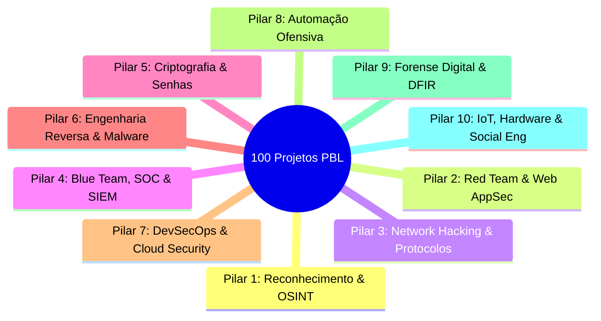

# 🛡️ Catálogo Mestre: 100 Projetos Práticos de Cibersegurança & Hacking (Metodologia PBL)

> **Metodologia Problem-Based Learning (PBL - Aprendizado Baseado em Problemas):**  
> Em vez de apenas ler teoria, você resolve uma dor real do mercado de segurança da informação, desenvolvendo código, analisando pacotes, interceptando requisições e defendendo infraestruturas.

---

## 🧭 Estrutura dos 10 Pilares de Especialização



---

## 📡 PILAR 1: Reconhecimento, OSINT & Superfície de Ataque (#01 ao #10)

### 01. Radar de Subdomínios & Takeover Scanner (SubDomain Hunter)
* **🎯 Problema Real:** Empresas com centenas de subdomínios esquecem registros DNS apontando para serviços em nuvem desativados, permitindo que atacantes assumam controle de domínios corporativos legítimos (Subdomain Takeover).
* **⚙️ O que você constrói:** Um scanner assíncrono em Python que consulta Certificate Transparency Logs (crt.sh), faz brute-force com wordlists e valida se registros CNAME apontam para buckets S3/GitHub Pages órfãos.
* **💡 Conceitos Aprendidos:** Protocolo DNS (A, CNAME, NS), Certificate Transparency, DNS Dangling, requisições assíncronas com `asyncio`/`aiohttp`.
* **🛠️ Tecnologias:** Python, `dnspython`, `aiohttp`, APIs públicas de DNS.

### 02. OSINT Email & Credential Breach Aggregator (LeakSentry)
* **🎯 Problema Real:** Vazamentos constantes de credenciais expõem e-mails corporativos e senhas em fóruns da dark web.
* **⚙️ O que você constrói:** Uma ferramenta CLI que consulta bases de vazamento com hashing k-anonymity (HaveIBeenPwned API), extrai formatos de e-mail de domínios corporativos e gera relatórios de risco em PDF.
* **💡 Conceitos Aprendidos:** OSINT (Open Source Intelligence), modelo k-anonimato de busca de hashes (SHA-1), geração automatizada de relatórios.
* **🛠️ Tecnologias:** Python, `requests`, ReportLab, HaveIBeenPwned API.

### 03. Web Asset Metadata & Secret Leak Harvester (MetaScraper)
* **🎯 Problema Real:** Documentos PDF, DOCX e imagens publicados no site de uma organização contêm metadados (nomes de usuários, softwares internos, versões de SO e chaves de API acidentalmente comitadas).
* **⚙️ O que você constrói:** Um crawler que baixa todos os arquivos públicos de um alvo, extrai metadados EXIF/PDF e busca regex de chaves de API (AWS, GitHub tokens, Stripe, OpenAI).
* **💡 Conceitos Aprendidos:** Web scraping estruturado, manipulação de metadados EXIF e XMP, regex de alta precisão para segredos de API.
* **🛠️ Tecnologias:** Python, `BeautifulSoup`, `PyMuPDF`, `Pillow`, `trufflehog-regex`.

### 04. Shodan/Censys Infrastructure Mapper & Port Profiler
* **🎯 Problema Real:** Servidores de desenvolvimento ou bancos de dados (MongoDB, Redis, Elasticsearch) são expostos sem autenticação na internet sem o conhecimento do time de TI.
* **⚙️ O que você constrói:** Uma engine que consulta a API do Shodan/Censys por ASN ou bloco de IP da organização, mapeia todas as portas abertas e classifica o nível de perigo de cada serviço.
* **💡 Conceitos Aprendidos:** Motores de busca para a Internet das Coisas (IoT Search Engines), arquitetura de ASNs e CIDR, avaliação de exposição de infraestrutura.
* **🛠️ Tecnologias:** Python, Shodan API, Censys API, `ipaddress`.

### 05. WHOIS & Historical DNS Tracker (DomainTimeMachine)
* **🎯 Problema Real:** Analistas precisam entender quando um domínio malicioso de phishing foi registrado e quais servidores de DNS utilizou historicamente.
* **⚙️ O que você constrói:** Um sistema que rastreia histórico WHOIS, mudanças de IP (Passive DNS) e calcula pontuação de reputação para domínios recém-registrados (NRDs - Newly Registered Domains).
* **💡 Conceitos Aprendidos:** Protocolo WHOIS, Passive DNS, algoritmos de reputação de domínio, heurística de detecção de campanhas maliciosas.
* **🛠️ Tecnologias:** Python, `python-whois`, APIs de Passive DNS (SecurityTrails, AlienVault OTX).

### 06. GitHub Organization Secret Leaker & Repo Auditor (GitGuardian-Mini)
* **🎯 Problema Real:** Desenvolvedores sobem arquivos `.env`, chaves privadas SSH e senhas de banco de dados em repositórios públicos ou commits antigos do Git.
* **⚙️ O que você constrói:** Um scanner de repositórios que clona repositórios públicos de uma organização e percorre o histórico completo de commits (`git log -p`) usando busca de entropia de Shannon e expressões regulares.
* **💡 Conceitos Aprendidos:** Estrutura interna do Git (blobs, commits, trees), cálculo de entropia da informação para detecção de chaves criptográficas.
* **🛠️ Tecnologias:** Python, `GitPython`, `math` (entropia de Shannon), regex.

### 07. Social Media Intelligence Recon Framework (UserRecon Plus)
* **🎯 Problema Real:** Em testes de engenharia social, o auditor precisa mapear a presença digital de colaboradores em dezenas de plataformas simultaneamente.
* **⚙️ O que você constrói:** Um script multithreaded que verifica a existência de usernames em mais de 100 redes sociais e serviços web, identificando perfis ativos com verificação de status HTTP e headers de redirecionamento.
* **💡 Conceitos Aprendidos:** Concorrência com `ThreadPoolExecutor`, tratamento de rate-limit e user-agents, técnicas de identificação de perfis falsos.
* **🛠️ Tecnologias:** Python, `concurrent.futures`, `requests`.

### 08. Dark Web Onion Site Scraper & Keyword Alert (DarkWatch)
* **🎯 Problema Real:** Dados vazados de empresas são leiloados em fóruns da rede Tor (.onion) antes de se tornarem públicos.
* **⚙️ O que você constrói:** Um crawler conectado ao proxy SOCKS5 da rede Tor que monitora fóruns de vazamentos e envia alertas no Discord/Telegram caso o nome ou domínio da empresa seja mencionado.
* **💡 Conceitos Aprendidos:** Roteamento cebola (Tor Network), configuração de proxies SOCKS5, automação de web hooks para alertas críticos.
* **🛠️ Tecnologias:** Python, `stem` (Tor controller), `PySocks`, Webhooks do Discord/Telegram.

### 09. Corporate Attack Surface Dashboard (AttackSurface Map)
* **🎯 Problema Real:** A liderança de segurança não tem visibilidade unificada de todos os domínios, IPs, portas e certificados SSL da empresa.
* **⚙️ O que você constrói:** Um dashboard web interativo que agrega os dados de descoberta de subdomínios, certificados expirados e serviços expostos em uma árvore de ativos com gráficos visuais.
* **💡 Conceitos Aprendidos:** Visualização de dados de segurança, modelagem de dados de inventário de ativos (ASM - Attack Surface Management).
* **🛠️ Tecnologias:** HTML5, CSS3, JavaScript (Chart.js / Vis.js), backend FastAPI / Python.

### 10. Threat Intelligence IOC Aggregator & STIX/TAXII Feed (ThreatFeed Hub)
* **🎯 Problema Real:** Feeds de ameaças fornecem milhares de IPs e hashes maliciosos em formatos incompatíveis que não conversam com os firewalls da empresa.
* **⚙️ O que você constrói:** Um normalizador de Indicadores de Comprometimento (IoCs) que consome feeds públicos (URLhaus, Feodo Tracker, Abuse.ch) e exporta em formato STIX 2.1 e listas de bloqueio para firewall.
* **💡 Conceitos Aprendidos:** Padrões STIX/TAXII para Threat Intel, normalização e desduplicação de dados, pipelines de dados de segurança.
* **🛠️ Tecnologias:** Python, `stix2`, APIs de Threat Intelligence.

---

## 💥 PILAR 2: Red Team, Web AppSec & OWASP Top 10 (#11 ao #20)

### 11. Scanner & Exploit Educacional de SQL Injection (SQLi Forge)
* **🎯 Problema Real:** Falhas de SQLi continuam entre as maiores causas de vazamento de bancos de dados inteiros no mundo.
* **⚙️ O que você constrói:** Uma aplicação intencionalmente vulnerável com um scanner automático capaz de detectar e demonstrar os 4 tipos de SQLi: In-band (UNION based), Error-based, Boolean Blind e Time-based Blind.
* **💡 Conceitos Aprendidos:** Construção de payloads SQL, consultas dinâmicas vulneráveis vs Prepared Statements (`Parameterized Queries`), técnicas de blind timing analysis.
* **🛠️ Tecnologias:** Python, SQLite, Flask, `time` benchmark analysis.

### 12. Cross-Site Scripting (XSS) Vulnerability Hunter & Cookie Stealer Lab
* **🎯 Problema Real:** Aplicações web que não tratam entradas de usuários permitem injeção de scripts JavaScript maliciosos que roubam sessões e sequestram contas.
* **⚙️ O que você constrói:** Um laboratório completo com motor de detecção de Reflected, Stored e DOM XSS, acompanhado de um receptor HTTP seguro de logs de cookies para demonstração de session hijacking.
* **💡 Conceitos Aprendidos:** Sanitização de HTML/JS, escape de caracteres contextuais, flag `HttpOnly`, `SameSite` em cookies e diretivas de `Content-Security-Policy (CSP)`.
* **🛠️ Tecnologias:** JavaScript, Node.js / Python, Express/Flask.

### 13. Broken Access Control & IDOR Exploiter (IDOR Finder)
* **🎯 Problema Real:** Mudança de parâmetros numéricos ou UUIDs em URLs (`/api/pedidos/1024` para `/api/pedidos/1025`) permite que usuários visualizem faturas e dados de outras contas.
* **⚙️ O que você constrói:** Um proxy de auditoria automatizado que compara requisições de dois tokens de usuários diferentes (Usuário A e Usuário B) para detectar rotas que não validam a propriedade do recurso.
* **💡 Conceitos Aprendidos:** Insecure Direct Object References (IDOR), controle de acesso baseado em papéis (RBAC vs ABAC), matrizes de autorização.
* **🛠️ Tecnologias:** Python, `requests`, `mitmproxy` API.

### 14. Server-Side Request Forgery (SSRF) Cloud Metadata Attacker Lab
* **🎯 Problema Real:** Funcionalidades de upload por URL ou webhook no servidor permitem que um atacante faça o servidor interno requisitar o endpoint de metadados da AWS (`http://169.254.169.254/latest/meta-data/`) e roubar credenciais IAM.
* **⚙️ O que você constrói:** Um simulador de endpoint SSRF com filtros de bypass (conversão para IP decimal, hexadecimal, DNS rebinding e redirecionamentos 302) e um validador de whitelist de IPs seguros.
* **💡 Conceitos Aprendidos:** Mecânica do SSRF, metadados de nuvem (AWS/GCP/Azure IMDSv1 vs IMDSv2), DNS Rebinding e técnicas de bypass de validação de URL.
* **🛠️ Tecnologias:** Python, Flask, `socket`, `ipaddress`.

### 15. JWT (JSON Web Token) Security Auditor & Key Cracker (JWT Sentry)
* **🎯 Problema Real:** Aplicações aceitam tokens JWT com algoritmo `none`, vulnerabilidade de chave pública RSA tratada como HMAC, ou senhas fracas de assinatura HMAC-SHA256.
* **⚙️ O que você constrói:** Uma ferramenta que analisa headers de JWT, testa ataque de algoritmo `none`, tenta brute-force de assinaturas fracas com dicionário e gera tokens forjados com privilégios de `admin`.
* **💡 Conceitos Aprendidos:** Criptografia de tokens JWT (Header, Payload, Signature), algoritmos HS256 vs RS256, vulnerabilidades clássicas de validação de assinatura.
* **🛠️ Tecnologias:** Python, `PyJWT`, `cryptography`, `hashlib`.

### 16. Cross-Site Request Forgery (CSRF) PoC Generator & Defense Lab
* **🎯 Problema Real:** Sites sem proteção contra CSRF permitem que uma página maliciosa force o navegador do usuário autenticado a fazer transferências ou trocar sua senha de forma invisível.
* **⚙️ O que você constrói:** Um gerador automático de páginas de exploit PoC CSRF (formulários ocultos com auto-submit) e uma implementação de defesa com tokens Anti-CSRF sincronizados e cookies com atributo `SameSite=Strict`.
* **💡 Conceitos Aprendidos:** Mecânica de ataques Cross-Site, ciclo de vida do cabeçalho `Origin` e `Referer`, padrão Synchronizer Token Pattern e Double Submit Cookie.
* **🛠️ Tecnologias:** HTML5, JavaScript, Python/Flask.

### 17. XML External Entity (XXE) Injection & File Extractor Lab
* **🎯 Problema Real:** Parsers XML com resolução de entidades externas habilitada permitem que invasores leiam arquivos do sistema operacional (`/etc/passwd` ou `C:\Windows\win.ini`) ou executem ataques DoS (Billion Laughs).
* **⚙️ O que você constrói:** Um serviço que processa XML vulnerável e demonstra a extração de arquivos locais via DTD externo e técnicas Out-of-Band (OOB).
* **💡 Conceitos Aprendidos:** Estrutura DTD de documentos XML, entidades externas (`SYSTEM`), desativação segura de DTDs em parsers modernos (`defusedxml`).
* **🛠️ Tecnologias:** Python, `lxml`, `defusedxml`.

### 18. Command Injection & Blind OS RCE Sandbox (CmdExec Lab)
* **🎯 Problema Real:** Códigos que usam funções como `system()` ou `exec()` concatenando entradas do usuário (`ping $IP`) permitem execução arbitrária de comandos no servidor.
* **⚙️ O que você constrói:** Um ambiente de teste com técnicas de injeção direta (`;`, `&&`, `|`, `` ` ``) e injeção cega (Time-based com `sleep` e Out-of-Band via `nslookup` DNS exfiltration).
* **💡 Conceitos Aprendidos:** Sanitização de processos do SO, execução segura com listas de argumentos (`subprocess.run(["ping", "-c", "1", ip])`), escaping de shell.
* **🛠️ Tecnologias:** Python, `subprocess`, `shlex`.

### 19. Insecure Deserialization Exploit & Safe Serializer Lab (Pickle/JSON Sentry)
* **🎯 Problema Real:** Deserializar objetos em linguagens como Python (`pickle`), Java (`ObjectInputStream`) ou PHP (`unserialize`) a partir de dados não confiáveis resulta em Execução Remota de Código (RCE) imediata.
* **⚙️ O que você constrói:** Uma demonstração prática de payload com o método `__reduce__` do `pickle` em Python demonstrando a execução de código, seguido de uma substituição segura por serializadores tipados com validação de esquema (Pydantic / JSON seguro).
* **💡 Conceitos Aprendidos:** Mecanismo de serialização/deserialização de objetos, perigos de código executável embutido em estado de objeto, arquitetura de dados seguros.
* **🛠️ Tecnologias:** Python, `pickle`, `pydantic`, `json`.

### 20. API Security Fuzzer & Broken Object Level Auth (BOLA) Tester
* **🎯 Problema Real:** APIs modernas sofrem com falta de rate limiting, vazamento de documentação Swagger não protegida e falhas de validação de tipo de dados (Mass Assignment).
* **⚙️ O que você constrói:** Um fuzzer de APIs REST que lê arquivos OpenAPI / Swagger, gera payloads automáticos de teste para todos os parâmetros e identifica rotas com vulnerabilidade de atribuição em massa e falhas BOLA.
* **💡 Conceitos Aprendidos:** OWASP API Security Top 10, especificação OpenAPI v3, testes automatizados de segurança de contratos de API.
* **🛠️ Tecnologias:** Python, `requests`, `openapi-spec-validator`.

---

## 🌐 PILAR 3: Network Hacking, Sniffing & Análise de Protocolos (#21 ao #30)

### 21. TCP/UDP Port Scanner Multithreaded com Banner Grabbing (Mini-Nmap)
* **🎯 Problema Real:** Mapear serviços ativos e versões de software expostas em milhares de IPs de forma rápida e silenciosa.
* **⚙️ O que você constrói:** Um scanner de portas em Python com suporte a TCP Connect, SYN Scan (com sockets brutos), medição de latência e captura de banners de serviços (HTTP, SSH, FTP, SMTP).
* **💡 Conceitos Aprendidos:** Three-Way Handshake do TCP (SYN, SYN-ACK, ACK), estados de portas (Open, Closed, Filtered), banner grabbing e sockets em baixo nível.
* **🛠️ Tecnologias:** Python, `socket`, `threading`, `struct`.

### 22. ARP Spoofer & Man-in-the-Middle (MITM) Packet Interceptor
* **🎯 Problema Real:** Dispositivos em redes locais confiam cegamente em anúncios ARP, permitindo que qualquer máquina na rede redirecione todo o tráfego para si mesma.
* **⚙️ O que você constrói:** Uma ferramenta que envia pacotes ARP Reply falsificados para a vítima e para o roteador (Gateway), habilitando repasse de pacotes (`IP forwarding`) e interceptação de tráfego HTTP sem criptografia.
* **💡 Conceitos Aprendidos:** Protocolo ARP (Address Resolution Protocol), envenenamento de cache ARP, conceitos de Camada 2 vs Camada 3, técnicas de defesa (Dynamic ARP Inspection - DAI).
* **🛠️ Tecnologias:** Python, `scapy`.

### 23. DNS Spoofer & Phishing Redirector Lab
* **🎯 Problema Real:** Resoluções de nomes DNS sem validação criptográfica (DNSSEC) podem ser interceptadas e responder com IPs falsos, enviando usuários para sites clonados.
* **⚙️ O que você constrói:** Um interceptador de requisições DNS que identifica queries para domínios específicos (ex: `login.empresa.com`) e responde com pacotes DNS Reply forjados apontando para um servidor local.
* **💡 Conceitos Aprendidos:** Estrutura de pacotes UDP/DNS (Flags, Questions, Answers, Transaction IDs), DNS Poisoning, importância do DNSSEC e DoH (DNS over HTTPS).
* **🛠️ Tecnologias:** Python, `scapy`, `netfilterqueue` / sockets.

### 24. Packet Sniffer & Credential Harvester (Mini-Wireshark)
* **🎯 Problema Real:** Protocolos antigos (HTTP, FTP, Telnet, POP3) transmitem usuários e senhas em texto puro pela rede.
* **⚙️ O que você constrói:** Um sniffer em modo promíscuo que disseca headers Ethernet, IP e TCP, e utiliza filtros regex para extrair automaticamente senhas e comandos de conexões não criptografadas em tempo real.
* **💡 Conceitos Aprendidos:** Modo promíscuo de placa de rede, dissecação de pacotes binários com `struct.unpack`, análise profunda de protocolos (DPI - Deep Packet Inspection).
* **🛠️ Tecnologias:** Python, `socket` (`AF_PACKET` / `AF_INET`), `struct`.

### 25. Wi-Fi Deauthentication & 4-Way Handshake Capture Lab
* **🎯 Problema Real:** O protocolo 802.11 Wi-Fi (WPA2) permite o envio de quadros de gerenciamento desautenticados, possibilitando derrubar clientes da rede para capturar o handshake de 4 vias.
* **⚙️ O que você constrói:** Um script em Python/Scapy que monitora o canal Wi-Fi, envia quadros de desautenticação 802.11 e captura o EAPOL 4-way handshake salvando em arquivo `.pcap` para auditoria.
* **💡 Conceitos Aprendidos:** Padrão IEEE 802.11, tipos de quadros (Management, Control, Data), funcionamento da derivação de chaves PMK/PTK no WPA2/WPA3, quadros PMF (Protected Management Frames 802.11w).
* **🛠️ Tecnologias:** Python, `scapy`, modo monitor (Aircrack suite / Linux).

### 26. ICMP & DNS Covert Tunnel Exfiltrator (Data Exfiltration Lab)
* **🎯 Problema Real:** Ambientes corporativos bloqueiam conexões TCP de saída, mas permitem pacotes ICMP (Ping) ou consultas DNS para resolver nomes externos, criando canais ocultos de vazamento de dados.
* **⚙️ O que você constrói:** Um cliente que quebra arquivos confidenciais em pequenos pedaços, codifica em Base64 e os envia embutidos no campo de dados do `Ping` ou como subdomínios DNS para um servidor ouvinte que remonta o arquivo.
* **💡 Conceitos Aprendidos:** Canais encobertos (Covert Channels), tunelamento ICMP/DNS, detecção de tráfego anômalo e assinaturas de exfiltração de dados.
* **🛠️ Tecnologias:** Python, `scapy`, `dnslib`.

### 27. SYN Flood & Slowloris DoS Simulator com Métricas de Impacto
* **🎯 Problema Real:** Ataques de negação de serviço esgotam a tabela de estados do kernel (SYN Flood) ou esgotam a fila de conexões do servidor HTTP mantendo cabeçalhos incompletos abertos (Slowloris).
* **⚙️ O que você constrói:** Um simulador que executa ambos os ataques de forma controlada em um servidor local e plota gráficos do uso de CPU, memória e conexões abertas (`ESTABLISHED` vs `SYN_RECV`).
* **💡 Conceitos Aprendidos:** Esgotamento de recursos de rede, TCP SYN Cookies, timeouts em servidores web (Nginx/Apache), estratégias de mitigação e rate limiting.
* **🛠️ Tecnologias:** Python, `socket`, `scapy`, `matplotlib`.

### 28. Network Topology Discovery & LLDP/CDP Listener
* **🎯 Problema Real:** Ao conectar em uma porta de rede física de uma empresa, switches e roteadores enviam anúncios periódicos com seu nome, modelo, porta e VLAN.
* **⚙️ O que você constrói:** Um coletor passivo que escuta pacotes LLDP (Link Layer Discovery Protocol) e CDP (Cisco Discovery Protocol) na placa de rede e desenha a topologia da rede local sem enviar um único pacote.
* **💡 Conceitos Aprendidos:** Protocolos de descoberta de Camada 2, segurança física de portas de rede (Port Security), reconhecimento passivo de infraestrutura de rede.
* **🛠️ Tecnologias:** Python, `scapy`.

### 29. SSL/TLS Certificate Validator & Cipher Suite Auditor (Mini-TestSSL)
* **🎯 Problema Real:** Servidores com suporte a versões antigas do TLS (TLS 1.0, 1.1) ou cifras vulneráveis (RC4, 3DES, EXPORT) estão suscetíveis a ataques como POODLE e BEAST.
* **⚙️ O que você constrói:** Um script que negocia conexões SSL/TLS com o servidor alvo, testa suporte a cifras fracas, verifica a cadeia de certificados, data de expiração e configurações de HSTS.
* **💡 Conceitos Aprendidos:** Protocolo TLS Handshake, criptografia assimétrica/simétrica, curvas elípticas, Perfect Forward Secrecy (PFS), auditoria de conformidade (PCI-DSS).
* **🛠️ Tecnologias:** Python, `ssl`, `cryptography`, `socket`.

### 30. DHCP Starvation & Rogue DHCP Server Lab
* **🎯 Problema Real:** Um atacante pode inundar o roteador com pedidos DHCP com MACs falsificados até esgotar o pool de IPs (Starvation) e em seguida subir um DHCP malicioso (Rogue) para definir seu próprio IP como Gateway e DNS de todas as máquinas.
* **⚙️ O que você constrói:** Um script de demonstração do ataque de esgotamento de DHCP e criação de servidor DHCP falso, acompanhado da configuração de proteção (DHCP Snooping).
* **💡 Conceitos Aprendidos:** Ciclo DORA do protocolo DHCP (Discover, Offer, Request, Acknowledge), ataques de Camada 2 e mitigação com DHCP Snooping em switches.
* **🛠️ Tecnologias:** Python, `scapy`.

---

## 🛡️ PILAR 4: Blue Team, SOC, SIEM & Detecção de Ameaças (#31 ao #40)

### 31. Mini-SIEM com Ingestão de Logs & Correlação em Tempo Real (SentinelSIEM)
* **🎯 Problema Real:** Equipes de segurança recebem milhões de linhas de log por segundo e precisam correlacionar eventos isolados para identificar um ataque em andamento.
* **⚙️ O que você constrói:** Um servidor SIEM que recebe logs de autenticação (Syslog / Windows Event Logs), normaliza os dados em JSON e dispara regras de correlação (ex: 5 falhas de login seguidas de 1 sucesso em menos de 60 segundos).
* **💡 Conceitos Aprendidos:** Arquitetura de SIEM, regras de correlação temporal, normalização de logs, mapeamento de eventos para a matriz MITRE ATT&CK.
* **🛠️ Tecnologias:** Python, SQLite/PostgreSQL, WebSockets, Dashboard HTML5.

### 32. Regras Sigma para Detecção de Ataques em Logs de Servidor (Sigma Rule Engine)
* **🎯 Problema Real:** Detecções de ameaças escritas para uma ferramenta específica não podem ser reutilizadas facilmente quando a empresa troca de plataforma de logs.
* **⚙️ O que você constrói:** Um motor que lê regras no padrão universal Sigma (YAML), compila para queries SQL/Regex e analisa arquivos de log históricos em busca de ataques de Web Shells e RCEs.
* **💡 Conceitos Aprendidos:** Padrão Sigma HQ, sintaxe de regras de detecção de ameaças, caça a ameaças (Threat Hunting).
* **🛠️ Tecnologias:** Python, `pyyaml`, `re`, `sqlite3`.

### 33. Host-based Intrusion Detection System - HIDS (File Integrity Monitor)
* **🎯 Problema Real:** Malwares e atacantes alteram arquivos críticos do sistema operacional (`/etc/passwd`, arquivos de configuração de web servers, binários do sistema) para manter persistência.
* **⚙️ O que você constrói:** Um agente HIDS que calcula hashes criptográficos (SHA-256) de todos os arquivos de um diretório monitorado, armazena em baseline e detecta adições, modificações e deleções em tempo real.
* **💡 Conceitos Aprendidos:** Integridade de arquivos (FIM - File Integrity Monitoring), eventos do sistema de arquivos (`inotify` no Linux / `ReadDirectoryChangesW` no Windows), conformidade PCI-DSS.
* **🛠️ Tecnologias:** Python, `hashlib`, `watchdog` / APIs nativas do SO.

### 34. Honeypot SSH & Web Inteligente com Captura de Comandos (Kippo-Lite)
* **🎯 Problema Real:** Empresas precisam de sistemas isca (Honeypots) para atrair atacantes, registrar seus métodos, ferramentas e senhas usadas antes que atinjam sistemas de produção.
* **⚙️ O que você constrói:** Um servidor SSH e Web simulado que aceita qualquer credencial, oferece um terminal restrito falso, grava todas as sessões em vídeo/log e envia alertas imediatos no Telegram com o IP e comandos do invasor.
* **💡 Conceitos Aprendidos:** Conceitos de Deception Technology, engenharia de Honeypots, análise de telemetria de atacantes em tempo real.
* **🛠️ Tecnologias:** Python, `paramiko`, `sqlite3`, Telegram Bot API.

### 35. Analisador de Tráfego de Rede com Regras Estilo Snort/Suricata
* **🎯 Problema Real:** O firewall não enxerga o conteúdo dos pacotes de dados para saber se uma requisição HTTP contém um payload de exploit conhecido.
* **⚙️ O que você constrói:** Um motor IDS de rede (NIDS) que lê tráfego de rede ou arquivos `.pcap`, aplica regras de correspondência de padrões de conteúdo (`content:"/bin/bash"`, `pcre:"/union.*select/i"`) e gera alertas de intrusão.
* **💡 Conceitos Aprendidos:** Algoritmos de busca de padrões múltiplos (Aho-Corasick), regras de NIDS, arquitetura de sistemas IDS/IPS.
* **🛠️ Tecnologias:** Python, `scapy`, `pyahocorasick`.

### 36. Automated Threat Response & IP Blacklisting Bot (SOAR Playbook)
* **🎯 Problema Real:** Analistas humanos demoram minutos para bloquear manualmente um IP após detectarem um ataque de força bruta, permitindo que a invasão continue.
* **⚙️ O que você constrói:** Um mini-SOAR (Security Orchestration, Automation and Response) que escuta alertas do SIEM e executa automaticamente playbooks: bloqueia o IP no firewall local (`iptables` / `Windows Defender Firewall`), invalida sessões ativas e abre um chamado no sistema de tickets.
* **💡 Conceitos Aprendidos:** Orquestração de segurança (SOAR), playbooks automatizados de resposta a incidentes, interação com APIs de infraestrutura e firewalls.
* **🛠️ Tecnologias:** Python, `subprocess`, APIs de firewall.

### 37. Windows Event Log Security Auditor (WinEvent Hunter)
* **🎯 Problema Real:** O Windows gera milhares de eventos diários, mas apenas combinações específicas de Event IDs indicam ataques graves (ex: Event ID 4625 = Falha de Login, 4672 = Atribuição de Privilégio Especial, 7045 = Novo Serviço Criado/Persistência).
* **⚙️ O que você constrói:** Um analisador de logs `.evtx` do Windows que busca sequências de eventos maliciosos como ataques de Pass-the-Hash, criação de usuários backdoor e limpeza do log de auditoria (Event ID 1102).
* **💡 Conceitos Aprendidos:** Arquitetura do Windows Event Logs (EVTX), Event IDs críticos de segurança da Microsoft, técnicas de caça a ameaças em ambientes Active Directory.
* **🛠️ Tecnologias:** Python, `evtx` / `pywin32`.

### 38. DNS Sinkhole & Malicious Domain Blocker (Pi-hole Security Shield)
* **🎯 Problema Real:** Dispositivos infectados tentam se conectar a servidores de Comando e Controle (C2) usando nomes de domínio gerados por algoritmos (DGA).
* **⚙️ O que você constrói:** Um servidor DNS local com filtro recursivo que intercepta consultas para domínios maliciosos conhecidos e responde com `0.0.0.0` (Sinkhole), gerando relatórios de qual máquina da rede interna tentou o acesso.
* **💡 Conceitos Aprendidos:** Arquitetura de servidores DNS recursivos e autoritativos, técnicas de DNS Sinkholing, contenção de tráfego de malwares.
* **🛠️ Tecnologias:** Python, `dnslib`, SQLite.

### 39. Web Application Firewall (WAF) em Camada 7 com Detecção de Injeções
* **🎯 Problema Real:** Proteger aplicações web legadas que não podem ser alteradas imediatamente no código contra ataques OWASP Top 10.
* **⚙️ O que você constrói:** Um proxy reverso HTTP intermediário que inspeciona parâmetros de URL, cabeçalhos, cookies e corpo da requisição com regras regex e pontuação de anomalia (Anomaly Scoring), bloqueando requisições suspeitas com status `403 Forbidden`.
* **💡 Conceitos Aprendidos:** Arquitetura de proxies reversos, Web Application Firewalls (WAF), mecanismos de decodificação de payloads (URL decoding, Unicode normalization).
* **🛠️ Tecnologias:** Python, `Flask` / `FastAPI` / `aiohttp`.

### 40. Dashboard Interativo de SOC Nível 1/2 com Métricas MTTR e MTTD
* **🎯 Problema Real:** Gestores de segurança precisam de visibilidade do tempo médio de detecção (MTTD) e tempo médio de resposta (MTTR) a incidentes.
* **⚙️ O que você constrói:** Uma interface web moderna para operação de SOC com fila de alertas triados, classificação de severidade (Baixa, Média, Alta, Crítica), cronômetro de SLA e histórico de ações do analista.
* **💡 Conceitos Aprendidos:** KPIs de segurança da informação (MTTD, MTTR, False Positive Rate), fluxo de trabalho de atendimento de incidentes de SOC.
* **🛠️ Tecnologias:** HTML5, CSS3, JavaScript, WebSockets, Python.

---

## 🔐 PILAR 5: Criptografia Aplicada, Hashes & Quebra de Senhas (#41 ao #50)

### 41. Multi-Hash Identifier & Cracker Multithreaded (Mini-John)
* **🎯 Problema Real:** Ao encontrar hashes em bases vazadas, o analista precisa identificar o tipo de hash e validar se a política de senhas da empresa impede que sejam quebradas facilmente.
* **⚙️ O que você constrói:** Uma ferramenta que analisa comprimento e charset para identificar mais de 30 tipos de hash (MD5, SHA-1, NTLM, SHA-256, Bcrypt) e executa ataques de dicionário e mutação de regras (leetspeak, sufixos numéricos).
* **💡 Conceitos Aprendidos:** Funções criptográficas de hash, colisões, conceito de salt e work factor (Bcrypt, Argon2), geração combinatória de regras de quebra.
* **🛠️ Tecnologias:** Python, `hashlib`, `bcrypt`, `multiprocessing`.

### 42. Gerador & Validador de Rainbow Tables com Funções de Redução
* **🎯 Problema Real:** Entender matematicamente por que senhas sem "Salt" podem ser descobertas instantaneamente com tabelas pré-computadas de espaço vs tempo.
* **⚙️ O que você constrói:** Um gerador educacional de Rainbow Tables que implementa funções de hash e redução em cadeia (`Hash -> Reduce -> Hash`), permitindo buscar hashes em frações de segundo.
* **💡 Conceitos Aprendidos:** Compensação espaço-tempo de Hellman, cadeias de redução, colisões em rainbow tables, importância vital do Salting criptográfico.
* **🛠️ Tecnologias:** Python, `hashlib`.

### 43. End-to-End Encrypted Chat com Criptografia Híbrida (RSA + AES-GCM)
* **🎯 Problema Real:** Comunicações empresariais necessitam de garantia de confidencialidade, integridade e não-repúdio mesmo se o servidor central for comprometido.
* **⚙️ O que você constrói:** Um sistema de chat cliente-servidor onde cada cliente gera um par de chaves RSA (assimétrica), troca chaves com segurança e criptografa as mensagens de chat usando AES-256-GCM (simétrica autenticada).
* **💡 Conceitos Aprendidos:** Criptografia híbrida, cifras de bloco e modos de operação (AES-GCM vs CBC), troca de chaves públicas/privadas, autenticação de integridade de mensagens (MAC).
* **🛠️ Tecnologias:** Python, `cryptography` (hazmat), `socket`, `threading`.

### 44. Autoridade Certificadora Local (Mini-PKI) com Validação X.509
* **🎯 Problema Real:** Organizações precisam emitir, validar e revogar certificados digitais internos para servidores e autenticação de colaboradores via mTLS.
* **⚙️ O que você constrói:** Uma autoridade certificadora (CA) completa em CLI capaz de gerar a chave raiz da CA, assinar CSRs (Certificate Signing Requests), gerar CRLs (Listas de Revogação) e validar a cadeia de confiança.
* **💡 Conceitos Aprendidos:** Infraestrutura de Chaves Públicas (PKI), formato X.509, CSRs, cadeia de confiança (Root CA -> Intermediate CA -> Leaf Certificate), revogação de certificados.
* **🛠️ Tecnologias:** Python, `cryptography.x509`.

### 45. Ataque de Padding Oracle em Cifras de Bloco no Modo CBC
* **🎯 Problema Real:** Aplicações web que revelam se o padding criptográfico PKCS#7 estava correto ou incorreto na resposta HTTP permitem que atacantes decifrem mensagens sem conhecer a chave AES.
* **⚙️ O que você constrói:** Um laboratório demonstrativo com um serviço vulnerável a Padding Oracle e um script de ataque que explora o oráculo de padding byte a byte para recuperar o texto claro.
* **💡 Conceitos Aprendidos:** Modo de operação CBC, padding PKCS#7, ataques de canal lateral (Side-Channel), por que usar cifras autenticadas (AEAD) como AES-GCM ou ChaCha20-Poly1305.
* **🛠️ Tecnologias:** Python, `cryptography`.

### 46. Esteganografia: Ocultação e Extração de Payloads em Imagens PNG
* **🎯 Problema Real:** Atacantes ocultam comandos maliciosos e dados roubados dentro dos bits menos significativos (LSB) de imagens inocentes para burlar firewalls e antivírus.
* **⚙️ O que você constrói:** Uma ferramenta que embutir arquivos de texto ou scripts nos bits LSB dos canais RGB de imagens PNG e um extrator forense com análise estatística de entropia para detectar se uma imagem contém esteganografia.
* **💡 Conceitos Aprendidos:** Esteganografia em imagens digitais, manipulação de pixels e arrays de bytes, análise de chi-quadrado para detecção de dados ocultos.
* **🛠️ Tecnologias:** Python, `Pillow`, `numpy`.

### 47. Ransomware Educacional em Sandbox & Ferramenta de Decriptação
* **🎯 Problema Real:** O modelo de ataque de ransomware criptografa arquivos locais com chave simétrica rápida e criptografa a chave simétrica com a chave pública do atacante.
* **⚙️ O que você constrói:** Uma simulação controlada e restrita a uma pasta temporária que demonstra a criptografia de arquivos com AES, exportação de chave pública e o mecanismo de decriptação fornecendo a chave privada correspondente.
* **💡 Conceitos Aprendidos:** Arquitetura de criptografia assimétrica/simétrica de malwares reais, rotinas de enumeração de arquivos em disco, estratégias de backup imutável.
* **🛠️ Tecnologias:** Python, `cryptography` (Fernet / AES).

### 48. Password Policy & Entropy Strength Meter com Dicionário de Vazamentos
* **🎯 Problema Real:** Usuários criam senhas fáceis trocando letras por números (`P@ssw0rd123`), que passam em validadores simples de tamanho mas são quebradas em segundos por atacantes.
* **⚙️ O que você constrói:** Um analisador de força de senhas que calcula a entropia real em bits, detecta padrões de teclado (QWERTY), sequências, datas e faz busca binária ultra-rápida em uma lista de 10 milhões de senhas mais comuns.
* **💡 Conceitos Aprendidos:** Cálculo de entropia de senhas ($E = L \times \log_2(R)$), busca binária em arquivos indexados, recomendações NIST Special Publication 800-63B.
* **🛠️ Tecnologias:** Python, `math`, `bisect`.

### 49. Gerador de Números Pseudoaleatórios (PRNG) Vulnerável vs Criptograficamente Seguro
* **🎯 Problema Real:** Usar geradores padrão de linguagens como `random()` em vez de `secrets` / `crypto.getRandomValues()` para gerar tokens de recuperação de senha permite que o invasor adivinhe tokens futuros conhecendo o estado do gerador.
* **⚙️ O que você constrói:** Uma demonstração que prevê os próximos 100 números gerados pelo Mersenne Twister (usado no `random` padrão) e compara com a geração via entropia do sistema operacional (`os.urandom`).
* **💡 Conceitos Aprendidos:** Diferença entre PRNG e CSPRNG (Cryptographically Secure Pseudo-Random Number Generator), estado interno de geradores de números aleatórios, ataques de previsão de tokens.
* **🛠️ Tecnologias:** Python, `random`, `secrets`, `os`.

### 50. Verificador & Gerador de Assinaturas Digitais ECDSA / RSA com Hash SHA-256
* **🎯 Problema Real:** Garantir a autenticidade de atualizações de software e binários para que atacantes não consigam distribuir executáveis adulterados aos usuários (Supply Chain Attacks).
* **⚙️ O que você constrói:** Uma ferramenta de linha de comando para desenvolvedores assinarem arquivos binários com chave privada ECDSA e verificarem a integridade e autenticidade da assinatura com a chave pública antes da execução.
* **💡 Conceitos Aprendidos:** Assinatura digital, curvas elípticas (ECDSA/Ed25519), verificação de integridade e não-repúdio, segurança na cadeia de suprimentos de software.
* **🛠️ Tecnologias:** Python, `cryptography` (hazmat.primitives.asymmetric).

---

## 🔬 PILAR 6: Engenharia Reversa, Binários & Análise de Malware (#51 ao #60)

### 51. Dissecador de Cabeçalhos PE (Windows Executable) & ELF (Linux Binary)
* **🎯 Problema Real:** Analistas de malware precisam inspecionar executáveis suspeitos sem executá-los para entender se foram compilados com proteções, quais DLLs importam e se contêm seções anômalas.
* **⚙️ O que você constrói:** Um parser estático que lê a estrutura binária de executáveis Windows (PE) e Linux (ELF), exibindo seções (`.text`, `.data`, `.rsrc`), tabela de importação de funções (IAT) e flags de compilação.
* **💡 Conceitos Aprendidos:** Estrutura do formato Portable Executable (PE Header, DOS Header, Optional Header), seções de memória, bibliotecas dinâmicas (DLLs) e chamadas de API do Windows.
* **🛠️ Tecnologias:** Python, `pefile`, `pyelftools`, `struct`.

### 52. Motor de Varredura e Criação de Regras YARA para Detecção de Malware
* **🎯 Problema Real:** Identificar famílias de malwares em milhões de arquivos através de strings características, sequências de bytes em hexadecimal e condições lógicas.
* **⚙️ O que você constrói:** Um sistema de varredura que compila dezenas de regras YARA customizadas, varre diretórios em busca de malwares conhecidos (Webshells, Ransomwares, Trojans) e extrai strings suspeitas em formato ASCII e Unicode.
* **💡 Conceitos Aprendidos:** Sintaxe de regras YARA (Strings, Hex, Condition, Loops), criação de assinaturas de detecção de malwares, extração de IoCs estáticos.
* **🛠️ Tecnologias:** Python, `yara-python`.

### 53. Detector de Packers, Ofuscadores e Cálculo de Entropia de Seções PE
* **🎯 Problema Real:** Criadores de malware utilizam "packers" (como UPX) ou técnicas de criptografia de binários para esconder o código malicioso do antivírus.
* **⚙️ O que você constrói:** Uma ferramenta que calcula a entropia de Shannon de cada seção do executável (seção com entropia > 7.2 indica código compactado/criptografado) e detecta packers conhecidos através de assinaturas de bytes.
* **💡 Conceitos Aprendidos:** Técnicas de Packing e Unpacking, cálculo de entropia de arquivos, ofuscação de código binário.
* **🛠️ Tecnologias:** Python, `pefile`, `math`.

### 54. Sandbox Dinâmica de Análise de Arquivos com Monitoramento de Processos
* **🎯 Problema Real:** Ao analisar um arquivo suspeito, é necessário executá-lo em um ambiente isolado e registrar quais processos ele cria, quais arquivos modifica e com quais IPs tenta se comunicar.
* **⚙️ O que você constrói:** Uma mini-sandbox que executa um binário em processo controlado, intercepta chamadas de sistema, monitora criação de arquivos temporários e gera um relatório forense detalhado de comportamento.
* **💡 Conceitos Aprendidos:** Análise dinâmica de malware (Behavioral Analysis), isolamento de processos, monitoramento de chamadas do sistema (Syscalls / Windows API Hooks).
* **🛠️ Tecnologias:** Python, `psutil`, `subprocess`, `scapy`.

### 55. Shellcode Runner & Analisador de Memória em C / Python
* **🎯 Problema Real:** Exploits utilizam pequenos blocos de código binário em Assembly (Shellcode) injetados na memória de processos vulneráveis para abrir uma conexão reversa.
* **⚙️ O que você constrói:** Um testador seguro de shellcodes em ambiente controlado que aloca memória executável (`VirtualAlloc` com `PAGE_EXECUTE_READWRITE`), injeta o shellcode e disseca as instruções em Assembly x86/x64.
* **💡 Conceitos Aprendidos:** Gerenciamento de memória do sistema operacional (Páginas de memória, permissões RWX), Assembly x86/x64, chamadas nativas da API do Windows (`ctypes` / Win32 API).
* **🛠️ Tecnologias:** Python com `ctypes` / C, `capstone` (dissasembly engine).

### 56. Decompiler & Auditor Estático de Bytecode Python (.pyc) e Java (.class)
* **🎯 Problema Real:** Softwares comerciais e malwares distribuídos como arquivos compilados intermediários (`.pyc` ou `.class`) escondem sua lógica que precisa ser revertida para auditoria.
* **⚙️ O que você constrói:** Uma ferramenta que extrai o bytecode compilado, desmonta os opcodes de execução (`dis` module) e reconstrói o código-fonte original quase idêntico.
* **💡 Conceitos Aprendidos:** Arquitetura de máquinas virtuais baseadas em pilha (Python VM / JVM), estrutura de bytecodes e opcodes, técnicas de engenharia reversa de linguagens interpretadas.
* **🛠️ Tecnologias:** Python, `dis`, `decompyle++` / `uncompyle6`.

### 57. Exploração Educacional de Buffer Overflow (Stack Smashing) no Linux x86
* **🎯 Problema Real:** Funções inseguras em C (`strcpy`, `gets`) que não verificam o tamanho do buffer permitem sobrescrever o ponteiro de retorno (`Instruction Pointer / EIP`) na pilha e redirecionar a execução.
* **⚙️ O que você constrói:** Um programa vulnerável em C em ambiente com proteções desativadas (sem ASLR e Stack Canary), calculando o offset exato com padrão cíclico e injetando payload para saltar para uma função oculta.
* **💡 Conceitos Aprendidos:** Estrutura da pilha de execução (Stack Frame: `EBP`, `ESP`, `EIP`), registradores da CPU, cálculo de offsets de estouro de memória, proteções modernas (DEP/NX, ASLR, Stack Canaries).
* **🛠️ Tecnologias:** C, GCC, GDB / Pwndbg, Python (`pwntools`).

### 58. Windows API Hooking & Detour Injector Educacional
* **🎯 Problema Real:** Antivírus e soluções de EDR (Endpoint Detection and Response) monitoram o comportamento de programas interceptando chamadas críticas do Windows (ex: `CreateRemoteThread`, `VirtualAllocEx`).
* **⚙️ O que você constrói:** Uma DLL de demonstração que substitui os primeiros bytes de uma função da API do Windows por um salto (`JMP`) para uma função customizada de monitoramento antes de executar o código original (Inline Hooking).
* **💡 Conceitos Aprendidos:** Técnicas de API Hooking (Inline Hooking, IAT Hooking), injeção de DLLs em processos, funcionamento interno dos agentes de EDR.
* **🛠️ Tecnologias:** C/C++ ou Python com `ctypes`, Win32 API.

### 59. DLL Sideloading & Hijacking Detector
* **🎯 Problema Real:** Aplicações assinadas e confiáveis do Windows podem ser induzidas a carregar DLLs maliciosas se a DLL estiver presente no mesmo diretório do executável (DLL Search Order Hijacking).
* **⚙️ O que você constrói:** Um scanner que audita executáveis instalados no sistema, mapeia a ordem de busca de DLLs e identifica executáveis vulneráveis a carregamento arbitrário de código.
* **💡 Conceitos Aprendidos:** Mecanismo de resolução de DLLs do Windows (Safe DLL Search Mode), técnicas de persistência e evasão de defesa usadas por grupos de ameaça persistente avançada (APT).
* **🛠️ Tecnologias:** Python, `pefile`, APIs de registro do Windows.

### 60. Volatility 3 Plugin Customizado para Forense de Memória RAM
* **🎯 Problema Real:** Malwares sofisticados residem apenas na memória RAM (Fileless Malware) sem salvar nenhum executável no disco rígido.
* **⚙️ O que você constrói:** Um script de extensão para o framework Volatility 3 que analisa um dump de memória RAM (`.raw` / `.dmp`), listando processos ocultos desvinculados da lista oficial de processos (`DKOM - Direct Kernel Object Manipulation`).
* **💡 Conceitos Aprendidos:** Estrutura interna do kernel do Windows (`EPROCESS`, listas duplamente encadeadas `ActiveProcessLinks`), forense de memória volátil, detecção de rootkits.
* **🛠️ Tecnologias:** Python, `volatility3`.

---

## ☁️ PILAR 7: DevSecOps, Docker, Kubernetes & Cloud Security (#61 ao #70)

### 61. Dockerfile & Container Security Scanner (Mini-Trivy)
* **🎯 Problema Real:** Imagens Docker utilizadas em produção frequentemente rodam como usuário `root`, utilizam imagens base desatualizadas e contêm pacotes com vulnerabilidades conhecidas (CVEs).
* **⚙️ O que você constrói:** Um linter e scanner estático de Dockerfiles e camadas de imagens que verifica diretivas inseguras (`USER root`, `ADD` de URLs remotas, `EXPOSE` de portas perigosas) e audita pacotes instalados contra a base de dados de CVEs do OSV/NVD.
* **💡 Conceitos Aprendidos:** Segurança de contêineres, princípio do menor privilégio em Linux, camadas de imagens OCI, varredura de vulnerabilidades de dependências.
* **🛠️ Tecnologias:** Python, Docker SDK for Python, APIs de CVEs (OSV.dev).

### 62. CI/CD Security Pipeline com SAST e DAST Automatizado no GitHub Actions
* **🎯 Problema Real:** Códigos vulneráveis são enviados diretamente para produção sem passar por validações de segurança automáticas no momento do Pull Request.
* **⚙️ O que você constrói:** Um pipeline completo de integração contínua (CI/CD) no GitHub Actions que executa análise estática de código (SAST), varredura de segredos (Secret Scanning) e teste dinâmico de segurança de aplicação (DAST) bloqueando o merge caso falhas críticas sejam encontradas.
* **💡 Conceitos Aprendidos:** Práticas de DevSecOps (Shift-Left Security), automação de pipelines de CI/CD, integração de ferramentas SAST/DAST/SCA.
* **🛠️ Tecnologias:** GitHub Actions, Semgrep, Trufflehog, OWASP ZAP CLI, Docker.

### 63. AWS S3 Bucket Misconfiguration & Permission Auditor (S3 Inspector)
* **🎯 Problema Real:** Baldes de armazenamento S3 configurados incorretamente como públicos vazam terabytes de dados confidenciais, documentos de clientes e backups de bancos.
* **⚙️ O que você constrói:** Uma ferramenta que testa nomes de buckets S3 derivados do nome da empresa, valida permissões de leitura/escrita anônima (`s3:GetObject`, `s3:PutObject`, `s3:ListBucket`) e audita políticas de bucket (Bucket Policies e ACLs).
* **💡 Conceitos Aprendidos:** Modelo de segurança e permissões da AWS (IAM Policies, Bucket Policies, ACLs),enumeração de ativos em nuvem, controle de acesso público (S3 Block Public Access).
* **🛠️ Tecnologias:** Python, `boto3`, `requests`.

### 64. Kubernetes RBAC & Pod Security Standards (PSS) Auditor
* **🎯 Problema Real:** Pods em clusters Kubernetes configurados com privilégios de root (`privileged: true`) ou montagem do socket do Docker (`/var/run/docker.sock`) permitem que invasores escapem do contêiner e controlem todo o nó do cluster.
* **⚙️ O que você constrói:** Um script de auditoria que inspeciona manifestos YAML de Kubernetes (`Deployments`, `DaemonSets`, `ClusterRoles`), detectando permissões excessivas de RBAC e configurações que violam os padrões de segurança do Kubernetes.
* **💡 Conceitos Aprendidos:** Arquitetura do Kubernetes, controle de acesso baseado em papéis (RBAC), Pod Security Standards (Privileged, Baseline, Restricted), técnicas de Container Escape.
* **🛠️ Tecnologias:** Python, `kubernetes` client, `pyyaml`.

### 65. Infrastructure as Code (IaC) Security Linter para Terraform (Mini-Checkov)
* **🎯 Problema Real:** Modelos de Terraform criam grupos de segurança liberando a porta 22 (SSH) ou 3389 (RDP) para toda a internet (`0.0.0.0/0`) ou desativam criptografia de volumes EBS por padrão.
* **⚙️ O que você constrói:** Um motor de análise estática que lê arquivos `.tf` (Terraform HCL), avalia regras de conformidade de segurança (ex: bancos RDS sem criptografia, Security Groups excessivamente abertos) e gera relatórios de não-conformidade.
* **💡 Conceitos Aprendidos:** Infraestrutura como Código (IaC), políticas de segurança em código (Policy-as-Code), melhores práticas do CIS Benchmarks para nuvem.
* **🛠️ Tecnologias:** Python, `python-hcl2`, `json`.

### 66. CloudTrail & GuardDuty Log Anomaly Detector para AWS
* **🎯 Problema Real:** Quando credenciais de administradores da AWS são comprometidas, o invasor cria instâncias EC2 para minerar criptomoedas em regiões incomuns ou apaga logs de auditoria.
* **⚙️ O que você constrói:** Um analisador de logs do AWS CloudTrail que detecta chamadas de API suspeitas (ex: desativação do CloudTrail `StopLogging`, criação de novos usuários com política `AdministratorAccess`, login via console sem MFA).
* **💡 Conceitos Aprendidos:** Auditoria e telemetria de nuvem, eventos de gerenciamento do CloudTrail, detecção de ameaças em ambientes de nuvem pública.
* **🛠️ Tecnologias:** Python, `boto3`, `pandas`, `json`.

### 67. Supply Chain Vulnerability & Software Bill of Materials (SBOM) Generator
* **🎯 Problema Real:** Projetos utilizam centenas de bibliotecas de terceiros que podem conter dependências transitivas comprometidas ou maliciosas (como no caso Log4j).
* **⚙️ O que você constrói:** Um gerador de SBOM no padrão CycloneDX / SPDX que analisa `requirements.txt`, `package.json` ou `pom.xml`, mapeia todas as dependências transitivas e cruza com bancos de vulnerabilidades abertos.
* **💡 Conceitos Aprendidos:** Segurança na cadeia de suprimentos (Software Supply Chain Security), formatos SBOM (CycloneDX, SPDX), gestão de vulnerabilidades em bibliotecas de terceiros.
* **🛠️ Tecnologias:** Python, `requests`, APIs do OSV.dev e PyPI.

### 68. Secret Zero & HashiCorp Vault Integration Client
* **🎯 Problema Real:** Aplicações precisam acessar bancos de dados e APIs sem gravar senhas em arquivos de configuração locais no servidor.
* **⚙️ O que você constrói:** Uma biblioteca cliente que autentica dinamicamente com o HashiCorp Vault usando AppRole ou certificados, busca credenciais temporárias que expiram automaticamente (Leasing/TTL) e rotaciona as chaves sem reiniciar o serviço.
* **💡 Conceitos Aprendidos:** Gestão centralizada de segredos (Secrets Management), conceito do "Secret Zero", credenciais dinâmicas e rotação automática de segredos.
* **🛠️ Tecnologias:** Python, `hvac` (HashiCorp Vault API), Docker.

### 69. Git Pre-Commit Security Hook com Bloqueio de Chaves
* **🎯 Problema Real:** O desenvolvedor digita uma chave privada no código para testar e sem querer faz `git push`, expondo o segredo instantaneamente no GitHub.
* **⚙️ O que você constrói:** Um hook de pré-commit (`pre-commit`) em Shell/Python instalado localmente no repositório que inspeciona todos os arquivos no `git diff --cached` e bloqueia o commit caso encontre strings que se assemelhem a chaves de API, senhas ou certificados privados.
* **💡 Conceitos Aprendidos:** Ciclo de vida de hooks do Git (`pre-commit`, `pre-push`), detecção preventiva de vazamento de segredos no computador do desenvolvedor.
* **🛠️ Tecnologias:** Python, Shell Script, Git Hooks.

### 70. Azure Active Directory (Entra ID) Security Misconfiguration Auditor
* **🎯 Problema Real:** Configurações incorretas no Azure AD permitem que usuários convidados convidem outros usuários externos ou que aplicações tenham permissões globais no tenant da empresa.
* **⚙️ O que você constrói:** Um script de auditoria que utiliza o Microsoft Graph API para verificar usuários sem MFA habilitado, aplicações com permissões excessivas de consentimento do usuário e administradores globais desnecessários.
* **💡 Conceitos Aprendidos:** Gestão de identidade em nuvem (Identity and Access Management - IAM), Microsoft Graph API, segurança de tenants do Azure AD / Entra ID.
* **🛠️ Tecnologias:** Python, `msal` (Microsoft Authentication Library), `requests`.

---

## ⚡ PILAR 8: Automação Ofensiva & Ferramentas em Python, Rust e Go (#71 ao #80)

### 71. Asynchronous Directory & File Fuzzer (Mini-FFUF em Python/Go)
* **🎯 Problema Real:** Fuzzing tradicional com requisições síncronas leva horas para testar listas de 100.000 palavras em servidores web.
* **⚙️ O que você constrói:** Um fuzzer de URLs de altíssima velocidade utilizando I/O assíncrono capaz de disparar mais de 1.000 requisições por segundo, com suporte a filtros por código de status HTTP, tamanho de resposta e quantidade de palavras.
* **💡 Conceitos Aprendidos:** Programação assíncrona de alta performance (`asyncio` / Goroutines), controle de concorrência com Semáforos, técnicas de enumeração de diretórios ocultos.
* **🛠️ Tecnologias:** Python (`aiohttp`/`asyncio`) ou Go.

### 72. Custom Command & Control (C2) Framework Educacional
* **🎯 Problema Real:** Entender como atacantes e equipes de Red Team controlam múltiplos agentes comprometidos através de canais criptografados e protocolos legítimos (HTTP/HTTPS/DNS).
* **⚙️ O que você constrói:** Um servidor C2 com dashboard interativo e um cliente (agente) que realiza comunicação periódica (Beaconing com Jitter aleatório), recebe tarefas (executar comando, tirar printscreen, listar arquivos) e envia resultados com criptografia AES-256.
* **💡 Conceitos Aprendidos:** Arquitetura de servidores de Comando e Controle (C2), técnicas de Beaconing e Jitter para burlar detecção de tráfego periódico em firewalls.
* **🛠️ Tecnologias:** Python, Flask/FastAPI, WebSockets, `cryptography`.

### 73. Webhook Exploitation Framework & SSRF Callback Server (Mini-Interactsh)
* **🎯 Problema Real:** Ao testar vulnerabilidades cegas (Blind XSS, Blind SSRF, Log4j, Blind SQLi), o testador precisa de um servidor público ouvindo para receber conexões de retorno quando a falha for disparada.
* **⚙️ O que você constrói:** Um servidor de escuta HTTP e DNS que gera URLs únicas descartáveis e registra em tempo real quando e de qual IP uma requisição de retorno ocorreu, enviando notificações instantâneas.
* **💡 Conceitos Aprendidos:** Técnicas de Out-of-Band Application Security Testing (OAST), servidores de callback, identificação de vulnerabilidades cegas.
* **🛠️ Tecnologias:** Python, `dnslib`, `aiohttp`, WebSockets.

### 74. Cross-Platform Keylogger Educacional em Sandbox com Notificação Criptografada
* **🎯 Problema Real:** Compreender como malwares do tipo Spyware capturam teclas digitadas pelo usuário para roubar credenciais bancárias e como os sistemas de proteção (EDR/Antivirus) bloqueiam essa técnica.
* **⚙️ O que você constrói:** Um interceptador de eventos de teclado em nível de usuário com gravação segura de logs criptografados e envio programado para um endpoint remoto, acompanhado das técnicas de detecção e mitigação.
* **💡 Conceitos Aprendidos:** Tratamento de eventos de entrada do sistema operacional, bibliotecas de baixo nível de hook de teclado, estratégias defensivas de proteção de credenciais.
* **🛠️ Tecnologias:** Python, `pynput` / `ctypes`, `cryptography`.

### 75. Automated CMS Vulnerability Scanner (Mini-WPScan para WordPress)
* **🎯 Problema Real:** Milhares de sites WordPress utilizam plugins desatualizados com vulnerabilidades críticas conhecidas.
* **⚙️ O que você constrói:** Um scanner modular que detecta a versão do WordPress via meta tags e hashes de arquivos estáticos, enumera plugins e temas instalados via requisições passivas e verifica se há CVEs registradas para cada versão encontrada.
* **💡 Conceitos Aprendidos:** Técnicas de fingerprinting de aplicações web, enumeração de componentes de terceiros, automação de testes de segurança de CMS.
* **🛠️ Tecnologias:** Python, `requests`, `BeautifulSoup`, `re`.

### 76. SSH Brute-Forcer com Detecção de Rate Limit e Rotação de Proxies
* **🎯 Problema Real:** Testar a robustez das credenciais de servidores SSH contra ataques de força bruta respeitando regras de segurança e avaliando mecanismos de bloqueio.
* **⚙️ O que você constrói:** Uma ferramenta de auditoria de autenticação SSH multithreaded que testa listas de usuários e senhas, detecta banimento temporário por fail2ban e suporta roteamento através de proxies SOCKS5.
* **💡 Conceitos Aprendidos:** Protocolo SSH (Handshake de autenticação), gestão de concorrência com pools de threads, estratégias defensivas contra ataques de dicionário.
* **🛠️ Tecnologias:** Python, `paramiko`, `concurrent.futures`.

### 77. Autonomous Vulnerability Assessment Scanner com Relatórios HTML/PDF
* **🎯 Problema Real:** Empresas precisam de varreduras periódicas em seus sistemas que gerem relatórios executivos e técnicos consolidados para compliance.
* **⚙️ O que você constrói:** Um orquestrador que executa varredura de portas, auditoria de cabeçalhos de segurança HTTP, verificação de certificados TLS e teste de diretórios sensíveis, consolidando todos os achados em um relatório visual com gráficos e recomendações de correção.
* **💡 Conceitos Aprendidos:** Metodologias de avaliação de vulnerabilidades (Vulnerability Assessment), classificação de severidade pelo padrão CVSS v3.1, geração automatizada de relatórios executivos.
* **🛠️ Tecnologias:** Python, `jinja2`, `weasyprint` / ReportLab, `Chart.js`.

### 78. Fast TCP SYN Port Scanner em Rust de Alta Performance
* **🎯 Problema Real:** Escanear blocos inteiros de redes `/16` (65.536 endereços IP) exige ferramentas compiladas e com uso direto de sockets sem overhead de runtime.
* **⚙️ O que você constrói:** Um scanner de portas assíncrono desenvolvido em Rust utilizando sockets brutos e threads nativas capaz de escanear portas em milhares de máquinas por minuto com consumo mínimo de memória.
* **💡 Conceitos Aprendidos:** Desenvolvimento de ferramentas de segurança de baixo nível em Rust, concorrência segura com `tokio`, manipulação direta de pacotes de rede sem garbage collector.
* **🛠️ Tecnologias:** Rust, `tokio`, `pnet`, `socket2`.

### 79. GraphQL Security Auditor & Introspection Query Exploiter
* **🎯 Problema Real:** Servidores GraphQL com queries de introspecção ativadas em produção revelam todo o esquema do banco de dados, tipos ocultos e queries administrativas para qualquer usuário.
* **⚙️ O que você constrói:** Uma ferramenta que envia queries de introspecção, mapeia todas as queries e mutations disponíveis, testa vulnerabilidades de injeção de profundidade de query (DoS por query recursion) e falta de autorização em campos sensíveis.
* **💡 Conceitos Aprendidos:** Arquitetura do GraphQL, esquema de tipos e introspecção, vulnerabilidades específicas de APIs GraphQL (Query Depth, Batching Attacks, Field Suggestions).
* **🛠️ Tecnologias:** Python, `requests`, `json`.

### 80. Network Traffic Anomaly & Botnet Detection Tool com Machine Learning
* **🎯 Problema Real:** Ataques modernos não possuem assinaturas fixas, exigindo detecção baseada em desvio de comportamento no tráfego de rede.
* **⚙️ O que você constrói:** Um modelo em Python com Scikit-Learn que treina em dados de fluxo de rede normais (tamanho de pacotes, intervalo entre conexões, contagem de portas) e classifica fluxos anômalos característicos de botnets e ataques DDoS.
* **💡 Conceitos Aprendidos:** Aplicação de Inteligência Artificial em Cibersegurança, algoritmos de detecção de anomalias (Isolation Forest / One-Class SVM), extração de features de tráfego de rede (NetFlow/IPFIX).
* **🛠️ Tecnologias:** Python, `scikit-learn`, `pandas`, `scapy`.

---

## 🔍 PILAR 9: Forense Digital & Resposta a Incidentes - DFIR (#81 ao #90)

### 81. Analisador Forense de Histórico e Artefatos de Navegadores Web
* **🎯 Problema Real:** Em investigações de vazamento interno de informações ou invasões, o perito precisa saber exatamente quais sites o usuário acessou, quais arquivos baixou e quais termos pesquisou.
* **⚙️ O que você constrói:** Um extrator forense que lê os bancos SQLite de navegadores (Chrome, Firefox, Edge), decodifica timestamps no formato WebKit/Unix, extrai histórico de navegação, downloads, cookies e termos de busca com geração de linha do tempo (Timeline).
* **💡 Conceitos Aprendidos:** Forense de artefatos de navegadores, estrutura interna de bancos SQLite de aplicações, conversão de formatos de data/hora forenses (Windows FileTime, Unix Epoch, PRTime).
* **🛠️ Tecnologias:** Python, `sqlite3`, `csv`, `jinja2`.

### 82. Windows Registry Forensics & Persistence Mechanism Hunter
* **🎯 Problema Real:** Malwares criam chaves no Registro do Windows para inicializarem automaticamente toda vez que o computador for ligado (ex: chaves `Run`, `RunOnce`, `Winlogon`, `Services`).
* **⚙️ O que você constrói:** Um script forense que analisa os arquivos de colmeia do Registro do Windows (`NTUSER.DAT`, `SYSTEM`, `SOFTWARE`), extrai todas as chaves de persistência configuradas e cruza com a lista de programas instalados.
* **💡 Conceitos Aprendidos:** Arquitetura do Registro do Windows (Hives, Keys, Values), técnicas de persistência da matriz MITRE ATT&CK (T1547), forense estática de sistemas Windows.
* **🛠️ Tecnologias:** Python, `python-registry` / `yarp`.

### 83. Prefetch & Shimcache Execution Timeline Generator
* **🎯 Problema Real:** Mesmo que um invasor apague o arquivo executável após utilizá-lo, o Windows mantém registros de execução nos arquivos Prefetch (`.pf`) e no Shimcache/Amcache.
* **⚙️ O que você constrói:** Um parser que lê arquivos de Prefetch do diretório `C:\Windows\Prefetch`, extrai o nome do executável, data e hora das últimas 8 execuções, contagem de execuções e lista de DLLs carregadas pelo programa.
* **💡 Conceitos Aprendidos:** Artefatos de evidência de execução no Windows (Prefetch, Shimcache, Amcache, UserAssist), reconstrução de linha do tempo de incidentes (Super Timeline).
* **🛠️ Tecnologias:** Python, `pylibforensic` / parsers nativos de Prefetch.

### 84. USB Forensic History & External Storage Auditor
* **🎯 Problema Real:** Investigar se dados confidenciais da empresa foram copiados para um pendrive ou HD externo não autorizado.
* **⚙️ O que você constrói:** Uma ferramenta que correlaciona entradas do Registro do Windows (`USBSTOR`, `MountedDevices`) e logs do Event Viewer para listar todos os dispositivos USB já conectados na máquina, com número de série do dispositivo e timestamp da primeira e última conexão.
* **💡 Conceitos Aprendidos:** Rastreamento de mídias removíveis em investigações corporativas, correlação de identificadores de hardware (VID, PID, Serial Number) no Windows.
* **🛠️ Tecnologias:** Python, `winreg` / `python-registry`, `pywin32`.

### 85. Automated Incident Response Triage Script (Live Response Collector)
* **🎯 Problema Real:** Ao identificar uma máquina sob ataque ativo, o analista precisa coletar o estado volátil do sistema imediatamente antes de desligar ou isolar a máquina.
* **⚙️ O que você constrói:** Um script de triagem rápida que coleta sem alterar o estado do sistema: conexões de rede ativas com seus respectivos PIDs, lista de processos em execução com hashes de executáveis, conexões de usuários logados, rotas de rede e serviços ativos, salvando tudo em pacote zip com hash de integridade.
* **💡 Conceitos Aprendidos:** Ordem de volatilidade de evidências (RFC 3227), coleta de dados ao vivo (Live Triage), preservação de cadeia de custódia e integridade forense.
* **🛠️ Tecnologias:** Python / PowerShell, `psutil`, `hashlib`, `zipfile`.

### 86. Memory Dump Acquisition & Raw Image Creator (Mini-FTK Imager)
* **🎯 Problema Real:** Obter uma cópia bit a bit da memória RAM de um servidor para análise forense sem corromper as evidências.
* **⚙️ O que você constrói:** Um script de automação de aquisição de memória que interage com drivers de captura em modo kernel (como WinPmem / LiME), calcula o hash SHA-256 do arquivo de dump gerado e documenta a cadeia de custódia em log imutável.
* **💡 Conceitos Aprendidos:** Aquisição forense de dados voláteis, integridade de evidências digitais (Cadeia de Custódia), formatos de imagens de memória raw.
* **🛠️ Tecnologias:** Python, PowerShell / Bash, ferramentas de kernel acquisition.

### 87. Email Header Analyzer & Anti-Phishing Forensic Parser
* **🎯 Problema Real:** Colaboradores recebem e-mails falsificados fingindo ser de diretores ou bancos solicitando pagamentos urgentes (ataques BEC - Business Email Compromise).
* **⚙️ O que você constrói:** Um analisador de arquivos de e-mail (`.eml` / `.msg`) que disseca a cadeia de cabeçalhos `Received`, valida alinhamento SPF (Sender Policy Framework), assinaturas criptográficas DKIM e políticas DMARC, apontando a real origem do remetente.
* **💡 Conceitos Aprendidos:** Protocolo SMTP, mecanismos de autenticação de e-mail (SPF, DKIM, DMARC), técnicas de forjamento de remetente (Email Spoofing) e detecção de phishing.
* **🛠️ Tecnologias:** Python, `email` library, `dkimpy`, `dnspython`.

### 88. File Carving & Deleted File Recovery Tool de Sistemas de Arquivos FAT/NTFS
* **🎯 Problema Real:** Quando um arquivo é deletado pelo criminoso, o sistema operacional apenas marca o espaço como livre, mantendo o conteúdo gravado nos setores físicos do disco.
* **⚙️ O que você constrói:** Uma ferramenta de "File Carving" que lê uma imagem de disco em formato binário bruto (`.dd` / `.img`), busca por números mágicos (Magic Bytes) de cabeçalho e rodapé de arquivos conhecidos (JPEG `FF D8 FF`, PDF `%PDF-`, ZIP `PK\x03\x04`) e extrai os arquivos deletados.
* **💡 Conceitos Aprendidos:** Estrutura de sistemas de arquivos, Magic Numbers / File Signatures, técnicas de recuperação forense de arquivos apagados (Carving).
* **🛠️ Tecnologias:** Python, `struct`, `os`.

### 89. Linux Auditd & Bash History Forensics Analyzer
* **🎯 Problema Real:** Identificar as ações executadas por um invasor após obter acesso root em um servidor Linux.
* **⚙️ O que você constrói:** Um analisador de logs do subsistema `auditd` e de históricos de shell que detecta comandos deletados, modificação de arquivos de autorização SSH (`~/.ssh/authorized_keys`), download de scripts maliciosos com `curl`/`wget` e criação de tarefas no `cron`.
* **💡 Conceitos Aprendidos:** Subsistema de auditoria do kernel Linux (`auditd`), trilhas de auditoria em sistemas Unix, técnicas de pós-exploração e persistência no Linux.
* **🛠️ Tecnologias:** Python, `re`, `json`.

### 90. Automated Ransomware Decryption & Key Recovery Framework
* **🎯 Problema Real:** Analisar se uma variante de ransomware utilizou falhas na implementação de criptografia (ex: gerador aleatório previsível, chave gravada na memória ou falha de algoritmo) para recuperar arquivos sem pagar o resgate.
* **⚙️ O que você constrói:** Uma ferramenta que analisa arquivos criptografados de demonstração, busca por chaves na memória RAM ou em arquivos temporários e testa rotinas de decriptação automática.
* **💡 Conceitos Aprendidos:** Engenharia reversa de criptografia de ransomwares, técnicas de recuperação de dados sem chave mestre, análise de falhas de implementação criptográfica.
* **🛠️ Tecnologias:** Python, `cryptography`, `volatility3`.

---

## 🎯 PILAR 10: Engenharia Social, Hardware Hacking & IoT Security (#91 ao #100)

### 91. Phishing Campaign Simulator & Awareness Platform (Mini-GoPhish)
* **🎯 Problema Real:** Treinar equipes corporativas com simulações realistas e controladas para medir o índice de vulnerabilidade humana a golpes de engenharia social.
* **⚙️ O que você constrói:** Uma plataforma web que permite disparar e-mails de teste controlados com templates customizados, rastreia cliques e submissões em páginas de treinamento e gera relatórios de métricas de conscientização da equipe.
* **💡 Conceitos Aprendidos:** Mecânicas de engenharia social, métricas de conscientização em segurança da informação (Click Rate, Report Rate), infraestrutura de envio e rastreamento de campanhas.
* **🛠️ Tecnologias:** Python, Flask/FastAPI, SQLite, HTML5/CSS3.

### 92. QR Code Phishing (QRLJacking / Quishing) Analyzer & Safe Decoder
* **🎯 Problema Real:** Atacantes colam adesivos com QR Codes maliciosos em estabelecimentos físicos e faturas que redirecionam para sites clonados ou roubam sessões de aplicativos (Quishing).
* **⚙️ O que você constrói:** Um scanner e analisador de QR Codes que decodifica a imagem, segue a cadeia completa de redirecionamentos HTTP em ambiente isolado, verifica a reputação do domínio final e alerta o usuário sobre tentativas de golpe.
* **💡 Conceitos Aprendidos:** Ataques baseados em QR Code (Quishing, QRLJacking), técnicas de redirecionamento de URL e análise automatizada de segurança em links.
* **🛠️ Tecnologias:** Python, `pyzbar`, `Pillow`, `requests`.

### 93. BadUSB / Rubber Ducky Keystroke Injection Payload Generator
* **🎯 Problema Real:** Dispositivos USB maliciosos se identificam para o computador como teclados humanos legítimos (HID - Human Interface Device) e digitam centenas de comandos maliciosos em milissegundos.
* **⚙️ O que você constrói:** Um compilador que traduz scripts de automação (Ducky Script) para código compatível com microcontroladores (Arduino / Raspberry Pi Pico / DigiSpark), acompanhado de regras de proteção e bloqueio de novos dispositivos HID no sistema operacional.
* **💡 Conceitos Aprendidos:** Ataques de Keystroke Injection, protocolo USB HID, segurança física de portas de computadores e políticas de bloqueio de hardware.
* **🛠️ Tecnologias:** C/C++ (Arduino), Python (Ducky Script parser), PowerShell / Udev rules.

### 94. Wi-Fi Evil Twin & Captive Portal Simulator Lab
* **🎯 Problema Real:** Invasores criam pontos de acesso Wi-Fi abertos com o mesmo nome (SSID) da rede da empresa ou hotel, forçando os usuários a se conectarem no roteador falso e digitarem senhas em portais cativos clonados.
* **⚙️ O que você constrói:** Um laboratório de demonstração do ataque de Evil Twin com portal cativo responsivo para autenticação simulada e análise de tráfego, acompanhado de roteiro de proteção com WPA3 Enterprise e certificados 802.1X.
* **💡 Conceitos Aprendidos:** Arquitetura de redes Wi-Fi públicas e empresariais, portais cativos (Captive Portals), certificados 802.1X, técnicas de defesa contra pontos de acesso não autorizados (Rogue AP).
* **🛠️ Tecnologias:** Python, `hostapd`, `dnsmasq`, Flask/HTML5.

### 95. RFID / NFC Access Card Cloner & Security Auditor (com Proxmark/PN532)
* **🎯 Problema Real:** Crachás de acesso físico baseados em frequências de 125 kHz (EM4100) ou cartões Mifare Classic de 13.56 MHz utilizam criptografia ultrapassada que permite clonagem em segundos.
* **⚙️ O que você constrói:** Um software em Python que se comunica com leitores NFC/RFID (como módulo PN532 ou leitor USB), lê os setores de memória do cartão, testa chaves padrão (Nested Attack) e avalia a segurança física do controle de acesso.
* **💡 Conceitos Aprendidos:** Frequências de RFID (LF 125 kHz vs HF 13.56 MHz), arquitetura de cartões inteligentes Mifare Classic, falhas no algoritmo Crypto-1, migração para Mifare DESFire seguro.
* **🛠️ Tecnologias:** Python, `nfcpy` / `pyscard`, hardware PN532 / ACR122U.

### 96. IoT Firmware Extractor & Vulnerability Auditor (com Binwalk)
* **🎯 Problema Real:** Roteadores domésticos e câmeras de segurança possuem firmwares cheios de senhas de backdoor gravadas no código e servidores web vulneráveis.
* **⚙️ O que você constrói:** Um pipeline de análise de firmware que extrai o sistema de arquivos comprimido (SquashFS / CramFS) de imagens de firmware `.bin`, busca por senhas hardcoded em `/etc/shadow`, chaves privadas SSL e binários desatualizados com CVEs públicas.
* **💡 Conceitos Aprendidos:** Estrutura de firmwares de dispositivos embarcados (Bootloader, Kernel, Rootfs), ferramentas de extração binária (`binwalk`), auditoria estática de sistemas embarcados Linux.
* **🛠️ Tecnologias:** Python, `binwalk`, Shell Script.

### 97. BLE (Bluetooth Low Energy) Beacon Sniffer & Device Tracker
* **🎯 Problema Real:** Dispositivos inteligentes (Smartwatches, tags de rastreamento, fechaduras eletrônicas) transmitem anúncios BLE contínuos que podem ser interceptados para rastrear pessoas ou invadir dispositivos mal protegidos.
* **⚙️ O que você constrói:** Um scanner BLE que captura pacotes de anúncio (Advertisement Packets), extrai UUIDs de serviços, mede a intensidade do sinal (RSSI) para cálculo de proximidade e audita se o dispositivo exige pareamento seguro com criptografia.
* **💡 Conceitos Aprendidos:** Protocolo Bluetooth Low Energy (GATT, GAP, UUIDs), técnicas de fingerprinting de dispositivos wireless, auditoria de segurança em IoT.
* **🛠️ Tecnologias:** Python, `bleak` (Cross-platform BLE client).

### 98. Modbus / SCADA Industrial Protocol Simulator & Security Monitor
* **🎯 Problema Real:** Redes industriais de infraestruturas críticas (usinas de energia, tratamento de água) utilizam o protocolo Modbus TCP sem autenticação ou criptografia, permitindo que atacantes enviem comandos para alterar sensores e atuadores físicos.
* **⚙️ O que você constrói:** Um simulador de PLC (Controlador Lógico Programável) com protocolo Modbus TCP e um monitor de segurança de rede que detecta comandos anômalos de escrita em registradores críticos (Coils / Holding Registers).
* **💡 Conceitos Aprendidos:** Sistemas de Controle Industrial (ICS/SCADA), protocolo Modbus TCP, segurança de infraestruturas críticas e detecção de ataques cibernéticos em redes operacionais (OT).
* **🛠️ Tecnologias:** Python, `pymodbus`, `scapy`.

### 99. Audio Deepfake & Voice Phishing (Vishing) Detection Tool
* **🎯 Problema Real:** Criminosos utilizam ferramentas de clonagem de voz por IA para ligar para funcionários fingindo ser executivos e solicitar transferências bancárias urgentes.
* **⚙️ O que você constrói:** Um analisador de áudio que processa arquivos `.wav` de chamadas, extrai espectrogramas e coeficientes MFCC (Mel-Frequency Cepstral Coefficients) e utiliza um modelo de Machine Learning para detectar artefatos de síntese de voz gerados por inteligência artificial.
* **💡 Conceitos Aprendidos:** Técnicas de Voice Phishing (Vishing), processamento de sinais de áudio e espectrogramas, detecção de Deepfakes e engenharia de defesas contra ataques com IA.
* **🛠️ Tecnologias:** Python, `librosa`, `scikit-learn` / `torch`, `numpy`.

### 100. Ultimate Cyber Range & CTF Challenge Engine (CyberRange Core)
* **🎯 Problema Real:** Treinar equipes de segurança exige um ambiente controlado onde desafios de Red Team e Blue Team possam ser instanciados sob demanda com pontuação e telemetria em tempo real.
* **⚙️ O que você constrói:** Uma plataforma completa de Cyber Range com gerenciamento de desafios estilo CTF (Web, Cripto, Forense, Rede, Engenharia Reversa), validação automática de flags criptográficas, ranking dinâmico de pontuação e telemetria de ataques.
* **💡 Conceitos Aprendidos:** Arquitetura de plataformas de treinamento e simulação de ataques (Cyber Range / CTF), isolamento de desafios de segurança, gamificação e consolidação de todos os 10 pilares de cibersegurança.
* **🛠️ Tecnologias:** Python, FastAPI/Flask, WebSockets, Docker, HTML5/CSS3 moderno.

---

## 🚀 Como Executar o Seu Primeiro Projeto Prático HOJE MESMO!

Para você não ficar apenas no papel e **aprender os conceitos agora mesmo na prática**, criamos um projeto completo e executável de **Mini-SOC & Scanner de Defesa em Tempo Real (SentinelSOC Live)** dentro do seu repositório!

👉 Dê dois cliques em **`EXECUTAR_PROJETO_PRATICO_HOJE.bat`** ou acerte o comando no terminal:
```bash
python projeto_pratico_hoje_sentinel_soc/sentinel_server.py
```
E abra seu navegador em `http://localhost:9090` para ver o radar de ameaças, testar injeções de ataque e analisar pacotes ao vivo!
