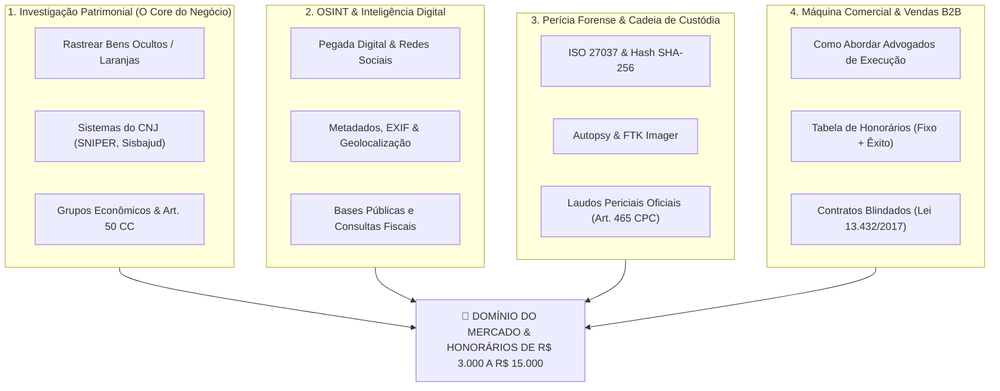

# 📚 CATÁLOGO MESTRE: TREINAMENTOS, CURSOS & ESCOLAS DE INTELIGÊNCIA PATRIMONIAL E PERÍCIA FORENSE
> **Guia Definitivo de Formação Prática para Atendimento a Advogados e Empresas**  
> **Compilado em:** 29/09/2026 | **Classificação:** Rota de Aprendizado de Alto Retorno (ROI)

---

## 🧭 MAPA ESTRATÉGICO DE CAPACITAÇÃO

---

## 🏛️ TRILHA 1: INVESTIGAÇÃO PATRIMONIAL & RASTREAMENTO DE BENS
*Esses cursos ensinam exatamente o que o advogado de execução e cobrança precisa: achar carros, cotas empresariais, imóveis e contas escondidas em nome de laranjas.*

| Curso / Treinamento | Instrutor / Instituição | Plataforma | Foco Principal | Custo Médio |
| :--- | :--- | :---: | :--- | :---: |
| **Guia Prático de Investigação Patrimonial** | Prof. Gustavo Cavalcanti | Hotmart | O método mais elogiado por advogados de execução para achar bens de devedores sem depender de decisões judiciais lentas. | Médio (Excelente ROI) |
| **Inteligência Financeira & Investigação Patrimonial** | Marcelo Montalvão | Montax Inteligência | Técnicas de inteligência e busca de ativos no Brasil e exterior de uma das maiores agências do RJ. | Médio / Alto |
| **Curso Prático de SNIPER (CNJ)** | Especialistas em Recuperação de Ativos | Hotmart | Treinamento sobre a ferramenta oficial do CNJ para cruzar dados patrimoniais e vínculos societários. | Acessível |
| **Execução sem Trégua** | Prof. Fabiano Coelho | Trabalho Notável / Hotmart | Estratégias judiciais e práticas para advogados cíveis e trabalhistas receberem dívidas consideradas "perdidas". | Médio |
| **Investigação Patrimonial para Execução Judicial** | Equipe Lexverse | Lexverse Academy | Coleta de dados, blindagem patrimonial, empresas de fachada e estruturação probatória. | Acessível |
| **Investigação de Fraudes e Ocultação de Bens** | IPEBJ / IBRAFP | Instituto de Perícia | Focado em laudos periciais de desconsideração da personalidade jurídica. | Médio |

---

## 🕵️‍♂️ TRILHA 2: OSINT (INTELIGÊNCIA EM FONTES ABERTAS) & BUSCA AVANÇADA
*Aprenda a mapear e-mails, telefones, redes sociais, viagens, fotos e metadados com ferramentas de investigação pública.*

| Curso / Treinamento | Instrutor / Instituição | Plataforma | Foco Principal | Custo Médio |
| :--- | :--- | :---: | :--- | :---: |
| **Formação OSINT & Investigação Cibernética** | Lucas Antunes | Foco em SEC | **Você já tem materiais desse curso no seu PC!** Foco em engenharia social, People OSINT e rastreamento de golpistas. | **Já possui no acervo** |
| **Curso Completo Avançado de OSINT** | Rogério Souza | OSINT Brasil / Hotmart | Metodologia organizada de busca em fontes públicas, scraping e cruzamento de bases. | Acessível |
| **OSINT COMPLETO – Inteligência de Fontes Abertas** | Especialistas em Threat Intelligence | Hotmart | Google Dorks, Maltego, metadados, rastreamento de telefones e segurança operacional (OPSEC). | Acessível |
| **Formação em OSINT e Inteligência de Ameaças** | Renan Cavalheiro | Academia Forense Digital (AFD) | O curso mais técnico e aprofundado do Brasil, com foco pericial e corporativo. | Médio |
| **OSINT: Investigação em Fontes Abertas** | Instrutores Verificados | Udemy | Fundamentos de ferramentas gratuitas (Sherlock, Ghunt, Spiderfoot, ExifTool). | **Econômico (R$ 27 a R$ 39)** |
| **Open Source Intelligence Fundamentals** | Trace Labs | Plataforma Global | Treinamento internacional de busca de pessoas desaparecidas e alvos digitais. | Acessível / Gratuito |

---

## 💻 TRILHA 3: COMPUTAÇÃO FORENSE, PERÍCIA JUDICIAL & CADEIA DE CUSTÓDIA
*Como extrair dados de computadores, celulares e e-mails garantindo validade perante o juiz (ISO 27037 / Hash SHA-256).*

| Curso / Treinamento | Instrutor / Instituição | Plataforma | Foco Principal | Custo Médio |
| :--- | :--- | :---: | :--- | :---: |
| **Computação Forense e Perícia Judicial na Prática** | Prof. Deivison Pinheiro | Udemy | Uso prático de Autopsy, FTK Imager, coleta de evidências e redação de laudos periciais. | **Econômico (R$ 29 a R$ 39)** |
| **Trilha de Forense Digital & Resposta a Incidentes** | Equipe AFD | Academia Forense Digital | Formação de peritos forenses para celulares, servidores, e-mails forjados e malwares. | Médio / Alto |
| **Curso Oficial de Cadeia de Custódia (ISO 27037)** | Governo Federal / Enap | EV.G (Escola Virtual Gov) | Como preservar provas digitais sem que o réu anule no processo. Emite certificado oficial. | **100% GRATUITO** |
| **Perícia Forense Digital: Do Zero ao Laudo** | Marcelo Silva | Udemy | Reconstituição de linha do tempo em máquinas onde houve desvio ou exclusão de arquivos. | **Econômico (R$ 29 a R$ 39)** |
| **Formação de Perito Assistente Técnico Judicial** | Ciberperícia | Plataforma Própria | Procedimentos do Código de Processo Civil (Arts. 159 e 465) para atuar como perito das partes. | Médio |

---

## 🪙 TRILHA 4: RASTREAMENTO DE CRIPTOATIVOS (BLOCKCHAIN FORENSICS)
*Quando o devedor ou golpista diz que não tem dinheiro, mas converteu o patrimônio em Bitcoin ou USDT.*

| Curso / Treinamento | Instrutor / Instituição | Plataforma | Foco Principal | Custo Médio |
| :--- | :--- | :---: | :--- | :---: |
| **Investigação de Fraudes com Criptoativos** | Academia Forense Digital (AFD) | AFD | Rastreamento de carteiras públicas, cruzamento com exchanges centralizadas (Binance) e pedidos judiciais de ofício. | Médio |
| **Blockchain Forensics & Rastreamento Cripto** | Instrutores de Cyber | Udemy | Análise de exploradores de bloco (Etherscan, Tronscan, Blockchain.com) e clusters de transações. | **Econômico (R$ 29 a R$ 39)** |
| **Criptomoedas e Crimes Financeiros** | Escola Superior do Ministério Público | Portal Aberto / YouTube | Aulas abertas sobre como promotores e peritos identificam lavagem de dinheiro com cripto. | **100% GRATUITO** |

---

## 🎯 TRILHA 5: A MÁQUINA COMERCIAL & VENDAS PARA ADVOGADOS (COMO COBRAR)
*Aprenda a fechar contratos de R$ 2.500 a R$ 10.000 com advogados e empresas.*

| Módulo Prático | O Que Você Aprende | Onde Estudar |
| :--- | :--- | :--- |
| **Precificação de Dossiês Patrimoniais** | Como cobrar **R$ 2.500 fixos de entrada + 5% a 10% de taxa de êxito** sobre os valores recuperados pelo cliente. | [PLAYBOOK_MONETIZACAO_INVESTIGACAO_DIGITAL.md](file:///c:/Users/mathe/Desktop/computacao/PLAYBOOK_MONETIZACAO_INVESTIGACAO_DIGITAL.md) |
| **Outbound Consultivo via WhatsApp** | Como abordar o advogado sem parecer vendedor chato, oferecendo um caso teste de cortesia. | [scripts/minerador_e_prospector_advogados.py](file:///c:/Users/mathe/Desktop/computacao/scripts/minerador_e_prospector_advogados.py) |
| **Contrato Blindado da Lei 13.432/2017** | As cláusulas obrigatórias de sigilo, honorários e escopo da investigação privada para proteger você legalmente. | Modelo incluso em [AGENCIA_INTELIGENCIA_FORENSE/](file:///c:/Users/mathe/Desktop/computacao/AGENCIA_INTELIGENCIA_FORENSE) |

---

## 📖 LIVROS OBRIGATÓRIOS (A BÍBLIA DO INVESTIGADOR)

1. **Open Source Intelligence Techniques (Michael Bazzell):** Considerado o livro número 1 do mundo em técnicas de OSINT por agentes do FBI e investigadores privados.
2. **Manual de Investigação Patrimonial (Gustavo Cavalcanti):** O melhor livro em português sobre como achar bens de devedores no Brasil.
3. **Tratado de Computação Forense (Jesus & D'Aurea):** Livro de referência da perícia criminal e digital brasileira.
4. **Inteligência Financeira e Recuperação de Ativos (Montax):** Guia prático de investigação de fraudes societárias.

---
*Documento compilado para o plano de formação da Consultoria de Inteligência Digital.*
