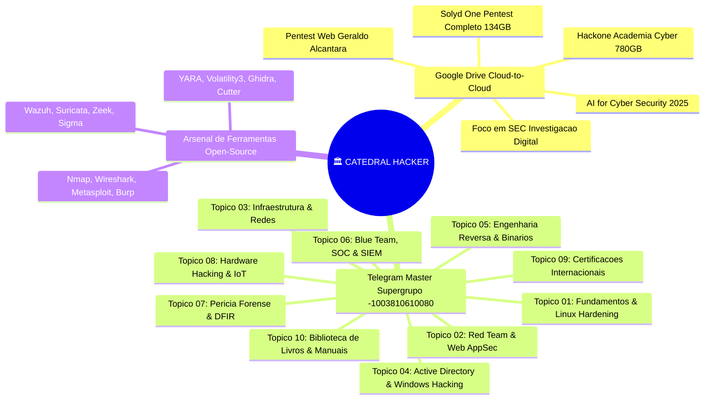

# 🏛️ CATEDRAL HACKER: Mega-Ecossistema de Cibersegurança, Pentest & Defesa (Telegram & Drive)

> **Centro de Comando Supremo de Cibersegurança & Hacking Ético**  
> **Repositório Oficial:** `matheusbarbosatech/computacao`  
> **Catedral Master no Telegram:** `🏛️ ACERVO MASTER — CIBERSEGURANÇA & DEVOPS` (ID: `-1003810610080`)  
> **Acervo Clonado no Google Drive:** `meudrive:MEU_ACERVO_CLONADO/`

---

## 🧭 Visão Geral do Ecossistema



---

## ☁️ 1. Acervo Google Drive (Clonagem Cloud-to-Cloud em Andamento)

| Acervo / Pasta | Conteúdo & Especialidade | Tamanho / Arquivos | Destino no seu Drive |
| :--- | :--- | :---: | :--- |
| **Solyd One — Formação Pentest** | 37 Módulos do Zero ao Avançado (Linux, Python, Redes, Web, Wi-Fi, Android, Cloud, Hardware, EDR Bypass, CTF) | **134.6 GB**<br>(534 itens) | `meudrive:MEU_ACERVO_CLONADO/SOLYD_ONE_FORMACAO_PENTEST_COMPLETA` |
| **Hackone — Academia Cyber** | 4 Trilhas Completas: Cibersegurança, Cloud Computing, Mikrotik e Redes de Computadores | **780.3 GB**<br>(4.048 itens) | `meudrive:MEU_ACERVO_CLONADO/HACKONE_ACADEMIA_CYBER_COMPLETA` |
| **Foco em SEC — 4 Pilares** | Cibersegurança Prática, Inteligência de Ameaças, Investigação Digital e Perícia Forense | **Formação Completa** | `meudrive:MEU_ACERVO_CLONADO/FOCO_EM_SEC_INVESTIGACAO_DIGITAL` |
| **Pentest Web Profissional** | Do Reconhecimento ao Relatório Executivo (Geraldo Alcântara) | **Curso Completo** | `meudrive:MEU_ACERVO_CLONADO/PENTEST_WEB_PROFISSIONAL_GERALDO_ALCANTARA` |
| **AI for Cyber Security 2025** | Inteligência Artificial Generativa, ChatGPT e Automações para Pentest e Blue Team | **Especialização** | `meudrive:MEU_ACERVO_CLONADO/AI_FOR_CYBER_SECURITY` |

---

## 📡 2. Mapa dos 10 Tópicos Estruturados na Catedral do Telegram (ID: `-1003810610080`)

A **Catedral Hacker** no Telegram funciona em **Modo Fórum**, com 10 tópicos atômicos para estudo e consulta rápida:

### 🧵 Tópico 01: Fundamentos, Linux para Pentesters & Terminal
* **Foco:** Comandos de terminal, scripts em Bash/Shell, automação em Python, gerenciamento de permissões e hardening de servidores Linux.
* **Cursos & Livros:** Linux Bible, Dominando o Linux para Pentesters, Shell Script Profissional.

### 🧵 Tópico 02: Red Team, Web AppSec & OWASP Top 10
* **Foco:** Injeção SQL (SQLi), Cross-Site Scripting (XSS), SSRF, IDOR, Broken Authentication, APIs REST e GraphQL.
* **Cursos & Livros:** Web Application Hacker's Handbook, Pentest Web Profissional, Solyd Web Pentest.

### 🧵 Tópico 03: Infraestrutura, Redes & Ataques em Protocolos
* **Foco:** TCP/IP profundo, modelo OSI, ARP Spoofing, DNS Hijacking, Wi-Fi 802.11 (WPA2/WPA3), DoS/DDoS e scans com Nmap.
* **Cursos & Livros:** TCP/IP Illustrated, Wireshark Network Analysis, Redes de Computadores (Tanenbaum).

### 🧵 Tópico 04: Active Directory & Pentest Corporativo Windows
* **Foco:** Pass-the-Hash, Kerberoasting, Golden/Silver Tickets, BloodHound, enumeração com Impacket e PowerShell para Pentesters.
* **Cursos & Livros:** Sektor7 Red Team Operator, Active Directory Attack & Defense.

### 🧵 Tópico 05: Engenharia Reversa, Binários & Desenvolvimento de Malware
* **Foco:** Assembly x86/x64, desmontagem de executáveis no Ghidra/IDA Pro, evasão de antivírus (AV/EDR), shellcodes e hooking.
* **Cursos & Livros:** Practical Malware Analysis, Mente Binária - Engenharia Reversa, The Rootkit Arsenal.

### 🧵 Tópico 06: Blue Team, SOC, SIEM & Detecção de Intrusão
* **Foco:** Operação de SOC N1/N2, regras Sigma, Wazuh XDR, Suricata/Snort, análise de tráfego com Zeek e Threat Hunting.
* **Cursos & Livros:** Applied Network Security Monitoring, Blue Team Field Manual (BTFM), SOC Analyst Guide.

### 🧵 Tópico 07: Perícia Forense Digital & Resposta a Incidentes (DFIR)
* **Foco:** Análise forense de memória RAM (Volatility 3), artefatos do Windows (Prefetch, Shimcache, Registro), extração de discos (Autopsy).
* **Cursos & Livros:** The Art of Memory Forensics, Incident Response & Computer Forensics, Foco em SEC.

### 🧵 Tópico 08: Hardware Hacking, IoT & Rádio-Frequência (RF)
* **Foco:** Clonagem RFID/NFC (Proxmark3), BadUSB (Rubber Ducky), barramentos UART/JTAG/SPI, rádio definido por software (SDR) e firmware hacking.
* **Cursos & Livros:** The Hardware Hacker (bunnie), Practical IoT Hacking, Hackeando Chips & Side Channel.

### 🧵 Tópico 09: Certificações Internacionais & Carreira Global
* **Foco:** Roteiros e simulados para CompTIA Security+, CompTIA Pentest+, CEH (Certified Ethical Hacker), OSCP, CISSP e CC (ISC2).
* **Cursos & Livros:** CEH v11/v12 Official Guides, Dion Training Pentest+, CompTIA Security+ All-in-One.

### 🧵 Tópico 10: Biblioteca Mestre de Livros, Manuais & CheatSheets
* **Foco:** O acervo definitivo com mais de 250 livros em PDF e EPUB de editoras de renome (No Starch Press, O'Reilly, Packt, Sybex).

---

## 🌐 3. Varredura e Diretório de Canais & Grupos de Hacking (BR & Global)

Abaixo está o radar dos canais e comunidades mais respeitados no Telegram para estudos, laboratórios de CTF e ferramentas de segurança:

### 🇧🇷 Canais e Comunidades no Brasil (Língua Portuguesa):
1. **Mente Binária:** Referência nacional em Engenharia Reversa, Análise de Binários e C/Assembly.
2. **HackerSec Brasil:** Notícias de segurança, dicas de Pentest e alertas de vulnerabilidades.
3. **Guia do Hacker / CyberSecurity BR:** Tutoriais práticos de ferramentas (Kali Linux, Parrot, Nmap).
4. **Foco em SEC & Perícia Digital:** Conteúdo de investigação forense, cadeia de custódia e OSINT.
5. **Comunidade Solyd / Hackone:** Discussões de alunos sobre laboratórios e certificações.
6. **Desec Security Community:** Trilha de Pentest Profissional (DCPT) e invasão de redes.
7. **Brasil CTF & Hackers Éticos:** Desafios de Capture The Flag, write-ups e engenharia reversa.

### 🌎 Canais & Comunidades Internacionais (Global / Inglês):
1. **The Hacker News (THN):** O maior portal de notícias de Zero-Days, vazamentos e ciberataques do mundo.
2. **Offensive Security Community:** Discussões de labs do Kali Linux, Proving Grounds e OSCP.
3. **OWASP Official Community:** Boas práticas de segurança em aplicações web e atualizações do Top 10.
4. **BleepingComputer News:** Alertas em tempo real sobre campanhas globais de ransomware e malwares.
5. **Reverse Engineering & Exploit Dev:** Fórum técnico de análise de assembly, buffer overflow e bypass de EDR.
6. **Bug Bounty World & HackerOne Community:** Dicas de caça a bugs, relatórios públicos e metodologias de reconhecimento.
7. **OSINT Framework & Investigation Tools:** Técnicas de investigação de fontes abertas e geolocalização.
8. **Cyber Security Books & PDF Library:** Repositórios de manuais, cheatsheets e e-books internacionais.

---

## 🛠️ 4. Arsenal de Ferramentas Essenciais Catalogadas

```
╔══════════════════════════════════════════════════════════════════════════════╗
║                    ARSENAL HACKER & BLUE TEAM CLASSIFICADO                   ║
╠══════════════════════════════════════════════════════════════════════════════╣
║ 🎯 RECON & OSINT:       Nmap, Subfinder, Amass, Shodan CLI, TheHarvester    ║
║ 💥 WEB PENTEST:         Burp Suite, OWASP ZAP, SQLMap, FFUF, Nuclei, Nikto   ║
║ 🌐 REDES & MITM:        Wireshark, Bettercap, Scapy, Aircrack-ng, Responder  ║
║ 🔑 SENHAS & CRIPTO:     John the Ripper, Hashcat, Hydra, JWT_Tool, CyberChef ║
║ 🏢 ACTIVE DIRECTORY:    BloodHound, Impacket, CrackMapExec, Mimikatz, Rubeus ║
║ 🔬 ENGENHARIA REVERSA:  Ghidra, IDA Free, Cutter, x64dbg, Radare2, GDB-Peda ║
║ 🛡️ BLUE TEAM & SOC:     Wazuh, Suricata, Zeek, Sigma Rules, Velociraptor     ║
║ 🔍 FORENSE DIGITAL:     Autopsy, Volatility 3, FTK Imager, RegRipper, YARA   ║
╚══════════════════════════════════════════════════════════════════════════════╝
```

---

## 🚀 5. Ações Práticas Disponíveis Agora

1. **Acompanhar a Cópia do Drive:** Veja o arquivo de log [clonagem_hackone.log](file:///c:/Users/matheus/Desktop/computacao/clonagem_hackone.log) e [clonagem_solyd_one.log](file:///c:/Users/matheus/Desktop/computacao/clonagem_solyd_one.log).
2. **Rodar a Varredura do Telegram:** Execute [VARREDURA_INGLES_E_CYBER.bat](file:///c:/Users/matheus/Desktop/computacao/VARREDURA_INGLES_E_CYBER.bat) ou o novo script de varredura hacker.
3. **Treinar no Mini-SOC Local:** Execute [EXECUTAR_PROJETO_PRATICO_HOJE.bat](file:///c:/Users/matheus/Desktop/computacao/EXECUTAR_PROJETO_PRATICO_HOJE.bat) para abrir o painel em `http://localhost:9090`.
