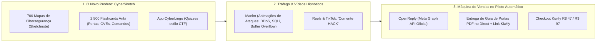

# 🛡️ CyberSketch Academy: Guia Mestre dos 100 Melhores Repositórios Open-Source de Cibersegurança do GitHub

Este guia fundamenta a **pivotagem oficial do projeto para Cibersegurança e Hacking Ético**. 

O mercado de tecnologia está saturado de cursos genéricos de programação, mas **cibersegurança é um oceano azul com demanda global desesperada e quase ZERO concorrentes produzindo material visual e didático de alto nível**.

Aqui estão os **100 maiores e mais respeitados repositórios open-source de segurança do GitHub**, organizados do **zero absoluto (didática, fundamentos e roadmaps)** até as **ferramentas de produção de Red Team, Blue Team, Forense e Análise de Malware**.

---

## 🧭 Tier 1: Do Zero Absoluto — Roadmaps, CheatSheets & Fundamentos (#1 ao #20)

| # | Repositório | Estrelas | Foco Principal | Como aplicar no CyberSketch |
| :-: | :--- | :--- | :--- | :--- |
| **1** | [swisskyrepo/PayloadsAllTheThings](https://github.com/swisskyrepo/PayloadsAllTheThings) | ~65k ★ | O maior guia prático do mundo de payloads e bypass para todas as falhas web e de infra. | **Bíblia dos Mapas de Ataque:** Fonte direta para mapear passo a passo como cada vulnerabilidade (SQLi, XSS, SSRF, RCE) é explorada. |
| **2** | [danielmiessler/SecLists](https://github.com/danielmiessler/SecLists) | ~60k ★ | Coleção definitiva de wordlists para fuzzing de segurança, nomes de usuário, senhas e URLs. | Mapear como funcionam ataques de força bruta e dicionário nos mapas mentais de autenticação. |
| **3** | [OWASP/CheatSheetSeries](https://github.com/OWASP/CheatSheetSeries) | ~30k ★ | Guias oficiais e condensados da OWASP ensinando como defender e proteger aplicações. | **Base da Trilha Blue Team:** Transforma os guias de boas práticas defensivas em cards atômicos de prevenção. |
| **4** | [sbilly/awesome-security](https://github.com/sbilly/awesome-security) | ~35k ★ | A curadoria de referência mundial de softwares, bibliotecas e recursos de segurança da informação. | Checklist mestre para organizar os 700 mapas mentais em módulos práticos. |
| **5** | [trimstray/the-book-of-secret-knowledge](https://github.com/trimstray/the-book-of-secret-knowledge) | ~245k ★ | Cheatsheets rápidos, one-liners de terminal, análise de tráfego e comandos de rede. | **Roteiros para Vídeos Curtos:** Dicas rápidas de 30 segundos no terminal para postar no Reels e TikTok. |
| **6** | [enaqx/awesome-pentest](https://github.com/enaqx/awesome-pentest) | ~23k ★ | Coleção curada das melhores ferramentas de teste de invasão (pentest) do mundo. | Mapa mental da esteira completa de um Pentest (Reconhecimento ➔ Varredura ➔ Exploração ➔ Pós-exploração). |
| **7** | [mytechnotalent/Reverse-Engineering-Tutorial](https://github.com/mytechnotalent/Reverse-Engineering-Tutorial) | ~11k ★ | Tutorial completo do zero ao avançado de Engenharia Reversa em x86/x64 e Assembly. | Mapas mentais que desmistificam registradores da CPU (`EAX`, `EBX`, `ESP`, `EBP`) e leitura de memória. |
| **8** | [RfidResearchGroup/proxmark3](https://github.com/RfidResearchGroup/proxmark3) | ~6k ★ | A ferramenta open-source líder em clonagem e auditoria de RFID, NFC e cartões de acesso. | Mapas da Escola de Hardware Hacking e Segurança Física. |
| **9** | [vitalysim/Awesome-Hacking-Resources](https://github.com/vitalysim/Awesome-Hacking-Resources) | ~15k ★ | Guia de estudos para iniciantes com livros, vídeos, cursos e plataformas de CTF. | Estruturação da trilha "Do Zero Absoluto ao Primeiro Hack Ético". |
| **10** | [ashishb/android-security-awesome](https://github.com/ashishb/android-security-awesome) | ~11k ★ | Tudo sobre análise de segurança, engenharia reversa e pentest de aplicativos Android. | Módulo exclusivo de Mobile AppSec nos mapas mentais. |
| **11** | [carpedm20/awesome-hacking](https://github.com/carpedm20/awesome-hacking) | ~65k ★ | Repositório abrangente com links para tutoriais e ferramentas de segurança ofensiva. | Referência para enriquecer as notas de rodapé e materiais complementares. |
| **12** | [onethinx/awesome-iot-security](https://github.com/onethinx/awesome-iot-security) | ~3k ★ | Guias de invasão e proteção de dispositivos inteligentes, câmeras e IoT. | Conteúdo para mapas sobre vulnerabilidades em roteadores e dispositivos domésticos. |
| **13** | [apsdehal/awesome-ctf](https://github.com/apsdehal/awesome-ctf) | ~9k ★ | Guia completo de ferramentas para resolver desafios de CTF (Capture The Flag). | **Alimentar o Duolingo de Cibersegurança:** Cada desafio de CTF vira uma fase ou quiz do jogo. |
| **14** | [paragonie/awesome-appsec](https://github.com/paragonie/awesome-appsec) | ~5k ★ | Melhores recursos para desenvolvedores aprenderem a criar código seguro (Secure Coding). | Mapas que ensinam programadores a não criarem vulnerabilidades básicas. |
| **15** | [Freedomofpress/securedrop](https://github.com/freedomofpress/securedrop) | ~4k ★ | Sistema de envio anônimo e seguro de informações mantido por ativistas e jornalistas. | Estudo de caso real de arquitetura criptográfica avançada e anonimato. |
| **16** | [gophish/gophish](https://github.com/gophish/gophish) | ~12k ★ | Plataforma open-source oficial para simulação controlada de campanhas de phishing. | Mapas mentais ensinando como empresas treinam seus funcionários contra golpes. |
| **17** | [infosecnirvana/Awesome-SOC](https://github.com/infosecnirvana/Awesome-SOC) | ~3k ★ | Ferramentas, métricas e arquitetura para montagem de um SOC (Security Operations Center). | Módulo profissional focado na carreira de Analista de SOC N1/N2. |
| **18** | [bkerler/edl](https://github.com/bkerler/edl) | ~3k ★ | Ferramenta para interagir com o modo Qualcomm Emergency Download (EDL) em chips de celular. | Mapas avançados de baixo nível e segurança de firmware. |
| **19** | [qazbnm456/awesome-cve-poc](https://github.com/qazbnm456/awesome-cve-poc) | ~9k ★ | Provas de conceito (PoC) históricas de vulnerabilidades críticas documentadas (CVEs). | Demonstrações práticas de exploits históricos para explicar a falha no código. |
| **20** | [Offensive-Security/exploitdb](https://github.com/offensive-security/exploitdb) | ~9k ★ | O arquivo oficial mantido pela criadora do Kali Linux com milhares de exploits públicos. | Como pesquisar e auditar se um sistema possui vulnerabilidades públicas conhecidas. |

---

## ⚔️ Tier 2: Segurança Ofensiva, Pentest & Red Team (#21 ao #40)

| # | Repositório | Estrelas | Foco Principal | Como aplicar no CyberSketch |
| :-: | :--- | :--- | :--- | :--- |
| **21** | [nmap/nmap](https://github.com/nmap/nmap) | ~11k ★ | O scanner de redes, portas e detecção de serviços mais consagrado do mundo. | **Mapa Obrigatório:** Anatomia de um pacote TCP SYN vs Connect, portas bem conhecidas e flags do Nmap. |
| **22** | [rapid7/metasploit-framework](https://github.com/rapid7/metasploit-framework) | ~35k ★ | A mais famosa suíte de testes de penetração e execução de payloads do mundo. | Diagramas de arquitetura de payloads (Staged vs Stageless, Reverse Shell vs Bind Shell). |
| **23** | [sqlmapproject/sqlmap](https://github.com/sqlmapproject/sqlmap) | ~34k ★ | Ferramenta de detecção e exploração automatizada de falhas de SQL Injection (SQLi). | Mapas visuais ensinando os tipos de SQLi (In-band, Error-based, Blind, Time-based). |
| **24** | [vanhauser-thc/thc-hydra](https://github.com/vanhauser-thc/thc-hydra) | ~11k ★ | O mais rápido quebrador de logins e autenticações de rede (SSH, FTP, HTTP, RDP). | Mapas sobre segurança de senhas, autenticação multifator (MFA) e limites de tentativa. |
| **25** | [openwall/john](https://github.com/openwall/john) | ~10k ★ | "John the Ripper": o decodificador e cracker de hashes de senhas mais lendário. | Mapas explicando a matemática de Criptografia: MD5, SHA-256, Bcrypt, Salting e Rainbow Tables. |
| **26** | [aircrack-ng/aircrack-ng](https://github.com/aircrack-ng/aircrack-ng) | ~6k ★ | Conjunto completo de ferramentas para auditoria e teste de segurança em redes Wi-Fi. | Mapas conceituais sobre o Handshake WPA2/WPA3 de 4 vias (4-way handshake) e desautenticação. |
| **27** | [commixproject/commix](https://github.com/commixproject/commix) | ~5k ★ | Ferramenta automatizada para exploração de falhas de Injeção de Comandos de Sistema Operacional. | Como comandos concatenados no backend abrem brechas de RCE (Remote Code Execution). |
| **28** | [fortra/impacket](https://github.com/fortra/impacket) | ~16k ★ | Biblioteca Python essencial para trabalhar com protocolos de rede de baixo nível do Windows (SMB, Kerberos). | O mapa definitivo de **Active Directory Hacking**: Pass-the-Hash, Kerberoasting e Golden Ticket. |
| **29** | [SpecterOps/BloodHound](https://github.com/SpecterOps/BloodHound) | ~10k ★ | Usa teoria dos grafos para mapear caminhos ocultos de escalonamento de privilégios no Active Directory. | Conecta o estudo de Algoritmos em Grafos aos ataques de redes corporativas. |
| **30** | [lgandx/Responder](https://github.com/lgandx/Responder) | ~6k ★ | Ferramenta de envenenamento de LLMNR, NBT-NS e mDNS para captura de hashes em redes locais. | Mapas mentais sobre ataques de Man-in-the-Middle (MITM) na rede local. |
| **31** | [ffuf/ffuf](https://github.com/ffuf/ffuf) | ~14k ★ | O fuzzer web mais rápido do mundo escrito em Go para descobrir pastas e arquivos ocultos. | Como fazer o reconhecimento de superfícies de ataque em aplicações web. |
| **32** | [aboul3la/Sublist3r](https://github.com/aboul3la/Sublist3r) | ~9k ★ | Ferramenta em Python para enumerar subdomínios usando motores de busca. | Mapas do estágio de Reconhecimento e Coleta de Informações (Recon). |
| **33** | [lanmaster53/recon-ng](https://github.com/lanmaster53/recon-ng) | ~5k ★ | Framework completo em Python para reconhecimento e OSINT web. | Como investigar informações públicas de uma organização antes do teste de invasão. |
| **34** | [sullo/nikto](https://github.com/sullo/nikto) | ~8k ★ | Scanner de servidores web que examina arquivos perigosos, CGIs e softwares desatualizados. | Auditoria de cabeçalhos de segurança HTTP (CSP, HSTS, X-Frame-Options). |
| **35** | [Bettercap/bettercap](https://github.com/bettercap/bettercap) | ~15k ★ | A ferramenta moderna e completa para ataques e auditorias de rede local, BLE e Wi-Fi. | Mapas sobre ARP Spoofing e interceptação de pacotes de dados. |
| **36** | [robertdavidgraham/masscan](https://github.com/robertdavidgraham/masscan) | ~25k ★ | O scanner de portas TCP mais rápido do mundo, capaz de escanear toda a internet em 6 minutos. | Como a transmissão assíncrona de pacotes SYN permite velocidades extremas de rede. |
| **37** | [byt3bl33d3r/CrackMapExec](https://github.com/byt3bl33d3r/CrackMapExec) | ~8k ★ | O canivete suíço de pentest em ambientes corporativos Windows/Active Directory. | Automação de movimento lateral em redes corporativas. |
| **38** | [rustscan/rustscan](https://github.com/rustscan/rustscan) | ~13k ★ | Scanner de portas ultra-rápido moderno escrito em Rust que se integra ao Nmap. | Mapas sobre a nova geração de ferramentas de segurança desenvolvidas em Rust. |
| **39** | [projectdiscovery/nuclei](https://github.com/projectdiscovery/nuclei) | ~22k ★ | Motor moderno de varredura de vulnerabilidades baseado em templates YAML simples. | Como criar testes automatizados de segurança para sistemas e APIs. |
| **40** | [projectdiscovery/subfinder](https://github.com/projectdiscovery/subfinder) | ~12k ★ | A ferramenta mais rápida e modular de descoberta de subdomínios da atualidade. | Pipeline de reconhecimento automatizado de ativos corporativos. |

---

## 🛡️ Tier 3: Defesa, Blue Team, SOC & Monitoramento (#41 ao #60)

| # | Repositório | Estrelas | Foco Principal | Como aplicar no CyberSketch |
| :-: | :--- | :--- | :--- | :--- |
| **41** | [wazuh/wazuh](https://github.com/wazuh/wazuh) | ~14k ★ | A plataforma open-source líder mundial para XDR, SIEM e monitoramento de segurança de servidores. | **O Coração do Blue Team:** Mapa de como um SIEM coleta logs, detecta invasores e responde a ameaças. |
| **42** | [OISF/suricata](https://github.com/OISF/suricata) | ~5k ★ | Motor de altíssimo desempenho para IDS (Detecção de Intrusão) e IPS (Prevenção) de rede. | Mapas explicando a diferença entre IDS, IPS e Firewall de borda. |
| **43** | [zeek/zeek](https://github.com/zeek/zeek) | ~5k ★ | O mais respeitado analisador e monitor de tráfego de rede para segurança e forense. | Como ler e interpretar o comportamento anômalo de conexões DNS, TLS e HTTP. |
| **44** | [snort3/snort3](https://github.com/snort3/snort3) | ~2k ★ | O software pioneiro de regras de detecção de invasão mantido pela Cisco Talos. | Como escrever regras de detecção de invasão (Snort Rules) para bloquear exploits. |
| **45** | [osquery/osquery](https://github.com/osquery/osquery) | ~22k ★ | Transforma o sistema operacional em um banco de dados SQL para auditar processos e arquivos. | Mapas ensinando a consultar processos suspeitos no Windows/Linux usando comandos SQL simples. |
| **46** | [MISP/MISP](https://github.com/MISP/MISP) | ~6k ★ | Plataforma open-source líder mundial para compartilhamento de Inteligência de Ameaças (Threat Intel). | Como empresas globais compartilham Indicadores de Comprometimento (IoCs). |
| **47** | [VirusTotal/yara](https://github.com/VirusTotal/yara) | ~16k ★ | A ferramenta padrão da indústria para identificar e classificar amostras de malware por assinaturas. | Como criar regras YARA para caçar arquivos maliciosos em discos rígidos. |
| **48** | [Velocidex/velociraptor](https://github.com/Velocidex/velociraptor) | ~5k ★ | Ferramenta avançada para caça a ameaças (Threat Hunting) e resposta rápida a incidentes de segurança. | Fluxograma de resposta a incidentes: da contenção da máquina infectada até o relatório forense. |
| **49** | [security-onion-solutions/securityonion](https://github.com/security-onion-solutions/securityonion) | ~4k ★ | Distribuição Linux completa e integrada para caça a ameaças, monitoramento e análise de logs de SOC. | Arquitetura visual de um laboratório completo de defesa cibernética. |
| **50** | [sleuthkit/autopsy](https://github.com/sleuthkit/autopsy) | ~5k ★ | A plataforma de computação forense digital mais utilizada por peritos criminais e policiais. | **Forense Digital:** Como recuperar arquivos apagados, examinar histórico de navegadores e extrair metadados. |
| **51** | [volatilityfoundation/volatility3](https://github.com/volatilityfoundation/volatility3) | ~4k ★ | A estrutura padrão de mercado para extração e análise de artefatos de memória RAM volátil. | Mapa mental de Forense de Memória: caçar malwares que rodam 100% injetados na RAM sem tocar o disco. |
| **52** | [TheHive-Project/TheHive](https://github.com/TheHive-Project/TheHive) | ~4k ★ | Plataforma de resposta e orquestração de incidentes de segurança para equipes de SOC e CSIRT. | Gestão de crises cibernéticas e mitigação de vazamento de dados corporativos. |
| **53** | [stamparm/maltrail](https://github.com/stamparm/maltrail) | ~6k ★ | Sistema leve de detecção de tráfego malicioso e servidores de Comando e Controle (C2). | Mapas ensinando como redes zumbis (Botnets) recebem ordens de servidores externos. |
| **54** | [SigmaHQ/sigma](https://github.com/SigmaHQ/sigma) | ~9k ★ | Formato universal de regras de detecção de ameaças aplicável a qualquer SIEM (Splunk, Elastic, QRadar). | O "idioma universal" dos analistas de SOC para detectar comportamentos hackers. |
| **55** | [elastic/elasticsearch](https://github.com/elastic/elasticsearch) | ~70k ★ | O motor de busca e indexação que serve de base para o SIEM da Elastic. | Como centralizar milhões de logs de servidores e pesquisar ataques em milissegundos. |
| **56** | [opnsense/core](https://github.com/opnsense/core) | ~5k ★ | Firewall e roteador open-source com suporte a VPNs, IDS e segmentação de redes. | Mapas de Topologia de Rede Segura: DMZ, VLANs e regras de entrada e saída. |
| **57** | [pfsense/pfsense](https://github.com/pfsense/pfsense) | ~4k ★ | O mais tradicional sistema de firewall e roteamento open-source para empresas. | Como configurar túneis seguros de VPN (OpenVPN / WireGuard) e filtrar pacotes maliciosos. |
| **58** | [fail2ban/fail2ban](https://github.com/fail2ban/fail2ban) | ~9k ★ | Bloqueia automaticamente endereços IP que tentam fazer ataques de força bruta em servidores Linux. | Como automatizar a autodefesa de servidores SSH e páginas web com scripts simples. |
| **59** | [modsecurity/ModSecurity](https://github.com/modsecurity/ModSecurity) | ~6k ★ | O motor de WAF (Web Application Firewall) open-source mais consagrado da internet. | A diferença crucial entre um Firewall de Rede (Camada 3/4) e um WAF de Aplicação (Camada 7). |
| **60** | [SpiderLabs/owasp-modsecurity-crs](https://github.com/coreruleset/coreruleset) | ~3k ★ | O conjunto de regras oficial da OWASP para bloquear ataques comuns (SQLi, XSS) em servidores web. | Como proteger sites contra invasões sem precisar mexer no código-fonte da aplicação. |

---

## 🌐 Tier 4: Segurança Web, AppSec & OWASP (#61 ao #80)

| # | Repositório | Estrelas | Foco Principal | Como aplicar no CyberSketch |
| :-: | :--- | :--- | :--- | :--- |
| **61** | [OWASP/owasp-top-10](https://github.com/OWASP/owasp-top-10) | ~6k ★ | O documento mais importante do mundo de segurança web: as 10 vulnerabilidades mais críticas. | **O Módulo Central do Curso:** 10 mapas detalhados das 10 falhas clássicas (Broken Access Control, Injection, etc.). |
| **62** | [zaproxy/zaproxy](https://github.com/zaproxy/zaproxy) | ~14k ★ | OWASP ZAP: o scanner e proxy de segurança web open-source mais utilizado do planeta (o rival aberto do Burp Suite). | Como interceptar requisições HTTP, alterar parâmetros invisíveis e hackear páginas web. |
| **63** | [sullo/nikto](https://github.com/sullo/nikto) | ~8k ★ | Scanner de vulnerabilidades em servidores web (Apache, Nginx, IIS). | Varredura de configurações perigosas em servidores de produção. |
| **64** | [xmendez/wfuzz](https://github.com/xmendez/wfuzz) | ~6k ★ | Fuzzer web flexível em Python para descobrir parâmetros vulneráveis e injeções ocultas. | Como encontrar portas dos fundos em APIs e rotas secretas em sistemas web. |
| **65** | [ticarpi/jwt_tool](https://github.com/ticarpi/jwt_tool) | ~4k ★ | Suíte para testes e exploração de tokens de autenticação JWT (JSON Web Tokens). | Mapas sobre falhas de tokens de login (algoritmo "None", chaves fracas, falsificação). |
| **66** | [s0md3v/XSStrike](https://github.com/s0md3v/XSStrike) | ~15k ★ | Suíte avançada para detecção e exploração inteligente de Cross-Site Scripting (XSS). | A diferença visual entre XSS Refletido, Armazenado (Stored) e baseado em DOM. |
| **67** | [digininja/DVWA](https://github.com/digininja/DVWA) | ~9k ★ | "Damn Vulnerable Web Application": a aplicação web propositalmente vulnerável para treinar hackers. | **Ambiente Prático do Aluno:** Laboratório onde o aluno testa na prática cada conceito dos mapas mentais. |
| **68** | [WebGoat/WebGoat](https://github.com/WebGoat/WebGoat) | ~7k ★ | Aplicação deliberadamente insegura mantida pela OWASP para ensinar segurança em Java/Web. | Desafios práticos para o Duolingo de Cibersegurança. |
| **69** | [semgrep/semgrep](https://github.com/semgrep/semgrep) | ~12k ★ | Motor moderno e ultra-rápido de SAST (Static Application Security Testing) para encontrar brechas no código. | Como auditar o código-fonte antes de colocar uma aplicação no ar para evitar invasões. |
| **70** | [aquasecurity/trivy](https://github.com/aquasecurity/trivy) | ~25k ★ | O scanner de vulnerabilidades em contêineres Docker, Kubernetes e imagens de nuvem mais popular. | Mapas essenciais de **DevSecOps**: como escanear imagens Docker contra pacotes com vírus. |
| **71** | [gitleaks/gitleaks](https://github.com/gitleaks/gitleaks) | ~19k ★ | Scanner rápido que detecta senhas, tokens de API e chaves privadas vazadas em repositórios Git. | Como evitar o erro amador número 1 de programadores: subir a senha do banco no GitHub. |
| **72** | [trufflesecurity/trufflehog](https://github.com/trufflesecurity/trufflehog) | ~18k ★ | Caça chaves secretas e credenciais vazadas em commits do Git e arquivos corporativos. | Mapas ensinando boas práticas de variáveis de ambiente (`.env`) e cofres de segredos. |
| **73** | [RetireJS/retire.js](https://github.com/RetireJS/retire.js) | ~4k ★ | Detector de bibliotecas JavaScript com vulnerabilidades conhecidas em aplicações web. | Os perigos de usar pacotes NPM desatualizados no frontend. |
| **74** | [projectdiscovery/httpx](https://github.com/projectdiscovery/httpx) | ~8k ★ | Canivete suíço para fazer consultas HTTP em massa e identificar tecnologias web ativas. | Como automatizar o mapeamento de centenas de sites de uma empresa em segundos. |
| **75** | [epsylon/xsser](https://github.com/epsylon/xsser) | ~2k ★ | Framework automatizado para detecção e geração de vetores de ataque XSS. | Demonstrações de como scripts maliciosos roubam cookies de sessão de usuários. |
| **76** | [EnableSecurity/wafw00f](https://github.com/EnableSecurity/wafw00f) | ~5k ★ | Identifica qual Firewall de Aplicação Web (WAF) está protegendo um site (Cloudflare, AWS WAF, etc.). | Como identificar as defesas de um alvo antes de tentar qualquer varredura. |
| **77** | [MobSF/Mobile-Security-Framework-MobSF](https://github.com/MobSF/Mobile-Security-Framework-MobSF) | ~18k ★ | Plataforma automatizada de análise estática e dinâmica para segurança de apps Android e iOS. | Como descompilar um arquivo `.apk` e encontrar falhas de segurança no código do app. |
| **78** | [OWASP/NodeGoat](https://github.com/OWASP/NodeGoat) | ~2k ★ | Ambiente propositalmente vulnerável para aprender as 10 falhas da OWASP em ambientes Node.js. | Exercícios práticos para a Escola de Desenvolvimento Backend. |
| **79** | [OWASP/WrongSecrets](https://github.com/OWASP/WrongSecrets) | ~2k ★ | Aplicação vulnerável criada para ensinar todos os jeitos errados de guardar senhas na nuvem e no código. | Como armazenar segredos com segurança em ambientes Docker e Kubernetes. |
| **80** | [RhinoSecurityLabs/pacu](https://github.com/RhinoSecurityLabs/pacu) | ~4k ★ | O framework de teste de penetração mais respeitado para ambientes em nuvem da Amazon (AWS). | **Cloud Security:** Como ocorrem invasões em contas e servidores na nuvem AWS. |

---

## 🔍 Tier 5: Engenharia Reversa, Malware, Forense & OSINT (#81 ao #100)

| # | Repositório | Estrelas | Foco Principal | Como aplicar no CyberSketch |
| :-: | :--- | :--- | :--- | :--- |
| **81** | [NationalSecurityAgency/ghidra](https://github.com/NationalSecurityAgency/ghidra) | ~55k ★ | O descompilador e framework de engenharia reversa de software da NSA (Agência de Segurança dos EUA). | **A Joia da Engenharia Reversa:** Mapas visuais ensinando como transformar binários `.exe` em código C legível. |
| **82** | [radareorg/radare2](https://github.com/radareorg/radare2) | ~21k ★ | Framework livre e portátil de engenharia reversa e análise de baixo nível por linha de comando. | Como dissecar arquivos compilados diretamente pelo terminal. |
| **83** | [x64dbg/x64dbg](https://github.com/x64dbg/x64dbg) | ~45k ★ | O mais famoso depurador (debugger) de código aberto para sistemas Windows de 32 e 64 bits. | Mapas ensinando o que são Breakpoints, Registers, Stack Traces e como quebrar proteções de software. |
| **84** | [rizinorg/cutter](https://github.com/rizinorg/cutter) | ~4k ★ | Interface gráfica moderna e amigável para o motor de engenharia reversa Rizin. | A porta de entrada mais fácil e visual para quem nunca fez engenharia reversa na vida. |
| **85** | [sherlock-project/sherlock](https://github.com/sherlock-project/sherlock) | ~60k ★ | Caça contas e pegadas digitais de um nome de usuário em mais de 400 redes sociais e sites da web. | **OSINT (Inteligência de Fontes Abertas):** Como peritos investigam criminosos digitais a partir de um apelido. |
| **86** | [laramies/theHarvester](https://github.com/laramies/theHarvester) | ~12k ★ | Coleta e-mails, nomes de funcionários, subdomínios, IPs e portas de empresas via buscas públicas. | Como funciona a primeira fase de um teste de penetração corporativo. |
| **87** | [smicallef/spiderfoot](https://github.com/smicallef/spiderfoot) | ~11k ★ | A melhor ferramenta de automação de OSINT, mapeando vulnerabilidades, domínios e redes de uma só vez. | Como criar relatórios completos de exposição de uma empresa na internet. |
| **88** | [cuckoosandbox/cuckoo](https://github.com/cuckoosandbox/cuckoo) | ~7k ★ | O sistema automatizado de análise dinâmica de malware mais clássico da história. | Como os antivírus executam vírus dentro de uma máquina virtual isolada (Sandbox) para ver o que ele faz. |
| **89** | [Gallopsled/pwntools](https://github.com/Gallopsled/pwntools) | ~12k ★ | Biblioteca Python consagrada mundialmente para desenvolvimento rápido de exploits em desafios de CTF. | Como escrever scripts em Python para automatizar a invasão de serviços de rede vulneráveis. |
| **90** | [quarkslab/lief](https://github.com/quarkslab/lief) | ~4k ★ | Biblioteca para analisar, modificar e injetar código em formatos de arquivo executável (ELF, PE, Mach-O). | Como funciona a estrutura interna de um arquivo `.exe` (Headers, Sections, Imports e Exports). |
| **91** | [hashcat/hashcat](https://github.com/hashcat/hashcat) | ~21k ★ | O mais rápido utilitário de recuperação e quebra de senhas do mundo acelerado por placa de vídeo (GPU). | Mapas ensinando a matemática das funções de hash e por que senhas de 8 caracteres não são mais seguras. |
| **92** | [mandiant/capa](https://github.com/mandiant/capa) | ~5k ★ | Ferramenta da Mandiant (Google Cloud) que identifica automaticamente o que um vírus sabe fazer (ex: gravar teclado, tirar print). | Como identificar as capacidades maliciosas de um software sem precisar ler todo o código Assembly. |
| **93** | [hugsy/gef](https://github.com/hugsy/gef) | ~7k ★ | Extensão moderna e visual para o depurador GDB do Linux voltada para pesquisadores de segurança. | Mapas ensinando como funciona o ataque de **Buffer Overflow** no Linux. |
| **94** | [google/AFLplusplus](https://github.com/AFLplusplus/AFLplusplus) | ~5k ★ | Fuzzer de última geração patrocinado pelo Google que testa programas jogando dados aleatórios para achar bugs graves. | Como o Google e grandes empresas encontram falhas críticas em navegadores e sistemas antes dos hackers. |
| **95** | [JusticeRage/Manalyze](https://github.com/JusticeRage/Manalyze) | ~2k ★ | Analisador estático para executáveis Windows que detecta códigos ofuscados e maliciosos. | Como os analistas de vírus examinam um arquivo suspeito em menos de 10 segundos. |
| **96** | [mfontanini/libtins](https://github.com/mfontanini/libtins) | ~2k ★ | Biblioteca multiplataforma de manipulação e análise de pacotes de rede de baixo nível. | Como criar sniffers e analisadores de pacotes de dados personalizados em código. |
| **97** | [skylot/jadx](https://github.com/skylot/jadx) | ~40k ★ | Descompilador que transforma arquivos de aplicativos Android (`.apk` / `.dex`) de volta em código Java puro. | **Engenharia Reversa Mobile:** Como abrir qualquer app da Play Store e ver como ele foi construído por dentro. |
| **98** | [flipperdevices/flipperzero-firmware](https://github.com/flipperdevices/flipperzero-firmware) | ~15k ★ | Firmware oficial de código aberto do Flipper Zero (a ferramenta portátil mais famosa de hardware hacking). | Mapas fascinantes sobre sinais de rádio (Sub-GHz), chaves de carro, crachás de catraca e infravermelho. |
| **99** | [trailofbits/algo](https://github.com/trailofbits/algo) | ~28k ★ | Scripts para subir seu próprio servidor de VPN pessoal e blindado na nuvem com 1 comando. | Como garantir privacidade total ao navegar em redes Wi-Fi públicas de aeroportos e cafeterias. |
| **100** | [trailofbits/manticore](https://github.com/trailofbits/manticore) | ~3k ★ | Ferramenta de análise de segurança baseada em execução simbólica para binários e contratos inteligentes (Smart Contracts / Web3). | Auditoria de segurança e prevenção de roubos em contratos de criptomoedas e blockchain. |

---

## 🚀 Como Pivotar o Ecossistema na Prática:

Este arquivo completo está salvo permanentemente no seu computador em:
* [**`GUIA_100_REPOSITORIOS_CIBERSEGURANCA.md`**](file:///c:/Users/matheus/Desktop/computacao/GUIA_100_REPOSITORIOS_CIBERSEGURANCA.md)
