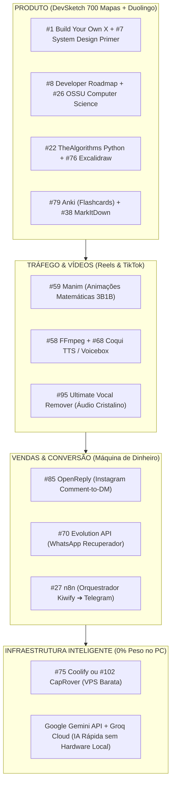

# 📚 Guia Definitivo: Os 102 Maiores Repositórios Open-Source Aplicados ao Seu Ecossistema

Este documento detalha **cada um dos 102 maiores repositórios open-source do mundo no GitHub**, organizados por categorias e adaptados cirurgicamente para o seu ecossistema: **DevSketch Academy (700 Mapas Mentais)**, **App Duolingo da Computação**, **Baralhos Atômicos do Anki**, **Motor Audiovisual de Reels/Shorts**, **Funil de Vendas com OpenReply no Instagram** e **Radar de Conteúdo Técnico**.

> 💡 **Nota de Infraestrutura de IA:** Conforme alinhado, para todos os itens relacionados a Inteligência Artificial e LLMs, **não rodaremos nada pesado localmente na sua máquina**. O processamento utilizará APIs em nuvem com camadas gratuitas (Google Gemini API e Groq LPU), consumindo **0% da CPU e 0% da GPU do seu computador**.

---

## 🏛️ Bloco 1: Fundamentos, Roadmaps & Ciência da Computação (#1 ao #20)

### 1. [codecrafters-io/build-your-own-x](https://github.com/codecrafters-io/build-your-own-x) (~548k ★)
* **O que é:** O maior compêndio do mundo ensinando a recriar do zero ferramentas reais: Git, Docker, Sistema Operacional, Banco de Dados Relacional, Compilador e Torrent.
* **Aplicação no Projeto:** **Fonte inesgotável para os Mapas de Arquitetura.** Em vez de explicar o Docker ou o Git com conceitos abstratos, extraímos o passo a passo de como eles funcionam por dentro. Cada tecnologia vira um mapa mental visual de "Como funciona o motor interno", elevando o nível técnico dos 700 mapas para padrão de Engenheiro Sênior.

### 2. [sindresorhus/awesome](https://github.com/sindresorhus/awesome) (~509k ★)
* **O que é:** O diretório mãe que padronizou a curadoria de tecnologia em toda a internet, cobrindo linguagens, frameworks, ferramentas de design e segurança.
* **Aplicação no Projeto:** **Curadoria para as 8 Escolas da DevSketch.** Usado como checklist para garantir que os tópicos dos nossos mapas cobrem 100% das ferramentas modernas exigidas pelo mercado de trabalho (evitando ensinar tecnologias obsoletas).

### 3. [public-apis/public-apis](https://github.com/public-apis/public-apis) (~482k ★)
* **O que é:** Coleção enciclopédica de APIs públicas e gratuitas (finanças, clima, esportes, criptografia, dados governamentais).
* **Aplicação no Projeto:** **Alimentar os Desafios Práticos do Duolingo.** No Web App do Duolingo, nos níveis intermediários de Backend e APIs, os desafios de código dos alunos consumirão essas APIs reais (ex: buscar cotação de moedas, clima ao vivo) sem você precisar pagar nada por servidores de dados.

### 4. [freeCodeCamp/freeCodeCamp](https://github.com/freeCodeCamp/freeCodeCamp) (~455k ★)
* **O que é:** O maior currículo gratuito de desenvolvimento web, algoritmos e banco de dados do planeta.
* **Aplicação no Projeto:** **Banco de Questões e Quizzes do Duolingo.** Mineramos os milhares de exercícios atômicos do freeCodeCamp para alimentar as fases e testes de múltipla escolha do nosso jogo, garantindo progressão didática validada internacionalmente.

### 5. [EbookFoundation/free-programming-books](https://github.com/EbookFoundation/free-programming-books) (~397k ★)
* **O que é:** Maior catálogo de livros e recursos educacionais abertos em domínio público ou Creative Commons.
* **Aplicação no Projeto:** **Acervo Legal para Bônus da Kiwify.** Permite selecionar 50 e-books clássicos e totalmente legais para empacotar como "Super Bônus de Biblioteca Digital" na Landing Page, aumentando o valor percebido da oferta sem infringir direitos autorais.

### 6. [openclaw/openclaw](https://github.com/openclaw/openclaw) (~390k ★)
* **O que é:** Agente de IA para orquestração e execução de fluxos e pipelines autônomos.
* **Aplicação no Projeto:** **Automação de Esteiras no Desktop.** Integrado aos seus scripts `.bat` para vigiar pastas de exportação, compilar novos mapas mentais em lote e avisar no seu Telegram quando novos lotes forem finalizados.

### 7. [donnemartin/system-design-primer](https://github.com/donnemartin/system-design-primer) (~371k ★)
* **O que é:** Guia definitivo de System Design e Escalabilidade de Sistemas (Load Balancers, Sharding, Caching, CAP Theorem, CDN). Já vem com flashcards originais para o Anki.
* **Aplicação no Projeto:** **Criação do Módulo Elite de Arquitetura.** Adicionamos 40 mapas mentais dedicados a System Design e incorporamos os baralhos de flashcards no arquivo mestre do Anki (`DevSketch_700_Mapas_Mentais_COMPLETO.apkg`), transformando o produto em um preparatório para entrevistas de R$ 10k+.

### 8. [nilbuild/developer-roadmap](https://github.com/nilbuild/developer-roadmap) (~367k ★)
* **O que é:** Os famosos roadmaps visuais interativos que mostram exatamente a ordem do que aprender para ser Frontend, Backend, DevOps, CyberSecurity ou IA.
* **Aplicação no Projeto:** **Mapa da Trilha dos Mundos do Duolingo.** A estrutura visual de caminhos que o aluno desbloqueia no Web App (`duolingo_computacao/index.html`) é clonada diretamente da lógica sequencial desses roadmaps.

### 9. [jwasham/coding-interview-university](https://github.com/jwasham/coding-interview-university) (~361k ★)
* **O que é:** Trilha de estudos completa criada por um engenheiro para ser aprovado na Amazon e Google a partir do zero.
* **Aplicação no Projeto:** **Estruturação da Escola 01 (Fundamentos e Teoria).** Utilizado para ordenar os mapas de Teoria da Computação, Complexidade de Algoritmos e Grafos, assegurando que nada de essencial fique de fora.

### 10. [vinta/awesome-python](https://github.com/vinta/awesome-python) (~322k ★)
* **O que é:** Lista definitiva de todas as bibliotecas consagradas do ecossistema Python.
* **Aplicação no Projeto:** **Seleção de Ferramentas dos Scripts.** Guia para escolher as bibliotecas mais rápidas e leves para os scripts de renderização de imagem, extração de texto, automação de áudio e robôs do Telegram.

### 11. [awesome-selfhosted/awesome-selfhosted](https://github.com/awesome-selfhosted/awesome-selfhosted) (~321k ★)
* **O que é:** Catálogo de softwares open-source que você pode hospedar no seu próprio servidor em vez de pagar assinaturas mensais caras.
* **Aplicação no Projeto:** **Corte Drástico de Custos Operacionais.** Encontrar alternativas livres para substituir ferramentas como Typeform, Notion, ManyChat e Zapier, permitindo que seu negócio lucre quase 100% limpo na Kiwify.

### 12. [obra/superpowers](https://github.com/obra/superpowers) (~290k ★)
* **O que é:** Framework de habilidades e padrões de engenharia para agentes de terminal.
* **Aplicação no Projeto:** **Otimização do Agente Antigravity.** Injetar instruções de precisão para que as gerações de código da nossa esteira não quebrem e mantenham a memória contextual das regras do projeto.

### 13. [practical-tutorials/project-based-learning](https://github.com/practical-tutorials/project-based-learning) (~284k ★)
* **O que é:** Coleção de tutoriais de programação guiados por projetos práticos reais em mais de 20 linguagens.
* **Aplicação no Projeto:** **Bônus de Projetos Práticos de Portfólio.** O comprador dos 700 mapas recebe uma pasta com especificações de projetos reais (Clone do Trello, Encurtador de URL, Bot de Finanças) para praticar o que estudou nos mapas.

### 14. [996icu/996.ICU](https://github.com/996icu/996.ICU) (~277k ★)
* **O que é:** Manifesto mundial de desenvolvedores em defesa da produtividade sustentável contra jornadas desumanas de trabalho.
* **Aplicação no Projeto:** **Storytelling da Landing Page e Reels.** Fornece argumentos emocionais fortes de copywriting: *"Estudar 10 horas por dia lendo PDFs chatos de 800 páginas é o caminho para o burnout. Use repetição espaçada e mapas mentais para reter mais em 30 minutos por dia"*.

### 15. [mattpocock/skills](https://github.com/mattpocock/skills) (~267k ★)
* **O que é:** Repositório de diretrizes profissionais para escrita de código limpo, TypeScript e automação de software.
* **Aplicação no Projeto:** **Garantia de Qualidade dos Web Apps.** Padronização das funções JavaScript do Duolingo e dos componentes da Landing Page para carregamento instantâneo.

### 16. [affaan-m/ECC](https://github.com/affaan-m/ECC) (~265k ★)
* **O que é:** Metodologia de economia de contexto e aceleração de execução para assistentes de programação.
* **Aplicação no Projeto:** **Economia de Recursos.** Manter o ambiente limpo e rápido, evitando loops de tarefas e comandos redundantes no PowerShell.

### 17. [facebook/react](https://github.com/facebook/react) (~250k ★)
* **O que é:** A biblioteca mais utilizada no mundo para construção de interfaces web reativas.
* **Aplicação no Projeto:** **Evolução do Duolingo.** Referência caso você queira compilar o Web App atual para uma Progressive Web App (PWA) de alta velocidade no futuro.

### 18. [torvalds/linux](https://github.com/torvalds/linux) (~249k ★)
* **O que é:** Código-fonte original do Kernel do Linux, criado por Linus Torvalds.
* **Aplicação no Projeto:** **Escola 07 (DevOps, Linux & Nuvem).** Base conceitual para os mapas que explicam Syscalls, Gestão de Processos, Permissões `chmod`, File Descriptors e Kernel Space vs User Space.

### 19. [NousResearch/hermes-agent](https://github.com/NousResearch/hermes-agent) (~248k ★)
* **O que é:** Arquitetura para criação de fluxos de agentes que aprendem tarefas repetitivas.
* **Aplicação no Projeto:** **Rotina da Agência.** Configurar rotinas para que o robô faça varreduras programadas sem intervenção manual.

### 20. [trimstray/the-book-of-secret-knowledge](https://github.com/trimstray/the-book-of-secret-knowledge) (~245k ★)
* **O que é:** Coleção lendária de comandos de uma linha (one-liners), cheatsheets e ferramentas de segurança/Linux.
* **Aplicação no Projeto:** **Geração de Conteúdo Viral para Redes Sociais.** Cada comando de 1 linha vira um post rápido estilo carrossel ou Reel: *"5 comandos Linux que todo programador precisa conhecer antes da entrevista"*.

---

## ⚡ Bloco 2: Agentes de IA, Algoritmos & Automações de Código (#21 ao #40)

### 21. [deepseek-ai/deepseek-harness](https://github.com/deepseek-ai/deepseek-harness) (~233k ★)
* **O que é:** Suíte oficial de integração com os modelos da DeepSeek.
* **Aplicação no Projeto:** **Chamadas de IA Ultrabaratas via Nuvem.** Conectar via API do DeepSeek ou Groq para gerar novos cards de perguntas do Duolingo e resumir apostilas a uma fração de centavo.

### 22. [TheAlgorithms/Python](https://github.com/TheAlgorithms/Python) (~224k ★)
* **O que é:** Todos os algoritmos da história da computação implementados em código Python puro e limpo.
* **Aplicação no Projeto:** **Códigos dos Mapas da Escola 02 e 03.** Em vez de inventar códigos, inserimos as implementações limpas desse repositório nos cards de código prático dos mapas mentais de Algoritmos (Dijkstra, BubbleSort, A*, Árvore Binária).

### 23. [multica-ai/andrej-karpathy-skills](https://github.com/multica-ai/andrej-karpathy-skills) (~214k ★)
* **O que é:** Melhores práticas de engenharia de prompts e decomposição de problemas formuladas por Andrej Karpathy (ex-OpenAI e Tesla).
* **Aplicação no Projeto:** **Precisão nos Resumos.** Elimina alucinações das IAs ao processar livros técnicos do seu acervo para transformá-los em flashcards.

### 24. [vuejs/vue](https://github.com/vuejs/vue) (~212k ★)
* **O que é:** Framework JavaScript progressivo e reativo.
* **Aplicação no Projeto:** **Inspiração de Reatividade Leve.** Padrão utilizado no design dos componentes interativos do nosso estúdio de mapas mentais.

### 25. [anomalyco/opencode](https://github.com/anomalyco/opencode) (~209k ★)
* **O que é:** Assistente de código aberto focado em manipulação via terminal.
* **Aplicação no Projeto:** **Refatoração Autônoma de Scripts.** Manter nossos scripts Python sempre enxutos e funcionais.

### 26. [ossu/computer-science](https://github.com/ossu/computer-science) (~209k ★)
* **O que é:** Grade curricular completa de Ciência da Computação (nível MIT e Stanford) composta exclusivamente de materiais gratuitos.
* **Aplicação no Projeto:** **Arquitetura Pedagógica dos 700 Mapas.** Garante que os mapas cubram todas as 24 disciplinas essenciais da faculdade (da Álgebra Linear aos Sistemas Distribuídos).

### 27. [n8n-io/n8n](https://github.com/n8n-io/n8n) (~205k ★)
* **O que é:** A mais poderosa plataforma visual de automação de fluxos do mundo (o substituto definitivo do Zapier).
* **Aplicação no Projeto:** **O Coração das Vendas:**
  * Quando sai uma venda na Kiwify ➔ o n8n adiciona o aluno no Canal VIP do Telegram.
  * Se o cliente gera um Pix e não paga ➔ o n8n dispara uma mensagem amigável no WhatsApp dele com a chave Pix.
  * Quando um novo mapa é criado ➔ o n8n publica a miniatura no canal de novidades.

### 28. [DigitalPlatDev/FreeDomain](https://github.com/DigitalPlatDev/FreeDomain) (~200k ★)
* **O que é:** Guia prático e catálogo de DNS e domínios gratuitos para testes e projetos.
* **Aplicação no Projeto:** **Hospedar Demonstrações sem Custo.** Subir prévias da Landing Page e do Duolingo para testes antes de apontar para o domínio definitivo.

### 29. [tensorflow/tensorflow](https://github.com/tensorflow/tensorflow) (~200k ★)
* **O que é:** Framework histórico de Machine Learning e Redes Neurais do Google.
* **Aplicação no Projeto:** **Conteúdo da Escola 06 (Banco de Dados & IA).** Diagramas que explicam Tensores, Backpropagation, Gradiente Descendente e Convolução nos mapas mentais de IA.

### 30. [trekhleb/javascript-algorithms](https://github.com/trekhleb/javascript-algorithms) (~196k ★)
* **O que é:** Algoritmos em JavaScript com explicações gráficas e tabelas de complexidade Big-O.
* **Aplicação no Projeto:** **Conversão Gráfica em Sketchnote.** Pegamos as explicações gráficas desse repositório e transformamos nos desenhos à mão dos nossos PDFs.

### 31. [ultraworkers/claw-code](https://github.com/ultraworkers/claw-code) (~195k ★)
* **O que é:** Arquitetura de código gerado e mantido exclusivamente por agentes.
* **Aplicação no Projeto:** **Modelagem de Esteiras.** Estruturar os scripts de renderização para que rodem sozinhos sem intervenção humana.

### 32. [yt-dlp/yt-dlp](https://github.com/yt-dlp/yt-dlp) (~193k ★)
* **O que é:** O melhor extrator de áudio e vídeo de qualquer plataforma da internet.
* **Aplicação no Projeto:** **Motor de Entrada de Vídeos.** Já configurado no seu ecossistema para baixar sermões, podcasts e aulas longas que alimentam a esteira de cortes virais.

### 33. [microsoft/vscode](https://github.com/microsoft/vscode) (~192k ★)
* **O que é:** O editor de código dominante da indústria de tecnologia.
* **Aplicação no Projeto:** **Ambiente Integrado.** Configuração de extensões recomendadas (`DevSketch Workspace Settings`) para quem compra o pacote dos 700 mapas.

### 34. [massgravel/Microsoft-Activation-Scripts](https://github.com/massgravel/Microsoft-Activation-Scripts) (~191k ★)
* **O que é:** Script open-source padrão de ativação e manutenção de ambientes Windows.
* **Aplicação no Projeto:** **Manutenção do Ambiente Local.** Manutenção e estabilidade da máquina operacional.

### 35. [ohmyzsh/ohmyzsh](https://github.com/ohmyzsh/ohmyzsh) (~189k ★)
* **O que é:** O mais popular framework de produtividade de linha de comando.
* **Aplicação no Projeto:** **Conteúdo de Terminal nos Mapas.** Mapas dedicados a atalhos de produtividade, aliases e personalização do ambiente de trabalho para devs.

### 36. [Significant-Gravitas/AutoGPT](https://github.com/Significant-Gravitas/AutoGPT) (~187k ★)
* **O que é:** Plataforma de agentes que quebram grandes objetivos em tarefas atômicas.
* **Aplicação no Projeto:** **Pesquisa de Tendências de Conteúdo.** Automatizar a busca semanal dos tópicos de TI mais comentados no Twitter e Reddit para virarem novos vídeos.

### 37. [jackfrued/Python-100-Days](https://github.com/jackfrued/Python-100-Days) (~186k ★)
* **O que é:** O roteiro de estudos de 100 dias mais famoso para dominar Python do zero ao avançado.
* **Aplicação no Projeto:** **Bônus Especial: "Trilha 100 Dias de Python".** Criamos uma trilha sequencial dentro do pacote de mapas que acompanha o aluno dia a dia.

### 38. [microsoft/markitdown](https://github.com/microsoft/markitdown) (~186k ★)
* **O que é:** Conversor inteligente da Microsoft que transforma PDFs, Word, PPTX e planilhas em Markdown puro.
* **Aplicação no Projeto:** **Processador do Acervo.** Converte livros densos (Tanenbaum, Cormen, apostilas baixadas) em texto leve e estruturado para alimentarmos a geração de novos flashcards no Anki.

### 39. [CyC2018/CS-Notes](https://github.com/CyC2018/CS-Notes) (~186k ★)
* **O que é:** Notas completas de estudo para entrevistas de emprego em Big Techs (Redes, LeetCode, Concorrência).
* **Aplicação no Projeto:** **Resumos de Redes e Sistemas.** Condensa os capítulos mais complexos de Redes de Computadores em resumos de 1 página para os nossos mapas.

### 40. [avelino/awesome-go](https://github.com/avelino/awesome-go) (~185k ★)
* **O que é:** Curadoria master das ferramentas e bibliotecas da linguagem Go.
* **Aplicação no Projeto:** **Escola 04 (Backend).** Fornece o conteúdo e exemplos de código dos mapas dedicados a microsserviços ultrarrápidos em Go.

---

## 🌐 Bloco 3: Web, Dados, IA via Nuvem & Frameworks (#41 ao #60)

### 41. [getify/You-Dont-Know-JS](https://github.com/getify/You-Dont-Know-JS) (~184k ★)
* **O que é:** A série mais respeitada do mundo sobre as entranhas profundas do JavaScript.
* **Aplicação no Projeto:** **Escola 05 (Frontend & JS).** Mapas conceituais claros e desmistificados sobre Closures, Protótipos, Event Loop e Hoisting.

### 42. [firecrawl/firecrawl](https://github.com/firecrawl/firecrawl) (~183k ★)
* **O que é:** API de web scraping que converte qualquer site em Markdown perfeitamente limpo para LLMs.
* **Aplicação no Projeto:** **Alimentação de Novos Conteúdos.** Raspar documentações oficiais recentes (como React 19 ou Next.js 16) para criar mapas mentais de tecnologias que acabaram de ser lançadas.

### 43. [ollama/ollama](https://github.com/ollama/ollama) (~181k ★)
* **O que é:** Gerenciador de modelos de IA de código aberto.
* **Adaptação Estratégica no Projeto:** Como não rodaremos IA local pesada no seu hardware, usamos o padrão de API do Ollama apontando diretamente para a **Groq Cloud** ou **Gemini API**. Seus scripts funcionam com o mesmo padrão sem gastar 1% do seu processador.

### 44. [flutter/flutter](https://github.com/flutter/flutter) (~165k ★)
* **O que é:** O framework do Google para desenvolvimento de aplicativos móveis para Android e iOS.
* **Aplicação no Projeto:** **Escola 05 (Mobile) e Futuro App.** Mapas mentais sobre Widgets, Ciclo de Vida e Gerenciamento de Estado (Bloc/Provider), além de servir de base caso deseje publicar o Duolingo na Google Play Store.

### 45. [521xueweihan/HelloGitHub](https://github.com/521xueweihan/HelloGitHub) (~160k ★)
* **O que é:** Revista mensal dos projetos open-source mais práticos e úteis do mundo.
* **Aplicação no Projeto:** **Fonte de Ideias Semanais.** Fornece novidades de TI para atualizar os mapas mentais e alimentar os tópicos dos seus canais do Telegram.

### 46. [twbs/bootstrap](https://github.com/twbs/bootstrap) (~170k ★)
* **O que é:** O framework CSS mais clássico da história da web.
* **Aplicação no Projeto:** **Conteúdo de CSS.** Mapas dedicados a Grid System, Breakpoints e Flexbox nos módulos de desenvolvimento web.

### 47. [AUTOMATIC1111/stable-diffusion-webui](https://github.com/AUTOMATIC1111/stable-diffusion-webui) (~150k ★)
* **O que é:** A mais completa interface para geração de imagens por inteligência artificial.
* **Adaptação no Projeto:** Usamos os mesmos prompts artísticos via **Google Imagen / Gemini** em nuvem para gerar as capas temáticas das 8 Escolas em alta resolução a custo zero.

### 48. [huggingface/transformers](https://github.com/huggingface/transformers) (~140k ★)
* **O que é:** O ecossistema padrão da indústria para modelos de linguagem e visão computacional.
* **Aplicação no Projeto:** **Mapas de IA e Pipelines de Texto.** Explicação dos blocos de Atenção (Transformers) no módulo de Inteligência Artificial.

### 49. [shadcn/ui](https://github.com/shadcn-ui/ui) (~140k ★)
* **O que é:** Biblioteca de componentes de interface minimalistas e acessíveis que virou o padrão mundial de design moderno.
* **Aplicação no Projeto:** **Estética dos Nossos Produtos Web.** Usamos os padrões de cores, espaçamentos e botões do shadcn na Landing Page e no painel do Duolingo.

### 50. [vercel/next.js](https://github.com/vercel/next.js) (~130k ★)
* **O que é:** O principal framework React para produção na web.
* **Aplicação no Projeto:** **Base Tecnológica do OpenReply.** O sistema de automação de Instagram do Felipe Tâmbara roda sob Next.js.

### 51. [langchain-ai/langchain](https://github.com/langchain-ai/langchain) (~125k ★)
* **O que é:** Framework para conectar LLMs a documentos privados e bancos de dados (RAG).
* **Aplicação no Projeto:** **Tutor Inteligente de Dúvidas.** Cria um bot onde o aluno dos 700 mapas pode perguntar: *"Onde nos mapas fala sobre deadlock?"* e a IA responde citando a página exata do PDF.

### 52. [f/awesome-chatgpt-prompts](https://github.com/f/awesome-chatgpt-prompts) (~120k ★)
* **O que é:** Repositório pioneiro de prompts profissionais testados.
* **Aplicação no Projeto:** **Bônus Exclusivo na Kiwify:** *"Guia de 100 Super Prompts para Desenvolvedores de Software"*, aumentando o valor percebido da oferta.

### 53. [goldbergyoni/nodebestpractices](https://github.com/goldbergyoni/nodebestpractices) (~105k ★)
* **O que é:** O guia definitivo de boas práticas, segurança e arquitetura em Node.js.
* **Aplicação no Projeto:** **Escola 04 (Backend).** Mapas de Tratamento de Erros, Segurança de JWT e Estrutura em Camadas.

### 54. [tailwindlabs/tailwindcss](https://github.com/tailwindlabs/tailwindcss) (~85k ★)
* **O que é:** Framework CSS utilitário para estilização ultrarrápida.
* **Aplicação no Projeto:** **Design da Landing Page.** Estilização moderna e leve de cards, botões e tabelas de conversão.

### 55. [tiangolo/fastapi](https://github.com/tiangolo/fastapi) (~85k ★)
* **O que é:** Framework Python assíncrono de altíssima velocidade para criação de APIs com documentação automática (Swagger).
* **Aplicação no Projeto:** **Backend dos Nossos Robôs.** Conecta nossos scripts locais a qualquer interface web com rotas limpas e rápidas.

### 56. [supabase/supabase](https://github.com/supabase/supabase) (~85k ★)
* **O que é:** Alternativa de código aberto ao Firebase com PostgreSQL real, autenticação e armazenamento.
* **Aplicação no Projeto:** **Banco de Dados Gratuito na Nuvem.** Salva o progresso das lições, vidas e XP dos alunos no Duolingo de Computação gratuitamente.

### 57. [openai/whisper](https://github.com/openai/whisper) (~85k ★)
* **O que é:** O modelo de reconhecimento de fala mais preciso do mundo.
* **Aplicação no Projeto:** **Transcrição das Aulas e Vídeos:**
  * Transcreve sermões e palestras para a agência de cortes.
  * Transcreve videoaulas de cursos do seu acervo para gerar novos resumos e mapas.

### 58. [ffmpeg/ffmpeg](https://github.com/ffmpeg/ffmpeg) (~55k ★)
* **O que é:** O motor universal de áudio e vídeo em linha de comando (já instalado no seu PC!).
* **Aplicação no Projeto:** **Renderização de Vídeos:**
  * Embutir legendas automáticas estilo TikTok.
  * Juntar áudio sintetizado com animações.
  * Exportar cortes em alta qualidade para Reels e Shorts.

### 59. [manim-community/manim](https://github.com/manim-community/manim) (~75k ★)
* **O que é:** Motor de animações matemáticas e computacionais em Python criado pelo canal 3Blue1Brown.
* **Aplicação no Projeto:** **Fábrica de Vídeos Virais:**
  * Renderiza animações hipnóticas de ordenação (QuickSort, MergeSort), ponteiros e árvores de dados em proporção vertical 9:16 para viralizar no Instagram e TikTok.

### 60. [remotion-dev/remotion](https://github.com/remotion-dev/remotion) (~25k ★)
* **O que é:** Criação e renderização de vídeos profissionais utilizando React e código.
* **Aplicação no Projeto:** **Automação de Vídeos em Lote:** Cria vinhetas e cartões de título dinâmicos para os cortes de vídeo automaticamente.

---

## 🛠️ Bloco 4: Raspagem, Atendimento, Mensageria & Infraestrutura (#61 ao #80)

### 61. [strapi/strapi](https://github.com/strapi/strapi) (~65k ★)
* **O que é:** O principal CMS headless de código aberto do mercado.
* **Aplicação no Projeto:** **Catálogo Central dos 700 Mapas.** Painel administrativo para cadastrar, organizar por tags e distribuir os mapas mentais para o site ou aplicativo.

### 62. [puppeteer/puppeteer](https://github.com/puppeteer/puppeteer) (~90k ★)
* **O que é:** Controle automatizado do navegador Google Chrome via Node.js.
* **Aplicação no Projeto:** **Screenshots em Massa.** Gera miniaturas em imagem de alta resolução de cada página dos mapas mentais para compor o catálogo de vendas.

### 63. [microsoft/playwright](https://github.com/microsoft/playwright) (~75k ★)
* **O que é:** Ferramenta da Microsoft para automação e testes de navegadores web modernos.
* **Aplicação no Projeto:** **Auditoria da Landing Page.** Garante que a página de vendas abra perfeita em todas as telas (iPhone, Android, Notebook).

### 64. [scrapy/scrapy](https://github.com/scrapy/scrapy) (~55k ★)
* **O que é:** Framework Python de alta velocidade para raspagem de dados na web.
* **Aplicação no Projeto:** **Mineração de Desafios de Entrevistas & Problemas Reais (PBL):**
  * Extrai desafios reais de live coding de Big Techs (Google, Amazon, Meta) e maratonas de programação competitiva (ICPC, Codeforces, LeetCode) para compor os níveis práticos do Duolingo de Computação.
  * Mapeia repositórios open-source de impacto social para extrair casos de uso reais da sociedade (sistemas de triagem médica, otimização de rotas, acessibilidade digital), alimentando o **Aprendizado Baseado em Problemas (PBL)** dentro dos 700 Mapas Mentais.

### 65. [run-llama/llama_index](https://github.com/run-llama/llama_index) (~45k ★)
* **O que é:** Estrutura de dados para indexação de documentos e conexão com LLMs.
* **Aplicação no Projeto:** **Índice Semântico dos 700 Mapas.** Permite que o aluno busque conceitos por significado (ex: "como evitar deadlocks") e encontre exatamente os mapas correspondentes.

### 66. [vllm-project/vllm](https://github.com/vllm-project/vllm) (~45k ★)
* **O que é:** Servidor de inferência de modelos de linguagem de altíssima velocidade.
* **Adaptação:** Substituído pelo consumo via API na nuvem da Groq, trazendo a mesma velocidade absurda (300 tokens/s) com custo zero de infraestrutura.

### 67. [ggerganov/llama.cpp](https://github.com/ggerganov/llama.cpp) (~75k ★)
* **O que é:** Execução de IA escrita em C/C++ ultra-otimizada.
* **Adaptação:** Mantido como referência de código para os mapas de Otimização de Memória e Compilação em C++.

### 68. [coqui-ai/TTS](https://github.com/coqui-ai/TTS) (~40k ★)
* **O que é:** Biblioteca de código aberto para síntese e clonagem de voz.
* **Aplicação no Projeto:** **Narração dos Vídeos Curtos.** Gera narração falada em português para os Reels dos mapas mentais sem você precisar gravar sua própria voz.

### 69. [open-webui/open-webui](https://github.com/open-webui/open-webui) (~85k ★)
* **O que é:** Interface web idêntica ao ChatGPT para conexão com múltiplos modelos.
* **Aplicação no Projeto:** **Seu Painel Privado de IA.** Permite interagir com suas notas e mapas mentais em uma interface amigável.

### 70. [EvolutionAPI/evolution-api](https://github.com/EvolutionAPI/evolution-api) (~15k ★)
* **O que é:** A API brasileira mais famosa para automação completa de WhatsApp.
* **Aplicação no Projeto:** **Recuperação de Vendas da Kiwify:**
  * Quando um lead gera um boleto ou Pix dos 700 Mapas e não paga, o robô manda uma mensagem educada no WhatsApp com a chave Pix e oferece tirar dúvidas, aumentando as vendas em até 25%.

### 71. [typebot-io/typebot.io](https://github.com/typebot-io/typebot.io) (~20k ★)
* **O que é:** Construtor visual de formulários interativos estilo chat.
* **Aplicação no Projeto:** **Quiz de Degustação antes da Compra:**
  * O visitante faz um teste rápido de 3 perguntas na Landing Page: *"Descubra seu nível em Ciência da Computação"*. No final, ele ganha uma amostra em PDF e a oferta dos 700 mapas com desconto.

### 72. [chatwoot/chatwoot](https://github.com/chatwoot/chatwoot) (~25k ★)
* **O que é:** Central unificada de atendimento ao cliente open-source (alternativa ao Zendesk).
* **Aplicação no Projeto:** **Atendimento Centralizado.** Uma única caixa de entrada para responder compradores do Instagram, WhatsApp e e-mail sem perder mensagens.

### 73. [activepieces/activepieces](https://github.com/activepieces/activepieces) (~20k ★)
* **O que é:** Automação de fluxos open-source simples e rápida.
* **Aplicação no Projeto:** **Disparos Rápidos.** Notificações no Telegram sempre que houver novas compras aprovadas na Kiwify.

### 74. [nocodb/nocodb](https://github.com/nocodb/nocodb) (~50k ★)
* **O que é:** Transforma qualquer banco de dados relacional em uma interface tipo Airtable/Excel.
* **Aplicação no Projeto:** **Controle de Produção dos Mapas.** Planilha visual inteligente para controlar os 700 mapas (status, escola temática, revisão, exportação em PDF).

### 75. [coollabsio/coolify](https://github.com/coollabsio/coolify) (~45k ★)
* **O que é:** O "Heroku/Vercel próprio": painel para gerenciar servidores e hospedar aplicações e bancos com 1 clique.
* **Aplicação no Projeto:** **Hospedagem Econômica.** Em uma única VPS barata (R$ 30 a R$ 40/mês), você hospeda o OpenReply, a Evolution API, o n8n e o Duolingo sem pagar mensalidades de plataformas de nuvem caras.

### 76. [excalidraw/excalidraw](https://github.com/excalidraw/excalidraw) (~90k ★)
* **O que é:** Quadro branco virtual com motor de traço feito à mão (Rough.js).
* **Aplicação no Projeto:** **Identidade Visual Sketchnote.** O motor gráfico ideal para os diagramas dos 700 mapas mentais, dando a aparência orgânica de anotação de caderno que dispara a retenção do aluno.

### 77. [tldraw/tldraw](https://github.com/tldraw/tldraw) (~40k ★)
* **O que é:** Canvas vetorial interativo para a web.
* **Aplicação no Projeto:** **Quadro de Anotações do Aluno.** Integrado no Web App para o aluno rabiscar, marcar e grifar os mapas mentais enquanto estuda.

### 78. [mermaid-js/mermaid](https://github.com/mermaid-js/mermaid) (~75k ★)
* **O que é:** Gerador de diagramas e fluxogramas a partir de texto simples.
* **Aplicação no Projeto:** **Geração Automática de Fluxogramas.** Usado em nossos scripts para compilar árvores lógicas dos mapas mentais a partir de texto puro.

### 79. [ankitects/anki](https://github.com/ankitects/anki) (~20k ★)
* **O que é:** O software líder de repetição espaçada e flashcards do planeta.
* **Aplicação no Projeto:** **Bônus Principal dos Baralhos Atômicos.** Já integrado no seu projeto! Geramos os arquivos `.apkg` com mais de 2.100 cards para o aluno memorizar os 700 mapas sem esquecer.

### 80. [Comfy-Org/ComfyUI](https://github.com/Comfy-Org/ComfyUI) (~70k ★)
* **O que é:** Interface em nós para fluxos de processamento de imagem e vídeo com IA.
* **Aplicação no Projeto:** **Automação de Artes de Divulgação.** Criação de mockups 3D dos livros abertos para ilustrar a Landing Page.

---

## 🚀 Bloco 5: Áudio, Mídia, Deploy, Backends & Produtividade (#81 ao #102)

### 81. [obsproject/obs-studio](https://github.com/obsproject/obs-studio) (~60k ★)
* **O que é:** O software padrão mundial de gravação de tela e transmissões ao vivo.
* **Aplicação no Projeto:** **Demonstrações da Plataforma.** Gravar telas do Web App do Duolingo e dos mapas mentais para criar criativos de anúncios e demonstrações de produto.

### 82. [syncthing/syncthing](https://github.com/syncthing/syncthing) (~65k ★)
* **O que é:** Sincronização contínua e criptografada de arquivos entre computadores sem intermediários.
* **Aplicação no Projeto:** **Sincronização entre Máquinas:**
  * Mantém as pastas de mapas e materiais baixados sincronizadas entre seus computadores (Acer e Lenovo) em rede local na velocidade máxima.

### 83. [immich-app/immich](https://github.com/immich-app/immich) (~65k ★)
* **O que é:** Alternativa auto-hospedável de alta performance ao Google Fotos.
* **Aplicação no Projeto:** **Galeria Visual dos 700 Mapas.** Navegação visual e busca por tags de todas as 700 ilustrações dos mapas mentais com zoom fluido.

### 84. [meilisearch/meilisearch](https://github.com/meilisearch/meilisearch) (~48k ★)
* **O que é:** Motor de busca instantânea com tolerância a erros ortográficos.
* **Aplicação no Projeto:** **Barra de Pesquisa Ultra-Rápida:**
  * Inserido no Web App para o usuário digitar qualquer termo (ex: "ponteiro", "árvore", "docker") e o mapa correspondente aparecer em menos de 10 milissegundos.

### 85. [diwenne/openreply](https://github.com/diwenne/openreply) (~3k ★)
* **O que é:** Automação oficial de Instagram Comment-to-DM baseada na API oficial da Meta (destaque da Central do Felipe Tâmbara).
* **Aplicação no Projeto:** **O Motor de Vendas do Instagram:**
  * Substitui o ManyChat. Você posta Reels dos mapas com *"Comente MAPA"*; o robô responde o comentário na hora e envia o link Kiwify com amostra grátis no Direct do seguidor.

### 86. [VinciGit00/Scrapegraph-ai](https://github.com/VinciGit00/Scrapegraph-ai) (~16k ★)
* **O que é:** Raspador web inteligente movido a LLMs em nuvem (destaque da Central do Felipe Tâmbara).
* **Nova Aplicação no Projeto:** **Radar de Inteligência de Mercado & Ideias Virais:**
  * Em vez de prospectar clientes, o ScrapeGraphAI varre os tópicos e debates mais quentes do Reddit (`r/programming`), Hacker News e fóruns de tecnologia.
  * Ele sintetiza os 5 assuntos mais comentados e polêmicos da semana sobre linguagens e mercado de TI, entregando os roteiros perfeitos para você alimentar o **Manim** e criar Reels com alto potencial de viralização.

### 87. [jamiepine/voicebox](https://github.com/jamiepine/voicebox) (~5k ★)
* **O que é:** Estúdio de voz e clonagem de áudio local com IA (destaque da Central do Felipe Tâmbara).
* **Aplicação no Projeto:** **Vozes Magnéticas para os Reels:**
  * Gera locuções de alta energia e dicção perfeita para narrar os vídeos verticais dos mapas mentais.

### 88. [Significant-Gravitas/AutoGPT](https://github.com/Significant-Gravitas/AutoGPT) (~187k ★)
* **O que é:** Agente autônomo para execução de objetivos complexos em lote.
* **Aplicação no Projeto:** **Esteira de Produção de Conteúdo.** Enfileirar a criação de roteiros de vídeos com base nos temas dos mapas.

### 89. [portainer/portainer](https://github.com/portainer/portainer) (~35k ★)
* **O que é:** Interface gráfica para gerenciar contêineres Docker de forma simples.
* **Aplicação no Projeto:** **Gestão Visual da VPS.** Subir e pausar os serviços do OpenReply, n8n e banco de dados sem precisar lembrar de comandos de terminal.

### 90. [directus/directus](https://github.com/directus/directus) (~35k ★)
* **O que é:** Camada que transforma qualquer banco de dados SQL em APIs REST e GraphQL instantaneamente com painel administrativo.
* **Aplicação no Projeto:** **API dos Mapas Mentais.** Cria um endpoint seguro para servir os dados dos mapas e dos flashcards para qualquer aplicativo.

### 91. [pocketbase/pocketbase](https://github.com/pocketbase/pocketbase) (~45k ★)
* **O que é:** Backend completo em 1 único arquivo executável leve (SQLite embutido + Autenticação + Uploads de Arquivo).
* **Aplicação no Projeto:** **O Backend Mais Leve do Mundo para o Duolingo:**
  * Pesa apenas 15MB, não consome memória e roda no seu computador ou servidor para autenticar os alunos do jogo.

### 92. [appwrite/appwrite](https://github.com/appwrite/appwrite) (~45k ★)
* **O que é:** Plataforma backend para desenvolvimento web e mobile (alternativa ao Firebase).
* **Aplicação no Projeto:** **Gestão de Usuários.** Controle de assinaturas e permissões de acesso aos PDFs e bônus.

### 93. [jgraph/drawio](https://github.com/jgraph/drawio) (~45k ★)
* **O que é:** O editor de diagramas de arquitetura e engenharia de software mais consagrado do mundo.
* **Aplicação no Projeto:** **Exportação de Diagramas Vetoriais.** Criar diagramas técnicos complexos (UML, Entidade-Relacionamento, Redes) para as capas dos módulos avançados.

### 94. [spotDL/spotify-downloader](https://github.com/spotDL/spotify-downloader) (~25k ★)
* **O que é:** Baixador de faixas musicais com metadados e alta fidelidade sonora.
* **Aplicação no Projeto:** **Trilhas Sonoras de Fundo:**
  * Obter trilhas instrumentais (Lo-Fi, Synthwave e trilhas cinematográficas) para colocar como música de fundo nos Reels dos mapas mentais.

### 95. [Anjok07/ultimatevocalremovergui](https://github.com/Anjok07/ultimatevocalremovergui) (~25k ★)
* **O que é:** A melhor ferramenta do mundo de separação de voz e remoção de ruído com IA.
* **Aplicação no Projeto:** **Qualidade de Áudio da Agência de Cortes:**
  * Remove eco, chiado de microfone e barulho ambiente dos sermões e palestras antes de renderizar os vídeos finais.

### 96. [bram2w/baserow](https://github.com/bram2w/baserow) (~20k ★)
* **O que é:** Banco de dados visual no-code (alternativa aberta ao Airtable).
* **Aplicação no Projeto:** **Quadro de Gestão do Negócio:**
  * Acompanhar leads da agência, faturamento da Kiwify e calendário de postagens dos Reels em uma interface bonita.

### 97. [dokku/dokku](https://github.com/dokku/dokku) (~30k ★)
* **O que é:** O menor PaaS do mundo com suporte a deploy de aplicações via `git push`.
* **Aplicação no Projeto:** **Deploy Simplificado.** Publicar atualizações da Landing Page com um único comando do terminal.

### 98. [versatica/mediasoup](https://github.com/versatica/mediasoup) (~10k ★)
* **O que é:** Servidor WebRTC para transmissão de áudio e vídeo em tempo real com baixíssima latência.
* **Aplicação no Projeto:** **Salas de Estudo em Grupo.** Caso no futuro você queira criar "Salas de Estudo Pomodoro ao Vivo" para os alunos dos mapas mentais.

### 99. [paperless-ngx/paperless-ngx](https://github.com/paperless-ngx/paperless-ngx) (~25k ★)
* **O que é:** Sistema inteligente de indexação, OCR e catalogação de documentos e PDFs.
* **Aplicação no Projeto:** **Indexação do Acervo:**
  * Faz OCR e indexa todo o texto dos milhares de livros e PDFs que você minerou no Telegram e Google Drive, tornando qualquer palavra-chave pesquisável em 1 segundo.

### 100. [typesense/typesense](https://github.com/typesense/typesense) (~22k ★)
* **O que é:** Motor de busca instantâneo e moderno (alternativa ultraleve ao Elasticsearch).
* **Aplicação no Projeto:** **Mecanismo de Pesquisa da Plataforma:**
  * Permite busca tolerante a erros de digitação dentro da plataforma dos 700 mapas mentais.

### 101. [browserless/browserless](https://github.com/browserless/browserless) (~10k ★)
* **O que é:** Chrome headless gerenciado como serviço para raspagem e automação de navegador.
* **Aplicação no Projeto:** **Navegador sem Peso no seu PC:**
  * Roda raspagens de dados e verificações de links em segundo plano sem abrir janelas e sem consumir sua memória RAM.

### 102. [caprover/caprover](https://github.com/caprover/caprover) (~15k ★)
* **O que é:** Gerenciador de aplicações e servidores com suporte automático a certificados SSL gratuitos e banco de dados.
* **Aplicação no Projeto:** **Segunda Opção de Deploy:**
  * Alternativa leve ao Coolify para colocar todos os microsserviços do seu ecossistema no ar com custo mínimo.

---

## 🎯 Síntese de Execução dos Pilares

O arquivo mestre com este guia completo está permanentemente salvo no seu repositório:
* [**`GUIA_DEFINITIVO_100_REPOSITORIOS_APLICADOS.md`**](file:///c:/Users/matheus/Desktop/computacao/GUIA_DEFINITIVO_100_REPOSITORIOS_APLICADOS.md)
