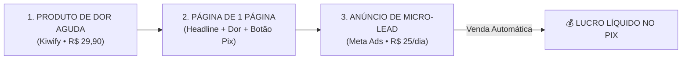

# 🚀 PLAYBOOK EXECUTIVO: CRIAÇÃO DE PRODUTO DIGITAL & TRÁFEGO DIRETO
> **Extraído e Condensado Diretamente dos Cursos do seu Google Drive:**
> * `Formação Copywriter de Anúncios — Anthony Carreiro`
> * `Código do Produto Viral + IA DNA Viral`
> * `Venda Todo Santo Dia (Regravação 2026) — Leandro Ladeira`
> * `Comunidade Sobral de Tráfego — Pedro Sobral`

---

## 🧭 O Mapa do Jogo em 3 Etapas

---

## 📦 ETAPA 1: A Criação do Produto de Dor Aguda (Menos de 4 Horas)

### A Regra de Ouro (Do curso *Código do Produto Viral*):
> *"Você não cria o que você 'acha' bonito. Você cria o analgésico para o que a pessoa já está morrendo de medo ou desespero hoje."*

### O Produto Escolhido:
* **Nome Comercial:** `PROTOCOLO CELULAR SEGURO & BLINDAGEM ANTI-GOLPE 2026`
* **Formato:** PDF diagramado de 20 a 25 páginas + Checklist rápido de 1 página.
* **Preço Principal:** **R$ 29,90**
* **Order Bump (no checkout):** **+ R$ 14,90** (*Dossiê: 10 Golpes Mais Perigosos do WhatsApp em 2026*)
* **Plataforma:** **Kiwify** (Cadastro gratuito, aprovação em 15 minutos, saque direto no Pix).

### O Conteúdo Exato do PDF (Gere com IA):
1. **Trava 01:** Como ativar o PIN do Chip SIM da operadora (impede ladrão de receber SMS do banco em outro aparelho).
2. **Trava 02:** Ocultar prévia de mensagens e códigos de SMS da tela de bloqueio.
3. **Trava 03:** Ativação de Pasta Segura / Segundo Espaço no Android e Face ID em apps no iOS.
4. **Trava 04:** Como configurar limites diários de Pix no celular da rua.
5. **Checklist de 15 Minutos:** Telefones e links de emergência caso o celular seja roubado.

---

## ✍️ ETAPA 2: A Copy de 8 Dígitos (Do curso *Anthony Carreiro*)

O Anthony Carreiro ensina o conceito de **Micro-Leads**: anúncios que não parecem propaganda, mas sim um **alerta urgente**.

### As Armas Secretas Encontradas no Curso do seu Drive:
* 🤖 **GPT Exclusivo do Anthony Carreiro (GPTonin):**  
  👉 `https://chatgpt.com/g/g-68a10b2a74d88191b579a3c07c4e4bf0-gptonin-microleads-beta`  
  *(Use esse GPT para gerar dezenas de variações de anúncios com 1 clique).*
* 📊 **Planilha com 1.000 Anúncios Validados de Múltiplos 8 Dígitos:**  
  👉 `https://docs.google.com/spreadsheets/d/1c2ITNvnugfUzaNvsp_o9j-5RpQwTrChv/edit?gid=145333854#gid=145333854`

### Roteiro de Anúncio Validado para Rodar no Instagram (Formato Vídeo ou Imagem):

#### 🚨 Modelo de Anúncio em Vídeo / Carrossel:
* **[0 a 3 seg - O Gancho]:**  
  *(Imagem com fundo preto e texto amarelo de alerta ou gravação de tela de celular)*  
  > *"Se você deixa o código do banco chegar na tela bloqueada do seu celular, você corre perigo todo dia na rua."*
* **[4 a 15 seg - A Dor]:**  
  > *"Em menos de 3 minutos, qualquer pessoa que pegar seu aparelho consegue trocar sua senha do banco ou clonar seu WhatsApp só lendo a notificação do SMS, sem nem saber a senha da tela."*
* **[16 a 25 seg - A Solução]:**  
  > *"Existe um protocolo simples de 4 travas que 99% dos brasileiros não ativam e que impede totalmente qualquer criminoso de acessar suas contas."*
* **[26 a 35 seg - Chamada para Ação (CTA)]:**  
  > *"Eu reuni esse passo a passo ilustrado em um guia rápido para Android e iPhone. Toque em 'Saiba Mais' abaixo e ative as travas hoje mesmo por menos de 30 reais."*

---

## ⚙️ ETAPA 3: A Máquina de Tráfego Direto (Do curso *Pedro Sobral* & *Leandro Ladeira*)

### Como Subir a Campanha no Gerenciador de Anúncios da Meta:

1. **Objetivo da Campanha:** `VENDAS` (Conversão).
2. **Pixel da Kiwify:**
   * Na Kiwify, vá em *Ferramentas -> Pixel de Rastreamento -> Facebook*.
   * Cole o ID do seu Pixel criado no Gerenciador de Anúncios.
   * Marque evento de `Compra` (Purchase).
3. **Orçamento Diário de Teste:**  
   * **R$ 25,00 por dia** (Orçamento a nível de Conjunto de Anúncios - CBO ou ABO).
4. **Público (Segmentação):**
   * *Localização:* Brasil inteiro.
   * *Idade:* 25 a 60 anos (público com poder de compra e maior preocupação com segurança).
   * *Gênero:* Homens e Mulheres (Todos).
   * *Público Aberto (Broad):* Sem interesses específicos. Deixe o algoritmo do Meta encontrar os compradores pela dor do criativo.
5. **Criativos:**
   * Suba **3 variações do anúncio** (1 imagem de alerta, 1 vídeo gravando a tela do celular, 1 carrossel).
6. **A Regra de Ouro da Otimização:**
   * Deixe rodar por **72 horas** sem mexer para o Pixel coletar dados.
   * Custo por Clique (CPC) ideal: abaixo de R$ 0,80.
   * Se o custo por compra estiver abaixo de R$ 20,00, **a campanha está dando lucro**.
   * Quando estiver positivo por 3 dias seguidos, você aumenta o orçamento em 20% ao dia.

---

### 🏆 Resumo das Ações Práticas:
1. **Hoje:** Abra o GPT do Anthony Carreiro e gere a copy da página e do anúncio.
2. **Amanhã:** Crie o PDF de 20 páginas com o ChatGPT e cadastre na Kiwify por R$ 29,90.
3. **Depois de amanhã:** Coloque R$ 25,00/dia no Meta Ads e deixe a máquina rodar.
