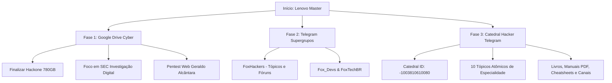

# 🛡️ PLAYBOOK MESTRE: CENTRALIZAÇÃO CYBER & HACKING (LENOVO MASTER)

> **Destino de Execução:** PC Lenovo (Workstation Central de Clonagem)  
> **IDE:** Google Antigravity IDE  
> **Foco Absoluto:** Cibersegurança, Pentest, Red Team, Blue Team, Engenharia Reversa, DFIR e Hardware Hacking  
> **Data:** 24/09/2026  

---

## 🧭 1. Visão Geral da Arquitetura & Ordem de Execução



---

## 🚀 2. Como Executar com 1 Clique no Lenovo

### Opção A: Executável Direto
* Dê um duplo clique em: **`EXECUTAR_MASTER_LENOVO_CYBER.bat`**
* Ou pelo terminal no Antigravity:
```powershell
cd c:\Users\matheus\Desktop\computacao
python orquestrador_master_lenovo_cyber.py
```

---

## ☁️ 3. Detalhes Técnicos: Google Drive (Cloud-to-Cloud)

### O que já foi clonado:
* ✅ **Solyd One Pentest:** 134.66 GB (534 arquivos) — 100% Concluído.

### Fila Ativa em Execução:
1. **Hackone - Academia Cyber Completa:**
   * Origem: `meudrive,shared_with_me:💎 DRIVE PREMIUM - MESTRE DOS CURSOS/02. 💻 Programação & Desenvolvimento/Hackone`
   * Destino: `meudrive:MEU_ACERVO_CLONADO/HACKONE_ACADEMIA_CYBER_COMPLETA`
   * *Status:* 1.354+ arquivos já transferidos.
2. **Foco em SEC - 4 Pilares de Cyber e Investigação Digital:**
   * Destino: `meudrive:MEU_ACERVO_CLONADO/FOCO_EM_SEC_INVESTIGACAO_DIGITAL`
3. **Pentest Web Profissional - Geraldo Alcantara:**
   * Destino: `meudrive:MEU_ACERVO_CLONADO/PENTEST_WEB_PROFISSIONAL_GERALDO_ALCANTARA`

### 💡 Regras de Cota do Google Drive:
* **Limite Diário:** 750 GB/dia por conta para transferências Server-Side.
* **Consumo de SSD e Internet:** 0 Bytes (Cópia direta entre servidores do Google).
* **Parâmetros Anti-Rate Limit:** `--tpslimit 3 --drive-pacer-min-sleep 100ms --drive-stop-on-upload-limit`.

---

## 📡 4. Detalhes Técnicos: Telegram Supergrupos & Catedrais

### 🏛️ A Catedral Hacker (ID: `-1003810610080`)
A Catedral está organizada em **10 Tópicos Especializados**:
1. `Tópico 01: Fundamentos, Linux para Pentesters & Terminal`
2. `Tópico 02: Red Team, Web AppSec & OWASP Top 10`
3. `Tópico 03: Infraestrutura, Redes & Ataques em Protocolos`
4. `Tópico 04: Active Directory & Pentest Corporativo Windows`
5. `Tópico 05: Engenharia Reversa, Binários & Desenvolvimento de Malware`
6. `Tópico 06: Blue Team, SOC, SIEM & Detecção de Intrusão`
7. `Tópico 07: Perícia Forense Digital & Resposta a Incidentes (DFIR)`
8. `Tópico 08: Hardware Hacking, IoT & Rádio-Frequência (RF)`
9. `Tópico 09: Certificações Internacionais & Carreira Global`
10. `Tópico 10: Biblioteca Mestre de Livros, Manuais & CheatSheets`

### 🤿 Supergrupo FoxHackers:
* Origem: `FoxHackers (-1001951230012)`
* Destino Clone: `-1004433669828`
* Script: `TelegramDownloader/clonar_supergrupos_completos.py`

---

## 🌐 5. Radar de Canais & Comunidades Mapeadas para Mineração

### 🇧🇷 Comunidades Brasil (Português):
* **Mente Binária:** Engenharia Reversa, Assembly, C e Análise de Binários.
* **HackerSec Brasil:** Pentest prático, Labs e Exploitation.
* **Guia do Hacker / CyberSecurity BR:** Tutoriais, Ferramentas Kali/Parrot.
* **Foco em SEC & Perícia Digital:** Forense, Cadeia de Custódia e OSINT.
* **Desec Security Community:** Trilha de Pentest Profissional (DCPT).
* **Brasil CTF:** Desafios práticos e Write-ups de competições.

### 🌎 Comunidades Globais (Inglês):
* **The Hacker News (THN):** Notícias de Zero-Days, Vulnerabilidades e APTs.
* **Offensive Security Community:** Labs, Kali Linux, OSCP e Proving Grounds.
* **OWASP Official Community:** Segurança Web, APIs, Boas Práticas e Top 10.
* **BleepingComputer:** Ameaças globais de Ransomware e Análise de Campanhas.
* **Reverse Engineering & Exploit Dev:** Buffer Overflow, Shellcoding e EDR Evasion.
* **Bug Bounty World & HackerOne Community:** Metodologias de Recon e Reports.
* **Cyber Security Books & PDF Library:** Livros de referência (No Starch Press, O'Reilly, Sybex).

---

## 🛠️ 6. Arsenal Open-Source Catalogado no Acervo

| Categoria | Principais Ferramentas |
| :--- | :--- |
| **Recon & OSINT** | Nmap, Subfinder, Amass, TheHarvester, Shodan CLI |
| **Web Pentest** | Burp Suite, SQLMap, FFUF, Nuclei, OWASP ZAP |
| **Redes & Wi-Fi** | Wireshark, Bettercap, Scapy, Aircrack-ng, Responder |
| **Active Directory** | BloodHound, Impacket, CrackMapExec, Mimikatz, Rubeus |
| **Engenharia Reversa** | Ghidra, IDA Free, Cutter, x64dbg, Radare2, GDB |
| **Blue Team & SOC** | Wazuh, Suricata, Zeek, Sigma Rules, Velociraptor |
| **Perícia Forense** | Autopsy, Volatility 3, FTK Imager, RegRipper, YARA |

---

## 📌 7. Instruções Finais para o Agente Lenovo

1. O agente no Lenovo deve abrir o diretório `c:\Users\matheus\Desktop\computacao`.
2. Executar `python orquestrador_master_lenovo_cyber.py` selecionando a opção **1**.
3. Acompanhar os logs gerados em:
   * `clonagem_hackone.log` (para o Google Drive)
   * `drive_clone_execucao.log`
   * `TelegramDownloader/progresso_clone_supergrupos.json`
