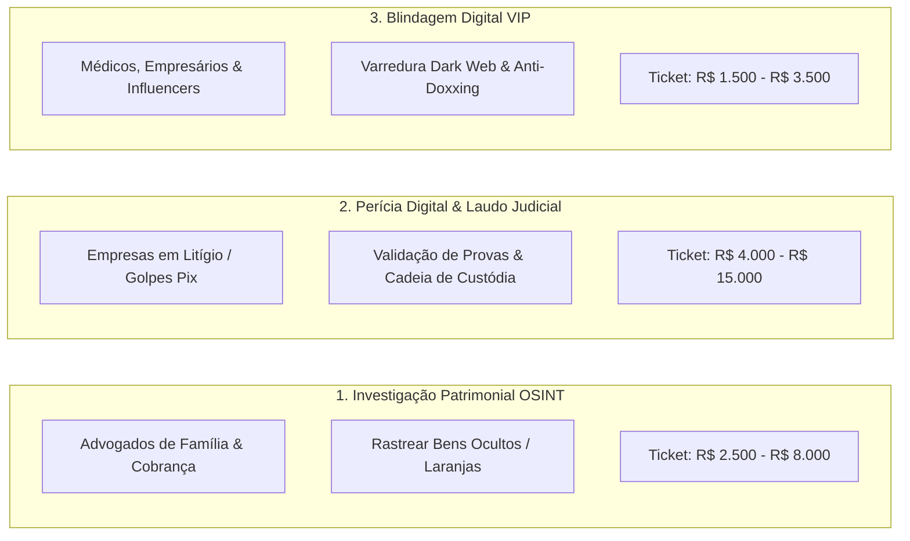

# 💰 PLAYBOOK COMERCIAL: Como Transformar a Investigação Digital & OSINT em R$ 10.000 a R$ 30.000/Mês

> **Metodologia de Monetização Prática Baseada no Treinamento FocoemSEC**  
> **Público Alvo Comprador:** Escritórios de Advocacia, Clínicas, Empresários e Vítimas de Fraudes Digitais

---

## 🧭 Os 3 Modelos de Serviços de Mais Alto Lucro (High-Ticket)



---

## 🎯 SERVIÇO 1: Rastreamento de Bens & Investigação Patrimonial para Advogados

### ❓ Por que Advogados pagam caro nisso?
Advogados que atuam em **Execução de Dívidas** (cobrança de milhões de reais) e **Direito de Família** (divórcios litigiosos) perdem processos porque o devedor esconde bens:
* Coloca carros e fazendas em nome de filhos/sócios laranjas.
* Abre empresas em paraísos fiscais ou com nomes semelhantes.
* Converte patrimônio em Criptomoedas (Bitcoin, USDT).

### 🛠️ O que você entrega (Usando as técnicas da Aula 02 do FocoemSEC):
Um **Dossiê de Inteligência Patrimonial (PDF Executivo)** contendo:
1. Mapeamento de empresas ativas e inativas vinculadas ao CPF do investigado (via CNPJs e QSA da Receita Federal).
2. Cruzamento de veículos registrados e histórico de transferências por placas.
3. Rastreamento de endereços físicos, e-mails secundários e redes sociais que mostram padrão de vida incompatível com a "falência declarada".
4. Mapeamento de transações em carteiras de criptomoedas públicas.

### 💵 Quanto cobrar:
* **Caso Simples (Pessoa Física):** R$ 2.500,00 por dossiê.
* **Caso Complexo (Grupo Econômico / Blindagem Patrimonial):** R$ 6.000,00 a R$ 12.000,00.

---

## 🎯 SERVIÇO 2: Laudo Técnico Forense para Defesa de Golpes e Fraudes Internas

### ❓ Por que Empresas pagam nisso?
Quando um funcionário desvia dinheiro (fraude de chave Pix ou alteração de boleto bancário) ou uma empresa sofre invasão:
* A polícia demora meses para iniciar a perícia.
* A empresa precisa de um **Laudo Técnico Imediato** para anexar ao processo judicial, acionar o seguro cibernético e responsabilizar o autor.

### 🛠️ O que você entrega (Usando a Suite Forense do repositório):
1. Preservação das evidências com cálculo de hash SHA-256 (garantia da Cadeia de Custódia ISO 27037).
2. Dissecação de cabeçalhos de e-mail comprovando se houve falsificação de remetente (Spoofing).
3. Reconstituição da linha do tempo da máquina usada na fraude.
4. **Laudo Pericial Oficial** assinado digitalmente com conclusão irrefutável.

### 💵 Quanto cobrar:
* **R$ 3.500 a R$ 8.000 por laudo emitido**.

---

## 🎯 SERVIÇO 3: Blindagem Digital & Remoção de Dados de Executivos (Doxxing Defense)

### ❓ Por que Médicos e Empresários pagam nisso?
Donos de clínicas, cirurgiões e empresários vivem com medo de:
* Ter o WhatsApp clonado ou receber tentativas de extorsão.
* Ter seus dados fiscais, endereços residenciais e nomes de familiares expostos na internet.

### 🛠️ O que você entrega (Usando as ferramentas de OSINT MAPS):
1. **Varredura Completa de Exposição:** Busca de vazamentos de senhas e dados na Dark Web.
2. **Relatório de Vulnerabilidade Pessoal:** Apontar onde o executivo está exposto.
3. **Guia de Blindagem Prática:** Configuração de MFA com chave física, remoção de registros em sites agregadores e protocolo de segurança para a família.

### 💵 Quanto cobrar:
* **R$ 1.500 a R$ 3.000 por consultoria de 2 horas + Dossiê de Blindagem**.

---

## 📱 SCRIPT DE PROSPECÇÃO PRONTO PARA ENVIAR A ADVOGADOS

```text
Olá, Dr. [Nome do Advogado], tudo bem?

Meu nome é Matheus, atuo com Investigação Digital e Inteligência em Fontes Abertas (OSINT) aplicada ao suporte probatório para escritórios de advocacia.

Sabemos que em processos de execução e família, o maior obstáculo é localizar bens de devedores que utilizam laranjas, empresas paralelas e ocultação patrimonial.

Desenvolvi uma metodologia pericial que cruza bases de dados públicas, vínculos empresariais, registros veiculares e movimentações digitais para localizar patrimônio oculto e subsidiar pedidos de penhora perante o juiz.

Tenho um modelo anomizado de Dossiê de Inteligência Patrimonial de 3 páginas que demonstra exatamente como apresentamos as provas. 

Posso te encaminhar o PDF aqui pelo WhatsApp para o senhor avaliar como apoio aos casos do escritório?
```

---

## 📈 META DE FATURAMENTO NOS PRIMEIROS 60 DIAS:

| Mês | Clientes / Casos | Serviço | Faturamento Estimado |
| :-: | :--- | :--- | :---: |
| **Mês 1** | 2 Escritórios de Advocacia | 2 Dossiês de Investigação Patrimonial (R$ 2.500 cada) | **R$ 5.000,00** |
| **Mês 2** | 3 Dossiês Patrimoniais + 1 Blindagem VIP | Investigação + Consultoria Anti-Golpe | **R$ 9.500,00** |
| **Mês 3** | 4 Dossiês + 1 Laudo Pericial de Fraude | Casos Avançados de Fraude Digital | **R$ 16.000,00** |

> Todo o conhecimento técnico para executar cada uma dessas entregas está dentro da pasta **FocoemSEC** e nas ferramentas automatizadas do seu repositório!
