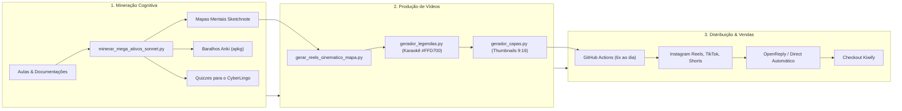

# 💻 Computação & CyberSketch — Ecossistema Autônomo de Educação, IA e Publicação Multirredes

> **Repositório Oficial:** [github.com/matheusbarbosatech/computacao](https://github.com/matheusbarbosatech/computacao)  
> **Caminho Local Oficial:** `C:\Users\matheus\Desktop\computacao`

---

## 🌟 O que é este projeto?

O **Computação** é um ecossistema completo de engenharia de software, inteligência artificial e criação audiovisual autônoma para transformar conceitos densos de **Ciência da Computação e Cibersegurança** em:

1. **700+ Mapas Mentais Visuais (Sketchnote)** desenhados à mão no estilo Excalidraw / Rough.js.
2. **Flashcards Atômicos para Anki** com repetição espaçada (portas de rede, flags TCP, comandos de terminal e algoritmos).
3. **App Gamificado (CyberLingo / DevSketch Play)** com desafios estilo CTF (Capture The Flag) e lógica de programação.
4. **Motores Audiovisuais Cinematográficos** com animações em Manim (estilo 3Blue1Brown) e VideoScribe, legendas estilo Hormozi (#FFD700) e Smart Auto-Reframe 9:16.
5. **Esteira de Publicação Autônoma na Nuvem (GitHub Actions)** que posta automaticamente 6x ao dia no Instagram Reels, TikTok, YouTube Shorts e WhatsApp Status sem precisar do PC ligado.

---

## 🏗️ Arquitetura do Repositório

```
computacao/
│
├── .github/workflows/
│   └── publicador_multirredes_6x_dia.yml  # Automação no GitHub Actions (06h, 09h, 12h, 15h, 18h, 21h)
│
├── config/                                 # Modelos e credenciais de APIs (Instagram, TikTok, WhatsApp, YouTube)
│   ├── client_secret.example.json
│   ├── instagram_credentials.example.json
│   ├── tiktok_credentials.example.json
│   └── whatsapp_credentials.example.json
│
├── minerador_cognitivo/                   # Motores de IA para extrair valor de aulas densas
│   ├── minerar_mega_ativos_sonnet.py      # Claude Sonnet 5 (1M tokens) para gerar Mapas, Flashcards e Resumos
│   └── minerador_multimodal_senior.py     # Qwen 3.8 Max / Gemini Flash para processamento semântico
│
├── motores_audiovisuais/                  # Pós-produção de vídeo automatizada
│   ├── gerador_legendas.py                # Legendas dinâmicas Karaokê Ouro (#FFD700) 60fps
│   ├── reframe_engine.py                  # Auto-Reframe 16:9 para 9:16 com IA
│   └── audio_energy_analyzer.py           # Normalização de áudio EBU R128 (-16 LUFS)
│
├── scripts/                               # Robôs de publicação e sincronização
│   ├── publicador_nuvem_github_actions.py # Orquestrador principal na nuvem
│   ├── instagram_uploader.py              # Upload oficial via Meta Graph API
│   ├── tiktok_uploader.py                 # Upload via TikTok Developer API
│   ├── whatsapp_canal_e_status.py         # Envio via Evolution API
│   ├── youtube_uploader.py                # Upload via YouTube Data API v3
│   ├── gerador_capas.py                   # Gerador de thumbnails e capas de alta conversão
│   └── gerar_copies_postagem.py           # Gerador de legendas e ganchos virais
│
├── templates/
│   └── 00_SINCRONIZACAO_TEMPLATE.json     # Fila de agendamento de posts e vídeos
│
├── duolingo_computacao/                   # App interativo gamificado no navegador
│   └── index.html                         # Interface CyberLingo / DevSketch Play
│
├── landing_page/                          # Página de vendas de alta conversão
│   └── index.html
│
├── 01_ciencia_computacao_uninter/         # Escolas de conteúdo estruturadas
├── 02_logica_e_algoritmos/
├── 03_python_especialista/
├── 04_backend_e_apis/
├── 05_frontend_e_mobile/
├── 06_banco_dados_e_ia/
├── 07_devops_linux_e_nuvem/
├── 08_ciberseguranca/
│
├── GUIA_100_REPOSITORIOS_CIBERSEGURANCA.md# Enciclopédia dos 100 maiores repositórios de Cyber
├── DEMO_EXCALIDRAW_E_MANIM.html           # Vitrine visual interativa
├── requirements.txt                       # Dependências Python
└── .env                                   # Chaves de API (Gemini, Groq, DevWorld, YouTube, etc.)
```

---

## ⚡ Conexão entre os Motores: Do Estudo à Venda



---

## 🚀 Como Executar Localmente

### 1. Iniciar o Estúdio de Mapas e Visualização:
Dê dois cliques em:
👉 **`INICIAR_ESTUDIO.bat`** (ou abra `http://localhost:8080`)

### 2. Abrir a Demonstração Interativa (Excalidraw + Manim):
Dê dois cliques em:
👉 **`ABRIR_DEMO_EXCALIDRAW_E_MANIM.bat`**

### 4. Abrir a Central do Segundo Cérebro (Obsidian) no PC Lenovo:
Dê dois cliques em:
👉 **`RODAR_LENOVO_SEGUNDO_CEREBRO.bat`**
* Opção 1: Executa a mineração de cursos do Drive Matriz
* Opção 2: Abre a pasta `SEGUNDO_CEREBRO_VAULT` para abrir como Cofre (Vault) no [Obsidian](https://obsidian.md/)
* Opção 3: Inicia a ponte de backup Telegram -> Google Drive 5TB

Consulte o manual completo em: [`GUIA_EXECUCAO_PC_LENOVO.md`](file:///c:/Users/matheus/Desktop/computacao/GUIA_EXECUCAO_PC_LENOVO.md).

---

## 🛡️ Licença & Direitos
Desenvolvido por Matheus Barbosa — Todos os direitos reservados.
