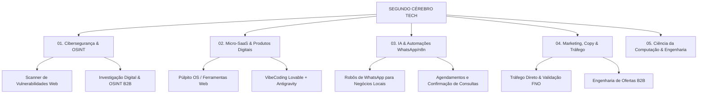

# 🏛️ 00. CENTRAL MESTRE: SEGUNDO CÉREBRO TECH & NEGÓCIOS
#segundo-cerebro #hub-central #matheus-barbosa #computacao

> **Bem-vindo ao seu Segundo Cérebro no Obsidian.**  
> Este Vault é a central consolidada de todo o seu acervo de conhecimento do **Google Drive Matriz**, **Canais do Telegram** e da sua formação em **Ciência da Computação**.

---

## 🗺️ Mapa de Navegação Rápida (Graph Hub)

---

## 📂 Trilhas do Seu Acervo de Elite

### 🛡️ 1. [[01_CIBERSEGURANCA_E_OSINT/00_Indice_Cyber|01. Cibersegurança, Hacking Ético & OSINT]]
* [[01_CIBERSEGURANCA_E_OSINT/Solyd_One_Pentest_Profissional|Solyd One - Formação Pentest Completa]]
* [[01_CIBERSEGURANCA_E_OSINT/Hackone_Academia_Cyber|Hackone - Academia Cyber]]
* [[01_CIBERSEGURANCA_E_OSINT/Foco_em_Sec_Investigacao_Digital_OSINT|Foco em SEC - Investigação Digital & OSINT]]
* [[01_CIBERSEGURANCA_E_OSINT/Scanner_Vulnerabilidades_MicroSaaS|Projeto Comercial: Scanner Web para PMEs]]

### 🤖 2. [[02_MICRO_SAAS_E_PRODUTO/00_Indice_SaaS|02. Criação de Micro-SaaS & Produtos Digitais]]
* [[02_MICRO_SAAS_E_PRODUTO/MVP_ao_SaaS_Gustavo_Sextaro|MVP ao SaaS - Gustavo Sextaro (Manual Completo)]]
* [[02_MICRO_SAAS_E_PRODUTO/Dev_de_Oferta_Roadmap|Dev de Oferta - O Roadmap para Desenvolvedores]]
* [[02_MICRO_SAAS_E_PRODUTO/PM3_Product_Management|PM3 - Product Management & Discovery de Produto]]
* [[02_MICRO_SAAS_E_PRODUTO/Arquitetura_VibeCoding_Lovable_Antigravity|A Esteira de Ouro: Lovable + Antigravity]]

### ⚡ 3. [[03_IA_E_AUTOMACAO/00_Indice_IA|03. Inteligência Artificial & Automações]]
* [[03_IA_E_AUTOMACAO/N8N_Master_Gestao_Automacoes|N8N Master - Gestão de Automações & Agentes]]
* [[03_IA_E_AUTOMACAO/WhatsApp_Automacoes_Comercio_e_Igreja|Projetos de WhatsApp para Comércio, Barbearias e Igrejas]]
* [[03_IA_E_AUTOMACAO/ClaudeCode_e_Embeddings_RAG|ClaudeCode, Embeddings & RAG sem Alucinação]]

### 📈 4. [[04_MARKETING_E_VENDAS/00_Indice_Marketing|04. Marketing, Tráfego & Validação de Ofertas]]
* [[04_MARKETING_E_VENDAS/Formula_Negocio_Online_2026|Fórmula Negócio Online 2026 - Alex Vargas]]
* [[04_MARKETING_E_VENDAS/Comunidade_Sobral_Trafego|Comunidade Sobral de Tráfego]]
* [[04_MARKETING_E_VENDAS/Venda_Todo_Santo_Dia_Perpetuo|Venda Todo Santo Dia - Produtos Perpétuos]]

### 💻 5. [[05_COMPUTACAO_E_ENGENHARIA/00_Indice_Computacao|05. Ciência da Computação & Engenharia de Software]]
* [[05_COMPUTACAO_E_ENGENHARIA/Ciencia_da_Computacao_Uninter_Matriz|Ciência da Computação UNINTER - Matriz Curricular]]
* [[05_COMPUTACAO_E_ENGENHARIA/System_Design_e_Arquitetura_Augusto_Galego|System Design & Algoritmos - Augusto Galego]]
* [[05_COMPUTACAO_E_ENGENHARIA/FullCycle_Microsservicos_e_Docker|Full Cycle - Microsserviços, Docker & Cloud]]

---

## ⚙️ Regras do Segundo Cérebro no Obsidian
1. **Conexões sempre vivas:** Toda nota técnica deve apontar para pelo menos uma nota de negócio ou aplicação prática.
2. **Build in Public:** Todo script que você codar deve virar uma nota com snippet de código testado e um resumo de 1 parágrafo.
3. **Busca Rápida:** Pressione `Ctrl + O` no Obsidian para pular para qualquer curso ou conceito instantaneamente.
