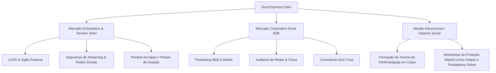

# 🛡️ THE CYBER WATCHMAN: O Guia Definitivo da Cibersegurança Alinhada à Fé Bíblica

> *"E não sejais cúmplices nas obras infrutíferas das trevas; antes, porém, reprovai-as [exponde-as à luz]."* — **Efésios 5:11**  
> *"Filho do homem, eu te dei por atalaia sobre a casa de Israel; ouve, pois, a palavra da minha boca e dá-lhes aviso da minha parte."* — **Ezequiel 33:7**

---

## 1. A Teologia da Cibersegurança: Por que um Hacker Ético é um Atalaia de Deus

No mundo espiritual e no mundo digital, as regras de combate são espelhadas:
1. **O Adversário invisível e constante:** Em 1 Pedro 5:8, o adversário *"anda em derredor bramando como leão, buscando a quem possa tragar"*. Na cibersegurança, isso é exatamente um port-scanner/exploit scanner automatizado rodando 24/7 procurando portas abertas e falhas não corrigidas.
2. **Defesa em Profundidade (A Armadura de Deus):** Efésios 6 descreve *capacete, couraça, escudo, espada, cinturão e calçados*. Isso é o equivalente bíblico à **Arquitetura Zero Trust** e **Defesa em Profundidade** (Endpoint Security, Firewall, Criptografia, IAM e Conscientização).
3. **O Hacker Ético como Curador e Revelador da Verdade:** O hacker criminoso (*black hat*) acha a fenda para destruir, roubar e extorquir (João 10:10). O hacker ético (*white hat*) acha a fenda para **trazer a falha à luz e curá-la antes do ataque**. É um ato de proteção pastoral e integridade.

---

## 2. Personagens Bíblicos como Profissionais Cyber

| Personagem | Perfil Cyber | Por que ele é esse profissional? | Referência |
| :--- | :--- | :--- | :--- |
| **Neemias** | **Lead DevSecOps / Blue Teamer / Perimeter Architect** | Fez reconhecimento noturno e discreto nas muralhas caídas de Jerusalém (*vulnerability assessment*), desenhou o plano de reconstrução e implementou defesa ativa (*"com uma mão trabalhavam e com a outra seguravam a arma"* = CI/CD com segurança embutida). | Neemias 2:11-15; 4:16-18 |
| **Daniel** | **Cryptanalyst / Reverse Engineer / Sandboxing Master** | Decifrou o que nenhum sábio conseguiu ler: a escrita cifrada na parede do palácio de Belsazar (*"Mene, Mene, Tequel, Ufarsim"*). Viveu dentro do sistema hostil da Babilônia sem ser infectado (*sandboxing/isolamento de kernel*). | Daniel 5:17-28; 1:8 |
| **Davi** | **Red Teamer / 0-Day Exploit Hunter** | Golias tinha a defesa de perímetro perfeita (armadura colossal de bronze, lança imensa, escudeiro). Davi identificou a única superfície de ataque desprotegida: **a testa** desprovida de viseira. Criou um payload cirúrgico (pedra de funda) e derrubou o monstro. | 1 Samuel 17:48-50 |
| **Mardoqueu** | **Threat Hunter / SOC Analyst / Insider Threat Detection** | Ficava sentado à porta do rei (o *Gateway/Firewall*). Interceptou o tráfego não autorizado e a conspiração de Bigtã e Teres (*insider threat*) para assassinar o rei, neutralizando o ataque antes da execução. | Ester 2:21-23 |
| **José do Egito** | **Threat Intelligence / Disaster Recovery & BCP (Plano de Continuidade)** | Interpretou a telemetria profética dos 7 anos de fartura e 7 de fome, arquitetou o maior plano de contingência e redundância de dados/alimentos da história da antiguidade. | Gênesis 41 |
| **Raabe** | **Covert Exfiltration / Secure Proxy / Backchannel** | Operou em território inimigo (Jericó), camuflou os agentes de reconhecimento sob feixes de linho (esteganografia), direcionou os rastreadores para falsas pistas (honeypot) e estabeleceu um canal criptografado de resgate (o cordão escarlate). | Josué 2 |
| **Os Doze Espias** | **OSINT / Reconnaissance Team** | Foram enviados para fazer reconhecimento de terreno, coletar inteligência sobre infraestrutura (cidades muradas) e analisar as defesas dos cananeus antes da incursão. | Números 13 |

---

## 3. Arquitetura da Marca

### Nomes de Alto Impacto
* **Opção 1: ATALAIA CYBER (ou WATCHMAN CYBER)**
  * *Conceito:* O vigilante no topo da muralha que não dorme para que o povo durma em paz (Ezequiel 33).
  * *Vibe:* Autoridade, sentinela, prontidão, nobreza protetora.
* **Opção 2: SANCTUM SECURITY**
  * *Conceito:* O lugar santo, blindado, inviolável e sagrado.
  * *Vibe:* Corporativa internacional, elegante, misteriosa e inviolável.
* **Opção 3: TEKEL LABS (ou MENE SECURITY)**
  * *Conceito:* Baseado em Daniel 5 (*"Tequel: Foste pesado na balança e achado em falta"*).
  * *Vibe:* A empresa que audita e encontra as faltas nos sistemas antes do inimigo achar. O slogan já vem pronto da Bíblia!
* **Opção 4: NEEMIAS DEFENSE**
  * *Conceito:* Reconstrução de muralhas digitais e segurança estrutural.

### Arquétipo de Marca
* **O Guardião (The Caregiver / Guardian) + O Sábio (The Sage):** 
  * Não é o hacker criminoso com capuz verde na garagem escura.
  * É o **Guardião da Aliança**: o profissional de moral inabalável em quem empresas e igrejas confiam suas chaves e segredos mais íntimos.

### O Slogan / Tagline
* *"Vigiando as muralhas digitais para proteger o que é sagrado."*
* *"Encontrando as fendas antes do adversário."*
* *"Segurança cibernética com integridade inabalável."*

---

## 4. Identidade Visual & Cores

### A Simbologia da Logo
1. **O Escudo e a Cruz Integrada:** Um escudo hexagonal ou estilizado em malha de circuitos integrados, onde os traços centrais formam sutilmente uma cruz ou a letra hebraica *Shin* (ש - associada a *Shaddai*, o Todo-Poderoso, e a *Shamar*, guardar).
2. **A Torre da Atalaia em Linhas de Código/PCB:** A silhueta de uma muralha ou torre de vigia construída a partir de trilhas de placa-mãe e nós de rede.
3. **A Pedra de Davi / Nodo Central:** Um feixe de luz focal que ilumina um ponto vulnerável em uma estrutura geométrica fechada.

### A Paleta de Cores

| Cor | Nome Técnico | Hex Code | Significado Teológico e Psicológico |
| :--- | :--- | :--- | :--- |
| **Primária** | **Obsidian Midnight** | `#0B0F19` | O manto da noite, a seriedade do terminal, a humildade de quem opera nos bastidores. |
| **Acento Divino** | **Glory Gold / Amber** | `#F59E0B` | A glória de Deus, o ouro refinado pelo fogo (Ap 3:18), o alerta e a inteligência ativa. |
| **Confiança** | **Celestial Cobalt** | `#2563EB` | A verdade, a lealdade, a clareza do céu, a precisão matemática da defesa cibernética. |
| **Status / Hash** | **Sanctified Emerald** | `#10B981` | O sistema limpo, o prompt de comando saudável, a vida restaurada após a auditoria. |
| **Base Neutra** | **Pure Slate** | `#F8FAFC` | A luz da verdade revelada; legibilidade e transparência. |

---

## 5. Estrutura da Página Web (Wireframe & Copy)

### 1. Hero Section
* **Badge Superior:** `[● ATALAIA CYBER DEFENSE] — PROTEGENDO O REINO NO MUNDO DIGITAL`
* **Título:** *"As muralhas caíram no mundo físico. No mundo digital, nós as mantemos de pé."*
* **Subtítulo:** *"Testes de intrusão, auditorias de segurança e proteção de dados com o rigor dos mais altos padrões internacionais e a integridade de princípios inegociáveis."*
* **CTAs:** `[Agendar Teste de Vulnerabilidade]` (Dourado/Neon) e `[Conhecer o Manifesto Atalaia]` (Outline).

### 2. A Dor Invisível (O Alerta)
* *"Sua igreja ou empresa possui dados mais valiosos do que imagina: aconselhamentos pastorais, dízimos, dados de membros, propriedades intelectuais. Para os criminosos, uma brecha não é apenas um código: é uma vida exposta."*

### 3. Nossos Serviços (As 4 Torres da Muralha)
1. **Pentest Ético (Invasão Controlada):** Como Davi, descobrimos onde sua armadura está falhando antes que o gigante ataque.
2. **Blindagem LGPD para Igrejas e Ministérios:** Adequação de fichas de membros, batismos, ofertas e atendimentos de aconselhamento à lei e ao sigilo pastoral.
3. **SOC & Monitoramento 24/7 (O Olho do Atalaia):** Vigilância ativa contra ataques de ransomware, sequestro de redes sociais e invasões de cultos online.
4. **Treinamento de Conscientização (Anti-Phishing Pastoral):** Capacitação de lideranças, pastores e secretarias contra golpes de engenharia social, PIX falso e clonagem de WhatsApp.

### 4. O Manifesto dos Guardiões
* Um texto inspirador conectando a responsabilidade espiritual de proteger as famílias e instituições contra a degradação e extorsão digital.

### 5. Prova de Confiança & Contato
* Formulário com chave PGP pública, canal criptografado e atendimento direto.

---

## 6. O Plano de Negócios (Business Model)

### Modelo de Mercado Duplo (B2C/B2B Religioso + B2B Corporativo)

### 1. Ofertas para Igrejas e Ministérios
* **O "Check-up da Muralha" (Auditoria Rápida):**
  * Auditoria de contas de redes sociais do ministério (YouTube, Instagram do pastor, site da igreja).
  * Proteção do canal do YouTube contra hackers que invadem para rodar lives de golpes de criptomoedas (caso extremamente comum em megaigrejas).
* **Adequação LGPD Pastoral:**
  * Dados de aconselhamento bíblico são juridicamente classificados como **dados sensíveis** (convicção religiosa, vida íntima). Se vazarem, a igreja pode ser processada e sofrer danos morais gigantescos.
* **Segurança do Culto Online:**
  * Prevenção de *Zoom bombing*, ataques DDoS e sequestro de domínios de arrecadação.

### 2. Ofertas para o Mercado Corporativo Tradicional
* **O Diferencial Competitivo da Integridade:**
  * No hacking ético, o maior medo dos clientes é: *"E se esse hacker roubar meus dados ou colocar um backdoor?"*
  * Posicionar sua marca como guiada por um **padrão moral e ético intransigente** atrai clientes de alto valor que buscam discrição, honestidade absoluta e entrega justa.

### 3. Braço Social / Ministério Digital (Formação de Novos Atalaias)
* Criar uma academia/bootcamp para treinar jovens da igreja e comunidades carentes em cibersegurança e programação defensiva.
* Em vez de caírem na criminalidade digital ou no desemprego, tornam-se profissionais valorizados com salários altos e propósito de vida.

---

## 7. Checklist de Ação Imediata

- [ ] **Definir o Nome Oficial:** Escolha entre *Atalaia Cyber*, *Tekel Security*, *Sanctum Defense* ou sua variante preferida.
- [ ] **Adquirir Domínio & Criar Identidade:** Registrar domínio limpo (ex: `.com.br` ou `.io / .security`).
- [ ] **Lançar a Landing Page com Design de Alto Padrão:** Visual escuro, moderno, com toque dourado e símbolos de proteção.
- [ ] **Escrever o Primeiro Whitepaper/Artigo:** *"Por que a sua igreja é o alvo preferido de hackers em 2026 (e como protegê-la)"*.
- [ ] **Primeiro Pitch Pastoral:** Apresentar a uma igreja de médio/grande porte um relatório gratuito de superfície de ataque exposta (OSINT não invasivo).
